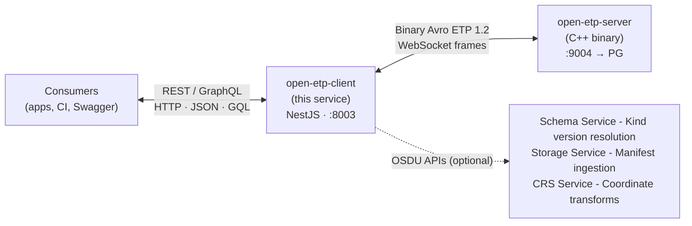
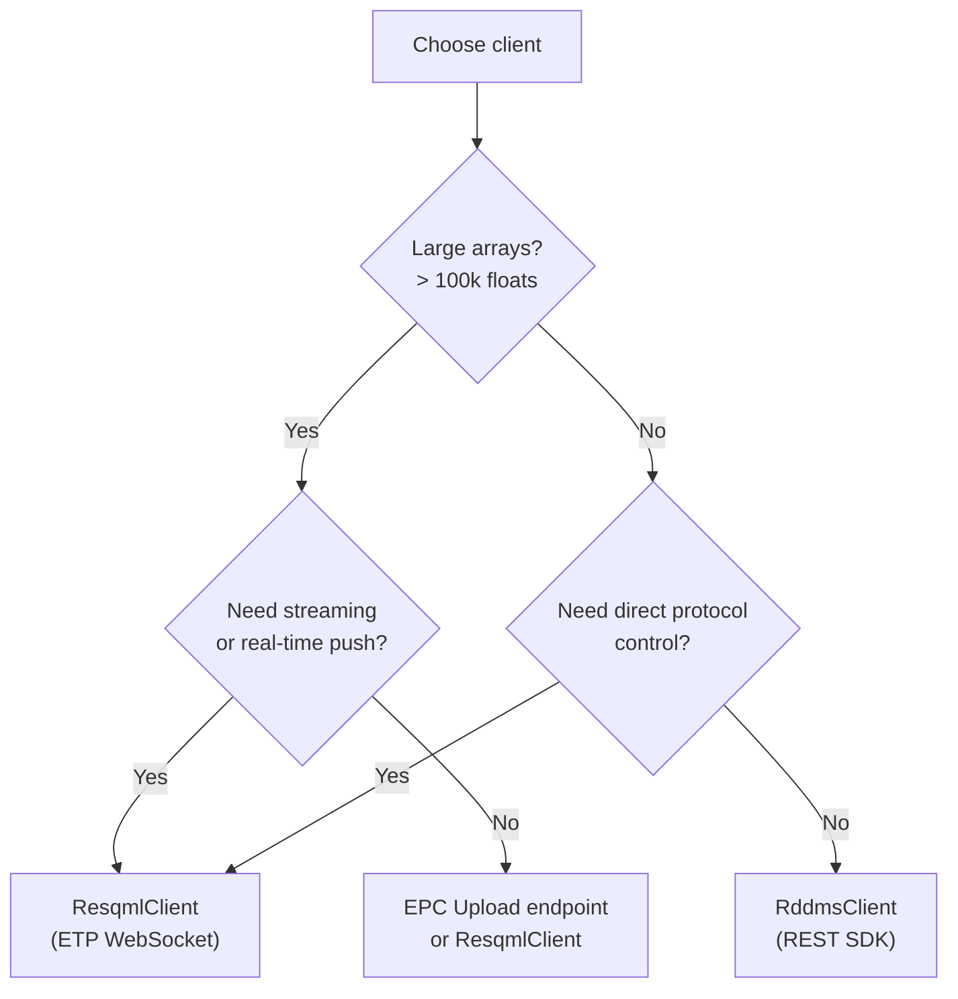

# @osdu/open-etp-client

REST and GraphQL gateway and SDK for [OpenETPServer](https://community.opengroup.org/osdu/platform/domain-data-mgmt-services/reservoir/open-etp-server). Bridges HTTP/JSON consumers to the binary Avro ETP 1.2 protocol - dataspace management, RESQML/WITSML/PRODML object access, data array streaming, OSDU manifest generation, EPC upload, and well search.



| Document                                                                                                                                 | Description                                                        |
| ---------------------------------------------------------------------------------------------------------------------------------------- | ------------------------------------------------------------------ |
| [REST SDK](./sdk/README.md)                                                                                                              | **Typed TypeScript SDK** - API reference, examples, quick start    |
| [CHANGELOG](./CHANGELOG.M27.md)                                                                                                          | Features, interfaces, and behavioral changes per milestone         |
| [Swagger UI](http://localhost:8003/Reservoir/v2/)                                                                                        | Interactive endpoint reference (served by the running application) |
| [RESQML → OSDU Guide](./ResqmlOsduGuide.md)                                                                                              | Populating RESQML metadata for lossless OSDU roundtrips            |
| [OpenETPServer](https://community.opengroup.org/osdu/platform/domain-data-mgmt-services/reservoir/open-etp-server/-/blob/main/README.md) | C++ ETP server: build, deploy, telemetry                           |

---

## Quick Start

```sh
# 1. Clone and install for standalone deployment/testing
git clone https://community.opengroup.org/osdu/platform/domain-data-mgmt-services/reservoir/open-etp-client.git
cd open-etp-client
npm install && npm run build

# 2. Configure
cp config.user.env.sample config.user.env
# Edit config.user.env - set RDMS_ETP_HOST, RDMS_ETP_PORT, etc.

# 3. Start ETP server (Docker) + REST API
npm run docker:compose:start    # OpenETPServer + PostgreSQL on :9004
npm run start                   # REST API on :8003
```

Open [http://localhost:8003/Reservoir/v2/](http://localhost:8003/Reservoir/v2/) for Swagger UI.

### Configuration

Set values in `config.user.env` (overrides `config.default.env`):

| Variable                   | Default         | Description                                                      |
| -------------------------- | --------------- | ---------------------------------------------------------------- |
| `RDMS_ETP_HOST`            | `localhost`     | ETP server hostname                                              |
| `RDMS_ETP_PORT`            | `9004`          | ETP server port                                                  |
| `RDMS_ETP_PROTOCOL`        | `ws`            | `ws` or `wss`                                                    |
| `RDMS_REST_PORT`           | `8003`          | REST API listen port                                             |
| `RDMS_REST_ROOT_PATH`      | `/Reservoir/v2` | REST API base path                                               |
| `RDMS_DATA_PARTITION_MODE` | `single`        | `single` or `multipartition` - see [Partitioning](#partitioning) |
| `RDMS_ETP_SSL_VERIFY`      | `true`          | Set `false` for self-signed certs                                |
| `RDMS_OSDU_URL`            | -               | OSDU platform URL (enables Schema Service, CRS lookups)          |
| `OSDU_MILESTONE`           | -               | Schema milestone (`M26` or `M27`) for manifest kind versions     |

---

## API Reference

### REST API

Interactive Swagger UI at the configured root path. Includes full endpoint descriptions, workflow examples, and try-it-out.

| Category         | Key endpoints                                                             |
| ---------------- | ------------------------------------------------------------------------- |
| **Health**       | Liveness, readiness, server info, converter registry                      |
| **Dataspaces**   | CRUD, clone, lock/unlock                                                  |
| **Resources**    | List, get, validate, graph traversal (sources/targets)                    |
| **Data Arrays**  | Array metadata, content, upload with chunking                             |
| **Query**        | FindResources, batch graph search, growing object parts, channel metadata |
| **Write**        | PutDataObjects, DeleteDataObjects (requires transaction)                  |
| **Transactions** | Start, commit, rollback                                                   |
| **EPC Upload**   | Upload EPC + H5 file pair with auto-transaction and diagnostics           |
| **Manifest**     | OSDU manifest generation from ETP dataspaces                              |
| **Wells**        | Cross-dataspace well search with hierarchy resolution                     |
| **WITSML**       | Store/query WITSML 2.1 and 1.4.1 XML objects                              |
| **PWLS**         | Curve mnemonic resolution and validation                                  |

### GraphQL API

Available at `/graphql` (with Playground in development mode). Same data as REST with field-level selection and DataLoader batching.

Query types: `dataspaces`, `resources`, `graph`, `objectContent`, `arrayMetadata`.

### TypeScript REST SDK - `RddmsClient`

The `RddmsClient` class provides a **typed HTTP/JSON SDK** for the REST API. No ETP protocol knowledge, no binary framing, no XML - just typed method calls.

```typescript
import { RddmsClient } from "./sdk";

const rddms = new RddmsClient({
  baseUrl: "http://localhost:8080/api/reservoir-ddms/v2",
  partitionId: "dev"
});

// Atomic write: transaction → put objects → put arrays → commit (auto-rollback on error)
await rddms.atomicWrite("demo/test", [crs, hdfProxy, pointSet], [coordArray]);

// Read back
const types = await rddms.resources.types("demo/test");
const arr = await rddms.arrays.get(
  "demo/test",
  containerType,
  containerUuid,
  arrayPath
);
```

See [sdk/README.md](./sdk/README.md) for the full API reference and [src/examples/sdk/](./src/examples/sdk/) for runnable examples.

### TypeScript Library (low-level)

The `ResqmlClient` class talks raw ETP 1.2 binary protocol over WebSocket - you manage connections, Avro frame encoding, session negotiation, and multi-part message assembly. See [src/examples/](./src/examples/).

> **When to use which?**



#### Performance: SDK vs Direct ETP vs fesapi/pyetp

| Operation                     | SDK (REST/JSON)  | Direct ETP (ResqmlClient) | fesapi (C++) |  pyetp  |
| ----------------------------- | :--------------: | :-----------------------: | :----------: | :-----: |
| Metadata (list, get, graph)   |      ~20 ms      |          ~15 ms           |    ~12 ms    | ~17 ms  |
| atomicWrite (2 objects)       |      ~44 ms      |          ~30 ms           |    ~25 ms    | ~35 ms  |
| atomicWrite (1000 objects)³   |     ~180 ms      |          ~120 ms          |    ~80 ms    | ~150 ms |
| 100k float array read         |     ~200 ms      |          ~50 ms           |    ~30 ms    | ~80 ms  |
| 1M float array read           |       ~2 s       |          ~300 ms          |   ~150 ms    | ~500 ms |
| 1GB float array (125M floats) | **impractical**¹ |          ~50 s²           |    ~25 s     |  ~80 s  |

¹ JSON text for 125M floats is ~2.5 GB - exceeds Node.js heap and HTTP chunking limits. Use EPC upload or direct ETP for arrays this size.
² ETP chunks at 4 MB (~250 chunks for 1 GB). Throughput is ~20 MB/s over WebSocket with Avro framing.
³ Object writes scale sub-linearly: the gateway batches 100 objects per ETP message, so 1000 objects = 10 ETP messages inside 1 HTTP call + fixed transaction overhead (~22 ms). Not 500× the 2-object time.

For **metadata operations**, the SDK adds ~5–8 ms overhead per call - negligible for application use (ETP server + PG query time dominates). For **large array I/O** (>100k floats), JSON serialization becomes the bottleneck (~5–7× slower than binary Avro). For array-heavy workflows (seismic grids, simulation results), use the EPC upload endpoint or direct ETP.

---

## Deployment

### Docker Compose (local)

```sh
npm run docker:compose:start    # OpenETPServer + PostgreSQL
npm run start                   # REST API against Docker ETP server
```

### Azure (AKS)

See [devops/azure/README.md](devops/azure/README.md) for Helm chart and Azure DevOps pipeline setup.

### Production notes

- ETP server and client are **separate containers** - deploy with shared network
- OpenETPServer requires **PostgreSQL** (stores XML metadata and HDF5 arrays)
- Configure `RDMS_OSDU_URL` for Schema Service kind resolution; falls back to static M27 versions if unavailable
- Health endpoints (`/health/liveness`, `/health/readiness`) are Kubernetes-ready
- SIGTERM triggers graceful shutdown: stops accepting requests, rolls back open transactions, exits within 30s

---

## Architecture

### ETP Protocols

All protocols are **auto-negotiated** at session open. Unsupported endpoints return 501.

| Protocol         | ID  | Purpose                                                      |
| ---------------- | --- | ------------------------------------------------------------ |
| Core             | 0   | Session management                                           |
| Discovery        | 3   | Resource enumeration, graph traversal                        |
| Store            | 4   | Get/Put/Delete data objects                                  |
| DataArray        | 9   | Array read/write with chunking                               |
| Transaction      | 18  | Start/commit/rollback                                        |
| Dataspace        | 24  | Create/delete/lock dataspaces                                |
| SupportedTypes   | 25  | Type enumeration                                             |
| DiscoveryQuery   | 13  | FindResources by URI pattern → `POST /query/resources/find`  |
| StoreQuery       | 14  | FindDataObjects with content → `POST /query/objects/find`    |
| GrowingObject    | 6   | Log curves, trajectory stations → `POST /query/growing/*`    |
| ChannelSubscribe | 21  | Real-time channel metadata → `POST /query/channels/metadata` |

---

## Testing

### Unit tests

```sh
npm run test                              # all (parallel, with coverage)
npm run test pattern1 pattern2            # subset by pattern
npm run test:single pattern1              # sequential, no coverage (debugging)
```

### Integration tests

Require a running ETP server:

```sh
npm run test:integration                  # TestClient + TestProtocols + TestWitsmlQuery
```

### Bruno API tests

The `bruno/` folder contains a [Bruno](https://www.usebruno.com/) collection for REST API testing. Environments: Local, Azure, CI.

```sh
npx bru run bruno/ --env Local            # headless CLI run
```

Manual workflow: run `_Setup/` requests → test individual endpoints → run `_Cleanup/`.

### Local ETP Server (Docker)

```sh
npm run docker:login               # once, for ACR access
npm run docker:update              # pull latest images
npm run docker:compose:start       # OpenETPServer on localhost:9004
```

---

## Reference

### Partitioning

Two modes (same as [ETP server](https://community.opengroup.org/osdu/platform/domain-data-mgmt-services/reservoir/open-etp-server/-/blob/main/README.md#partition-modes)):

- **Single-partition** - client handles one partition, does not transmit `data-partition-id` to server
- **Multi-partition** - expects `data-partition-id` header in REST requests, forwards to server

Set `RDMS_DATA_PARTITION_MODE` in config.

### Schema Version Support

Manifest builder resolves OSDU kind versions at startup:

1. **Schema Service query** - queries OSDU Schema Service for latest published versions
2. **Static fallback** - built-in `FALLBACK_KINDS` map provides M27 versions if service unavailable

No configuration needed - adapts automatically to the target platform.

---

## Development

### Code style

```sh
npm run lint                  # eslint analysis
npm run prettier              # formatting check
npm run validate              # lint + prettier + tests in parallel
npm run lint:fix              # auto-fix lint issues
npm run prettier:write        # auto-fix formatting
```

Pre-commit hook runs `lint-staged` automatically.

### Packaging

```sh
npm run build && npm pack     # creates osdu-open-etp-client-x.x.x.tgz
npm i /path/to/osdu-open-etp-client-x.x.x.tgz   # install in another project
```

### Publishing

1. Update version in `package.json` + `npm i` to sync lock file
2. Update `CHANGELOG.md`
3. Create MR "Bump version to vX.Y.Z"
