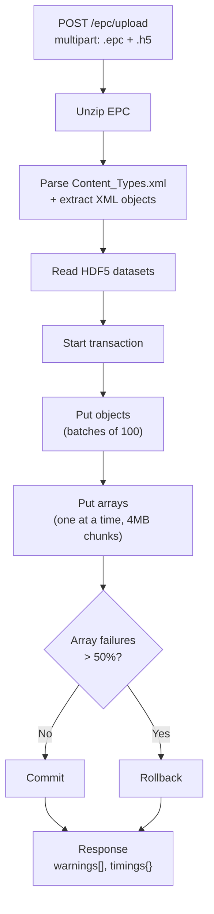

# Release Notes: Reservoir DDMS Client v1.3.0

Changes in the `open-etp-client` REST gateway since the M27 baseline (`cfffaa2`).

> **Note**: ETP protocols not yet implemented in `open-etp-server` (DiscoveryQuery 13, GrowingObject 6, ChannelSubscribe 21) have been removed from the codebase. See `ToDo.md` for re-enablement plan.

---

## TypeScript REST SDK - `RddmsClient`

New typed HTTP/JSON SDK in [`sdk/`](./sdk/) wrapping the REST API. Unlike the low-level `ResqmlClient` (WebSocket/Avro, ETP protocol knowledge required), `RddmsClient` talks plain HTTP/JSON - no binary protocols, no XML, no HDF5 linking.

### What it provides

- **Typed namespaces** - `rddms.dataspaces`, `rddms.resources`, `rddms.arrays`, `rddms.transactions`, `rddms.query`, `rddms.graph`, `rddms.health`, `rddms.manifest`
- **`atomicWrite()` helper** - wraps start transaction → put objects → put arrays → commit, with auto-rollback on error
- **Auto-auth** - fetches dev token from `GET /auth/token` when no static token is provided
- **Zero dependencies** - uses native `fetch` only

### Example suite

Five runnable examples in [`src/examples/sdk/`](./src/examples/sdk/):

| Example                 | Demonstrates                                                 |
| ----------------------- | ------------------------------------------------------------ |
| `01-hello-pointset.ts`  | PointSet + CRS + HdfProxy + coordinate array, full lifecycle |
| `02-grid2d-property.ts` | Grid2D with continuous property and multi-array write        |
| `03-transactions.ts`    | Commit vs rollback, atomicWrite helper                       |
| `04-query-graph.ts`     | FindResources, batch graph search, list all                  |
| `05-dataspaces.ts`      | Create, list, info, lock/unlock, clone, delete               |

See [sdk/README.md](./sdk/README.md) for full API reference.

---

## New Interfaces

### REST Endpoints (8 new)

| Method | Path                               | Purpose                                                                  | Status |
| ------ | ---------------------------------- | ------------------------------------------------------------------------ | ------ |
| POST   | `/query/objects/find`              | FindDataObjects with full XML content (ETP Protocol 14)                  | Live |
| POST   | `/query/graph/search`              | Batch graph search - merged subgraph for multiple URIs                   | Live |
| PUT    | `/witsml/store`                    | Ingest WITSML 2.1/1.4.1 XML with auto-transaction and channel extraction | Live |
| POST   | `/dataspaces/{id}/epc/upload`      | Upload EPC + H5 file pair, unzip, parse, and ingest with transaction     | Live |
| GET    | `/wells?name=&dataspace=&include=` | Cross-dataspace well search with hierarchy resolution                    | Live |

### GraphQL API

New `/graphql` endpoint with field-level selection and DataLoader batching. Query types: `dataspaces`, `resources` (with lazy `content` and `arrays` fields), `graph` traversal. Uses the same ETP session pool as REST.

### ETP Protocol Handlers

| Protocol                  | ID  | Handler                             | Purpose                                       | Status |
| ------------------------- | --- | ----------------------------------- | --------------------------------------------- | ------ |
| StoreQuery                | 14  | `StoreQueryCustomer`                | Bulk data object retrieval                    | Live |

Protocols DiscoveryQuery (13), GrowingObject (6), GrowingObjectNotification (7), and ChannelSubscribe (21) have been removed — `open-etp-server` does not implement them. See `ToDo.md`.

---

## New Features

### OSDU Manifest Builder Enhancements

- **Schema Service integration** - on boot, queries OSDU Schema Service for latest kind versions (M27+). Falls back to static `FALLBACK_KINDS` if unavailable.
- **CollaborationProject** - auto-generates a `master-data--CollaborationProject:1.0.0` record per dataspace with deterministic UUID v5 and lifecycle events.
- **Lineage** - auto-generated Activity record linking source EPC to output manifest records.
- **Best-effort mode** - converter errors skip the failed object instead of aborting the entire build. Check `errors[]` in the response.
- **`includeArrayData` option** - opt-in to bulk data array reads during manifest build.
- **Smart property inclusion** - properties with canonical OSDU/PWLS names are auto-included; non-canonical properties excluded to avoid manifest bloat.
- **Transmissibility detection** - GridConnectionSet records report `HasTransmissibilityMultipliers` when attached properties are found.
- **WellLog depth range** - WellboreFrame→WellLog populates TopMeasuredDepth/BottomMeasuredDepth.

### OSDU Converters (20+ new)

| Category                | Types                                                                                                                                                                                                |
| ----------------------- | ---------------------------------------------------------------------------------------------------------------------------------------------------------------------------------------------------- |
| **Reservoir modelling** | IjkGrid enrichments (RealizationIndex, ParentGrid, HasTruncations, RockFluidOrganization), GenericBinGrid, HorizonControlPoints, ReservoirCompartmentInterpretation, GridConnectionSetRepresentation |
| **Structural**          | StructuralOrganizationInterpretation, SeismicLineGeometry                                                                                                                                            |
| **PRODML**              | FluidModel (FluidCharacterization), ProductionValues (TimeSeriesData)                                                                                                                                |
| **WITSML**              | Rig, Tubular, FluidsReport, BHARun, WellCompletion                                                                                                                                                   |
| **WellLog flattening**  | WellboreFrame with N properties → single WellLog record                                                                                                                                              |
| **Master data dedup**   | BoundaryFeature de-duplication on re-ingest                                                                                                                                                          |
| **Lineage**             | Activity parameter extraction with typed values                                                                                                                                                      |

### CRS Enrichment

- **Vertical CRS extraction** - reads EPSG from inline (v2.0) or DOR-resolved (v2.2) vertical CRS definitions.
- **Local-frame metadata** - preserves all 9 local engineering CRS parameters in `rddms/localFrame/*` for lossless round-trip.
- **WKT CRS detection** - supports non-EPSG coordinate systems via WKT string parsing.
- **Rotated-CRS affine transforms** - correct SpatialArea bounding boxes for rotated local CRS.
- **LocalAuthority CRS (v2.2)** - maps company-managed CRS codes to OSDU reference-data IDs.

### Round-Trip Fidelity

- **ExtraMetadata preservation** - non-`osdu/`-prefixed entries kept in `ResqmlMetadata`.
- **AuthoringSoftware** - `Citation.Format` mapped for all WPCs.
- **IjkGrid field completion** - RealizationIndex, ParentGridID, RockFluidOrganizationInterpretationIDs, HasTruncations.
- **PropertyKind→UnitQuantity** - QuantityClass lookup for v2.2 PropertyKinds.
- **Activity parameters** - full typed extraction (String, Float+UOM, Integer, DataObject, TimeIndex).
- **Display labels** - InterpretationName prepended to WPC names for richer catalog display.

### WITSML Support

- **Store endpoint** (`PUT /witsml/store`) - accepts WITSML 2.1 and 1.4.1 XML. Auto-detects plural containers, generates deterministic UUIDs, extracts channel data and trajectory stations as ETP arrays.
- **Query endpoint** (`POST /witsml/query`) - query objects by type filter.
- **Well search** (`GET /wells`) - cross-dataspace search with automatic hierarchy resolution (wellbores, logs, trajectories, channelSets).

### EPC Upload

- **Batched object writes** - 100 per ETP message to stay within size limits
- **Bounded memory** - H5 on disk (multer), arrays sent one at a time
- **Configurable limits** - `RDMS_EPC_MAX_SIZE_MB` (200), `RDMS_H5_MAX_SIZE_MB` (2048), `RDMS_EPC_MAX_OBJECTS` (10000)

### Operational

- **Converter registry** - `GET /health/converters` lists all registered source types and target OSDU kinds.
- **SIGTERM graceful shutdown** - stops accepting requests, rolls back open transactions, exits within 30s.
- **SSL config** - `RDMS_ETP_SSL_VERIFY=false` for self-signed certificates.
- **Retry + array chunking** - exponential backoff and 4MB chunk limit for large array uploads.

---

## Behavioral Changes ⚠️

These changes may affect existing consumers:

| Change                      | Old behavior                                                           | New behavior                                  | Workaround                 |
| --------------------------- | ---------------------------------------------------------------------- | --------------------------------------------- | -------------------------- |
| **Default manifest filter** | All RESQML types included                                              | Only Interpretations, Representations, WITSML | Pass `typePatterns: ["*"]` |
| **Grid2d routing**          | Depth-domain Grid2d with HorizonInterpretation → GenericRepresentation | → StructureMap                                | -                          |
| **DELETE locked dataspace** | Returned 204 (silent success)                                          | Returns 403                                   | Unlock before delete       |
| **Protocol negotiation**    | `RDMS_ETP_EXTENDED_PROTOCOLS` env var                                  | Auto-negotiated, env var removed              | -                          |
| **Dataspace ACL override**  | ETP customData always overrode pre-configured ACLs                     | Pre-configured ACLs take priority             | -                          |

---

## Bug Fixes

| #     | Summary                                                | Impact                                                |
| ----- | ------------------------------------------------------ | ----------------------------------------------------- |
| -     | Circular reference resolution in `resolveReferences()` | Objects with mutual DORs now fully resolved           |
| -     | TriangulatedSurface node count 3× overcount            | `IndexableElementCount` was counting x,y,z separately |
| #126  | Invalid dateTime → HTTP 500                            | Now returns 400 with descriptive message              |
| #130  | DELETE locked dataspace → 204                          | Now propagates 403                                    |
| CRS-2 | ArealRotation wrong for rotated local CRS              | Correct affine transform applied                      |

---

## Test Coverage

| Suite                   | Count   | Scope                                                                                   |
| ----------------------- | ------- | --------------------------------------------------------------------------------------- |
| CRS and bugfixes        | 41      | Bug fixes, rotation, routing, chunking, SIGTERM                                         |
| Manifest                | 12      | Converter registry, collaboration UUID, dedup, lineage                                  |
| Seismic line geometry   | 7       | Coordinate extraction and kind mapping                                                  |
| Reservoir converters    | 40      | IjkGrid, FacetIDs, MilestoneKinds, PRODML                                               |
| BinGrid + ControlPoints | 18      | GenericBinGrid, HorizonControlPoints routing                                            |
| Activity converter      | 9       | Parameter extraction (all typed variants)                                               |
| Reservoir layer 1       | 146     | Smart property filter, transmissibility, ColumnBasedTable                               |
| Other (unchanged)       | 148     | ETP protocol, client, error mapping, validation                                         |
| RESQML Validator        | 50      | 9 layers, real datasets (pyetp, Volve, DGI, fesapi), ValidatorClient local mode         |
| **Total**               | **437** | `npm test` (+ 44 validator/dataset tests via `--testPathIgnorePatterns=/node_modules/`) |

Integration tests (require ETP server): `npm run test:integration`

---

## REST API Documentation (OpenAPI / Swagger)

> **New in M27** - the interactive Swagger UI page (served at the REST API root) now contains comprehensive, self-contained documentation for every endpoint. The static `RestApi.md` file has been removed.

### What changed

- **Rich endpoint descriptions** - every `@ApiOperation` decorator now includes purpose, required context (transaction, dataspace), chunking/batching notes, and inline examples where applicable.
- **Tag-level documentation** - each section header (Health, Auth, Resources, Manifest, Query, Transactions, Write, Wells, WITSML, PWLS, Metrics) includes a summary of scope and transaction requirements.
- **Logical tag ordering** - tags are ordered by typical usage flow (health → auth → read → manifest → query → write → domain-specific → metrics), not alphabetically. A custom `tagsSorter` preserves `addTag()` declaration order.
- **Tag split** - "Wells" section split into separate **Wells**, **WITSML**, and **PWLS** tags for clarity.
- **Top-level description** - the Swagger page header documents ETP protocols, write workflow (start transaction → put objects → put arrays → commit), scope values, pagination, and environment variables.
- **`RestApi.md` removed** - all content migrated into the OpenAPI decorators. `README.md` references updated to point to the Swagger UI.
- **`openapi.yaml` and `swagger.json` regenerated** - reflect all enriched descriptions. Can be used for client generation.

### RESQML Validator (built-in)

> **New in M27** - a complete RESQML strict-validation engine is now bundled as a TypeScript module. No Python, no separate container, no subprocess. Runs in-process.

- **9 validation layers** - EPC structure, XSD schema (via libxmljs2/libxml2), DOR integrity, HDF5 references, cross-object consistency, business rules S01–S18, PWLS PropertyKind, fesapi compatibility, RDDMS compatibility.
- **Supported schema versions** - RESQML 2.0.1 and 2.2 (XSD schemas bundled). Versions 2.0.2 and 2.3.0 excluded from public release (not yet published by Energistics).
- **`ValidatorClient` local mode** - when no `RDMS_VALIDATOR_URL` is configured (the default), validation runs in-process via the built-in engine. Set `RDMS_VALIDATOR_URL` to fall back to an external HTTP validator service.
- **In-memory validation** - `validateObjects()` accepts XML strings directly (e.g. from ETP GetDataObjects), no EPC file needed.
- **Skip options** - each layer can be individually disabled: `skip_xsd`, `skip_dor`, `skip_business_rules`, `skip_fesapi`, `skip_hdf5`, etc.
- **38 unit tests + 12 dataset integration tests (50 total)** - covers all 9 layers, end-to-end EPC validation, in-memory validation, `ValidatorClient` local mode, roundtrip diff detection, and real-world EPCs from 4 authoring tools.
- **6 real-dataset integration tests** - validated against EPCs from 4 different authoring tools:

| Dataset      | Source                              | Objects | Errors | Warnings | XSD time | Fast-path |
| ------------ | ----------------------------------- | ------- | ------ | -------- | -------- | --------- |
| demo_seismic | pyetp                               | 6       | 0      | 2        | 656 ms   | 3 ms      |
| pyetp_demo   | pyetp                               | 9       | 0      | 4        | 210 ms   | 2 ms      |
| Volve        | ETP Client                          | 30      | 0      | 4        | 1.0 s    | 7 ms      |
| Olympus      | DGI cv_etpexport + fesapi           | 395     | 0      | 251      | 12.8 s   | 95 ms     |
| Teapot       | DGI cv_etpexport + fesapi           | 108     | 0      | 28       | 3.1 s    | 23 ms     |
| Drogon       | Aspen RMS + ores (fesapi roundtrip) | 276     | 0\*    | 46       | 8.3 s    | 101 ms    |

\* Drogon has 1 RDDMS-compat info (missing `.rels` for EpcExternalPartReference) - not a validity error.

- **Performance** - without XSD (fast-path), even the 395-object Olympus model validates in under 100 ms. XSD validation is ~30 ms/object (libxml2 parse + validate per object).

---

## Performance Optimizations

| #   | Change                                                                                          | File(s)                                             | Impact                                                                    |
| --- | ----------------------------------------------------------------------------------------------- | --------------------------------------------------- | ------------------------------------------------------------------------- |
| 1   | Chunked Buffer accumulation - collect in array, single `concat` at end (was O(n²) per chunk)    | `StoreCustomer.ts`                                  | Eliminates ~5 GB intermediate allocations for 50 MB chunked objects       |
| 2   | Direct recursive BigInt converter replaces `JSON.parse(JSON.stringify(...))` roundtrip          | `XmlJsonUtil.ts`, `ControllerUtils.ts`              | Avoids double allocation + string parsing for custom data fields          |
| 3   | `Set` for key filtering in `simpleJson` (was `Array.includes` - O(n) per key)                   | `XmlJsonUtil.ts`                                    | O(1) lookup per property for large RESQML objects                         |
| 4   | XML builder uses `string[]` + `.join("")` instead of `val +=` concatenation in recursion        | `Json2Xml.ts`                                       | Reduces GC pressure for 100KB+ XML generation                             |
| 5   | Index-based `slice` replaces mutating `splice`; loop-push replaces spread (stack overflow risk) | `Array.controller.ts`                               | Prevents stack overflow for 1000+ arrays, removes O(n²) splice            |
| 6   | EPC validation passes file paths directly (avoids re-reading multi-GB files into memory)        | `EpcUpload.controller.ts`, `ValidatorClient.ts`     | Saves up to 4 GB redundant memory allocation during validation            |
| 7   | EPC HDF proxy regex uses `lastIndex` positioning instead of `slice` per match                   | `EpcUpload.controller.ts`                           | Eliminates O(n×m) string allocations during path rewriting                |
| 8   | Hoist regex constants out of per-object XML scanning loop                                       | `EpcUpload.controller.ts`                           | Avoids regex recompilation per RESQML object                              |
| 9   | Remove `new Uint8Array(h5Data)` copy - pass Buffer directly to emscripten FS                    | `EpcUpload.controller.ts`                           | Saves 1× H5 file size in peak memory (~14 MB–2 GB)                        |
| 10  | Eliminate `Array.prototype.slice.call(array)` - pass TypedArray directly                        | `ResqmlClient.ts`                                   | Saves 1 full array copy for small array uploads                           |
| 11  | `Array.from({length})` → `new Array(n)` pre-allocation for chunked slices                       | `ResqmlClient.ts`                                   | Faster allocation for sub-array slicing in large transfers                |
| 12  | Parallel array uploads with bounded concurrency (default 5)                                     | `EpcUpload.controller.ts`                           | 3-5× faster for many small arrays                                         |
| 13  | Zero-copy TypedArray chunking + Avro memcpy for float/double serialization                      | `ResqmlClient.ts`, `EtpAvro.ts`, `ArrayCustomer.ts` | 15% faster putArrays; eliminates ~1 GB heap allocation for large datasets |

## EPC Upload Robustness & Diagnostics

| #   | Feature                                                   | Impact                                       |
| --- | --------------------------------------------------------- | -------------------------------------------- |
| 1   | `warnings[]` in response - structured actionable feedback | No more log-scraping for issues              |
| 2   | `timings` breakdown per phase (ms)                        | Performance visibility for large uploads     |
| 3   | Rollback on array failure threshold (>50%)                | Prevents half-ingested corrupt dataspaces    |
| 4   | Validate EpcExternalPartReference UUID refs exist in ZIP  | Catches dangling HDF proxy refs early        |
| 5   | H5 dataset size totals in response (`elements`, `bytes`)  | Transfer size estimation                     |
| 6   | Upload timeout (configurable, default 10 min)             | Prevents hung requests on large H5 files     |
| 7   | Retry `putDataArray` once on transient failure            | Handles intermittent ETP errors              |
| 8   | Dtype compatibility warning (64-bit int datasets)         | Catches potential data-type issues           |
| 9   | Duplicate UUID detection in EPC                           | Handles malformed EPCs from broken exporters |
