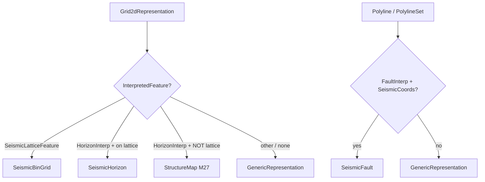
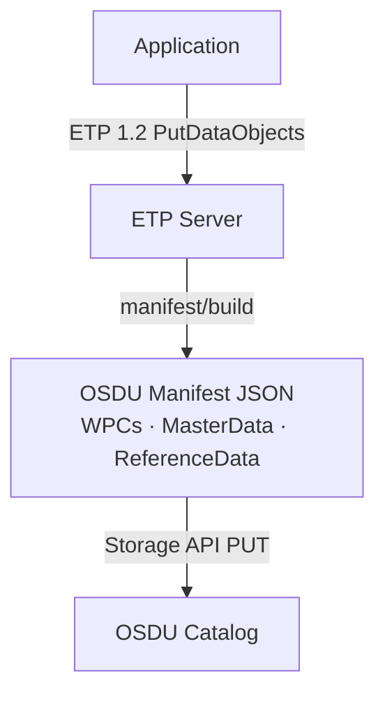

# RESQML → OSDU Manifest: Mapping & Metadata Population Guide

> How to author RESQML/EML objects so the RDDMS manifest converter produces
> rich, consistent, lossless OSDU records — minimising information loss on
> application → ETP → OSDU round-trips.

---

## 1. Complete Type Mapping

> **Direction:** One-way only. RESQML/WITSML → OSDU manifest record. Not reversible.
>
> **RESQML versions:** Both 2.0.1 (`obj_` prefix) and 2.2 are listed. Each has a separate
> converter file (e.g., `FaultInterpretation.ts` + `FaultInterpretation22.ts`).
>
> **Schema versions:** Will vary by target milestone. See `MilestoneKinds.ts` — versions
> shown here are M27 (Venus). Set `RDMS_OSDU_MILESTONE=M26` for Mercury equivalents.

| OSDU Kind (schema version) | RESQML 2.0.1 Type | RESQML 2.2 Type | Routing Condition | Status |
|---|---|---|---|---|
| `master-data--ActivityTemplate:1.1.0` | `obj_ActivityTemplate` | `eml23.ActivityTemplate` | Direct | ✅ |
| `master-data--BoundaryFeature:1.2.0` | — | — | Auto-created from LocalBoundaryFeature converter | ✅ |
| `master-data--SeismicAcquisitionSurvey:1.4.0` | `obj_SeismicLatticeFeature` | `SeismicLatticeFeature` | Direct | ✅ |
| `master-data--Well:1.3.0` | — | `witsml21.Well` | Direct (WITSML) | ✅ |
| `master-data--Wellbore:1.3.0` | — | `witsml21.Wellbore` | Direct (WITSML) | ✅ |
| `reference-data--PropertyType:1.0.0` | `obj_PropertyKind` | `eml23.PropertyKind` | Direct | ✅ |
| `WPC--Activity:1.4.0` | `obj_Activity` | `eml23.Activity` | Direct | ✅ |
| `WPC--BHARunReport:1.3.0` | — | `witsml21.BhaRun` | Direct (WITSML) | ✅ |
| `WPC--ColumnBasedTable:1.3.0` | `obj_StringTableLookup`, `obj_DoubleTableLookup` | `eml23.ColumnBasedTable` | Direct | ✅ |
| `WPC--EarthModelInterpretation:1.2.0` | `obj_EarthModelInterpretation` | `EarthModelInterpretation` | Direct | ✅ |
| `WPC--FaultInterpretation:1.2.0` | `obj_FaultInterpretation` | `FaultInterpretation` | Direct | ✅ |
| `WPC--FluidBoundaryInterpretation:1.2.0` | `obj_FluidBoundaryFeature` | `FluidBoundaryInterpretation` | Direct | ✅ |
| `WPC--FluidsReport:1.3.0` | — | `witsml21.FluidsReport` | Direct (WITSML) | ✅ |
| `WPC--GenericBinGrid:1.0.0` | `obj_Grid2dRepresentation` (no interp) | `Grid2dRepresentation` (no interp) | Grid2d with no interpretation (isochore, DEM, etc.) | ✅ |
| `WPC--GenericProperty:1.2.0` | `obj_CategoricalProperty`, `obj_ContinuousProperty`, `obj_DiscreteProperty` | `ContinuousProperty`, `DiscreteProperty` | Direct (NOT on WellboreFrame) | ✅ |
| `WPC--GenericRepresentation:1.2.0` | `obj_TriangulatedSetRepresentation`, `obj_PointSetRepresentation`, `obj_BlockedWellboreRepresentation` | same | Direct (catch-all) | ✅ |
| `WPC--GenericRepresentation:1.1.0` | `obj_PolylineRepresentation`, `obj_PolylineSetRepresentation` | same | Fallback when NOT SeismicFault | ✅ |
| `WPC--GeologicUnitOccurrenceInterpretation:1.2.0` | `obj_StratigraphicOccurrenceInterpretation` | `StratigraphicOccurrenceInterpretation` | Direct | ✅ |
| `WPC--GeobodyBoundaryInterpretation:1.1.0` | `obj_GeobodyBoundaryInterpretation` | `GeobodyBoundaryInterpretation` | Direct | ✅ |
| `WPC--GeobodyInterpretation:1.3.0` | `obj_GeobodyInterpretation` | `GeobodyInterpretation` | Direct | ✅ |
| `WPC--GridConnectionSetRepresentation:1.2.0` | `obj_GridConnectionSetRepresentation` | `GridConnectionSetRepresentation` | Direct | ✅ |
| `WPC--HorizonControlPoints:1.0.0` | `obj_PointSetRepresentation` + HorizonInterp | `PointSetRepresentation` + HorizonInterp | PointSet with HorizonInterpretation | ✅ |
| `WPC--HorizonInterpretation:1.2.0` | `obj_HorizonInterpretation` | `HorizonInterpretation` | Direct | ✅ |
| `WPC--IjkGridRepresentation:1.2.0` | `obj_IjkGridRepresentation` | `IjkGridRepresentation` | Direct | ✅ |
| `WPC--LocalBoundaryFeature:1.2.0` | `obj_GeneticBoundaryFeature`, `obj_TectonicBoundaryFeature` | `BoundaryFeature` | Direct | ✅ |
| `WPC--LocalModelCompoundCrs:1.2.0` | `obj_LocalDepth3dCrs`, `obj_LocalTime3dCrs` | `eml23.LocalEngineeringCompoundCrs` | Direct | ✅ |
| `WPC--LocalModelFeature:1.2.0` | `obj_OrganizationFeature` | `OrganizationFeature` | Direct | ✅ |
| `WPC--LocalRockVolumeFeature:1.2.0` | `obj_StratigraphicUnitFeature` | `StratigraphicUnitFeature` | Direct | ✅ |
| `WPC--PersistedCollection:1.2.0` | `obj_PropertySet`, `obj_RepresentationSetRepresentation` | `eml23.DataobjectCollection` | Direct | ✅ |
| `WPC--Rig:1.3.0` | — | `witsml21.Rig` | Direct (WITSML) | ✅ |
| `WPC--RockFluidOrganizationInterpretation:1.2.0` | `obj_RockFluidOrganizationInterpretation` | same | Direct | ✅ |
| `WPC--RockFluidUnitInterpretation:1.3.0` | `obj_RockFluidUnitInterpretation` | same | Direct | ✅ |
| `WPC--ReservoirCompartmentInterpretation:1.2.0` | — | `ReservoirCompartmentInterpretation` | Direct (v2.2 only) | ✅ |
| `WPC--SealedSurfaceFramework:1.2.0` | `obj_SealedSurfaceFrameworkRepresentation` | same | Direct | ✅ |
| `WPC--SealedVolumeFramework:1.2.0` | `obj_SealedVolumeFrameworkRepresentation` | same | Direct | ✅ |
| `WPC--SeismicBinGrid:1.3.0` | `obj_Grid2dRepresentation` | `Grid2dRepresentation` | InterpretedFeature is `SeismicLatticeFeature` | ✅ |
| `WPC--SeismicFault:2.0.0` | `obj_PolylineRepresentation`, `obj_PolylineSetRepresentation` | same | FaultInterpretation + SeismicCoordinates | ✅ |
| `WPC--SeismicHorizon:2.0.0` | `obj_Grid2dRepresentation` | `Grid2dRepresentation` | HorizonInterpretation + Z on seismic lattice | ✅ |
| `WPC--SeismicLineGeometry:1.2.0` | `obj_SeismicLineFeature` | — | Direct (v2.0 only) | ✅ |
| `WPC--StratigraphicColumn:1.2.0` | `obj_StratigraphicColumn` | `StratigraphicColumn` | Direct | ✅ |
| `WPC--StratigraphicColumnRankInterpretation:1.3.0` | `obj_StratigraphicColumnRankInterpretation` | same | Direct | ✅ |
| `WPC--StratigraphicUnitInterpretation:1.3.0` | `obj_StratigraphicUnitInterpretation` | same | Direct | ✅ |
| `WPC--StructuralOrganizationInterpretation:1.2.0` | `obj_StructuralOrganizationInterpretation` | same | Direct | ✅ |
| `WPC--StructureMap:1.0.0` | `obj_Grid2dRepresentation` | `Grid2dRepresentation` | HorizonInterpretation + NOT on lattice (M27 only) | ✅ |
| `WPC--SubRepresentation:1.2.0` | `obj_SubRepresentation` | `SubRepresentation` | Direct | ✅ |
| `WPC--TimeSeries:1.2.0` | `obj_TimeSeries` | `TimeSeries` | Direct | ✅ |
| `WPC--Tubular:1.3.0` | — | `witsml21.Tubular` | Direct (WITSML) | ✅ |
| `WPC--UnsealedSurfaceFramework:1.3.1` | `obj_NonSealedSurfaceFrameworkRepresentation` | same | Direct | ✅ |
| `WPC--UnstructuredGridRepresentation:1.2.0` | `obj_UnstructuredGridRepresentation` | same | Direct | ✅ |
| `WPC--WellboreMarkerSet:1.2.0` | `obj_WellboreMarkerFrameRepresentation` | `WellboreIntervalSet` | Direct | ✅ |
| `WPC--WellboreCompletion:1.3.0` | — | `witsml21.WellCompletion` | Direct (WITSML) | ✅ |
| `WPC--WellboreInterpretation:1.2.0` | — | `WellboreInterpretation` | Direct (v2.2 only) | ✅ |
| `WPC--WellboreTrajectory:1.3.0` | — | `WellboreTrajectoryRepresentation`, `witsml21.Trajectory` | Direct | ✅ |
| `WPC--WellLog:1.3.0` | `obj_WellboreFrameRepresentation` + Properties | same, `witsml21.Log` | Frame + attached properties → single WellLog | ✅ |
| `WPC--FluidModel:1.0.0` | — | `prodml23.FluidCharacterization` | Direct (PRODML) | ✅ |
| `WPC--ProductionValues:1.1.1` | — | `prodml23.TimeSeriesData` | Direct (PRODML) | ✅ |
| `master-data--Reservoir:2.0.0` | — | — | MilestoneKinds only (no converter yet) | ⏳ |
| `master-data--ReservoirSegment:2.0.0` | — | — | MilestoneKinds only (no converter yet) | ⏳ |

### Dynamic Routing



### CRS Metadata Enrichment

| OSDU Field | RESQML 2.0.1 Source | RESQML 2.2 Source |
|---|---|---|
| `CoordinateReferenceSystemID` | `ProjectedCrs.EpsgCode` | `OriginProjectedCrs…EpsgCode` |
| `VerticalCoordinateReferenceSystemID` | `VerticalCrs.EpsgCode` | Resolved via DOR |
| `persistableReferenceCrs` | EPSG JSON / WKT from `Unknown` | EPSG JSON / WKT / LocalAuthority |
| `SpatialArea` coordinates | Offset + rotation applied | Offset + azimuth applied |
| `localFrame` (ExtensionProperties) | xOffset, yOffset, zOffset, rotation, uom, Z-dir | same |

### Not Yet Mapped

| OSDU Kind | Source | Notes |
|---|---|---|
| `WPC--VelocityModeling:1.4.0` | Property with velocity PropertyKind | Cross-object detection needed |
| `master-data--Seismic3DInterpretationSet:1.0.0` | SeismicLatticeFeature | One-to-two conflict with SeismicAcquisitionSurvey |

---

## 2. Architecture Overview



The RDDMS manifest converter (`src/lib/jsonTypes/`) reads:

1. **XSD-defined elements** — `Citation`, `InterpretedFeature`, `LocalCrs`,
   `Domain`, geometry arrays, relationship DORs, etc.
2. **`ExtraMetadata`** (RESQML 2.0.1) / **`ExtensionNameValue`** (EML 2.3) —
   free-form name/value pairs with the **`osdu/`** prefix convention.
3. **`OSDUIntegration`** (EML 2.3 only) — dedicated XSD element for OSDU-specific
   spatial and administrative metadata.

Applications that populate these correctly get richer OSDU records without any
converter modification.

---

## 3. XSD Standard Elements — Always Populate These

### 2.1 Citation (mandatory on every data object)

| XSD Element | Maps to OSDU field | Guidance |
|---|---|---|
| `Citation.Title` | `data.Name` | Use a human-meaningful display name, not a UUID or auto-generated token. |
| `Citation.Description` | `data.Description` | One-paragraph purpose statement. Appears in OSDU search. |
| `Citation.Originator` | `createUser` | Person or service account that created the object. |
| `Citation.Editor` | `modifyUser` | Last editor (falls back to Originator). |
| `Citation.Creation` | `createTime` | ISO-8601 creation timestamp. |
| `Citation.LastUpdate` | `modifyTime` | ISO-8601 last modification timestamp. |
| `Citation.Format` | `data.ExtensionProperties.AuthoringSoftware` | **Critical for provenance.** Use format: `CompanyName SoftwareName vX.Y.Z` (e.g. `Schlumberger Petrel 2024.1`). |

### 2.2 InterpretedFeature (Interpretations)

All interpretation objects (`HorizonInterpretation`, `FaultInterpretation`,
`StratigraphicUnitInterpretation`, etc.) reference an interpreted feature.

- Always create the Feature object **before** the Interpretation.
- Use `DataObjectReference` with correct `ContentType` (v2.0) or `QualifiedType` (v2.2).
- The converter resolves `data.FeatureID` from this DOR and also extracts
  age information (`AbsoluteAge.YearOffset`) from GeneticBoundaryFeature.

### 2.3 LocalCrs (all geometry-bearing representations)

| Element | Converter use |
|---|---|
| `ProjectedCrs.EpsgCode` | Resolves `CoordinateReferenceSystemID`, enables WGS84 conversion, produces `SpatialPoint` + `SpatialArea` |
| `XOffset`, `YOffset`, `ZOffset` | Applied as local→projected CRS transform, stored in `ExtensionProperties.rddms/localFrame/*` |
| `ArealRotation` | Inverse-rotated for projected coordinates; stored in ExtensionProperties |
| `VerticalCrs.EpsgCode` | Stored in `VerticalCoordinateReferenceSystemID` |
| `ZIncreasingDownward` | Propagated to ExtensionProperties for round-trip |

**Best practice**: Always use a **well-known EPSG code** for projected CRS.
If you use `ProjectedUnknownCrs`, the converter cannot perform WGS84 conversion
and OSDU spatial search will be degraded.

### 2.4 Geometry Arrays

For representations (IjkGrid, Grid2d, TriangulatedSet, PolylineSet, etc.):

- Store point coordinates in HDF5 (`DoubleHdf5Array` / `FloatingPointExternalArray`).
- The converter reads the bounding box to produce `SpatialArea` (polygon) and
  `SpatialPoint` (first point) in both local and WGS84 coordinate systems.
- **Node count** is derived from array dimensions → `data.NodeCount`.

### 2.5 Domain

Explicitly set `Domain` on interpretations (`mixed`, `depth`, `time`).
Maps to `data.DomainTypeID` reference data.

### 2.6 Relationship DORs (DataObjectReference)

Every `DataObjectReference` the converter traverses becomes an OSDU SRN link.
Ensure DORs have:
- Correct `UUID` / `Uuid`
- Correct `ContentType` (v2.0) or `QualifiedType` (v2.2)
- Non-null `Title` (used for name resolution fallback)

---

## 4. ExtraMetadata Convention — `osdu/` Prefix

### 3.1 Mechanism

RESQML 2.0.1 objects have:

```xml
<ExtraMetadata>
  <NameValuePair>
    <Name>osdu/data/SequenceStratigraphySurfaceTypeID</Name>
    <Value>opendes:reference-data--SequenceStratigraphySurfaceType:MaximumFloodingSurface:</Value>
  </NameValuePair>
</ExtraMetadata>
```

EML 2.3 objects use `ExtensionNameValue`:

```xml
<ExtensionNameValue>
  <Name>osdu/data/SequenceStratigraphySurfaceTypeID</Name>
  <Value>opendes:reference-data--SequenceStratigraphySurfaceType:MaximumFloodingSurface:</Value>
</ExtensionNameValue>
```

### 3.2 Path Resolution Rules

The converter's `assignExtraMetaData()` method:

1. Strips the `osdu/` prefix.
2. Walks the remaining path as nested object keys on the OSDU record.
3. If the path is valid on the record prototype → sets the value directly.
4. If the path is **not** valid → stores in `data.ExtensionProperties` as a flat key.
5. JSON values are auto-parsed; strings remain as strings.
6. **Non-`osdu/` entries** are preserved in `data.ExtensionProperties.ResqmlMetadata` for lossless round-trip (not discarded).

### 3.3 Non-osdu Metadata Preservation

Any `ExtraMetadata` / `ExtensionNameValue` entry that does NOT start with `osdu/` is stored under:

```json
{
  "data": {
    "ExtensionProperties": {
      "ResqmlMetadata": {
        "CustomField": "value",
        "MyApp.BuildVersion": "3.2.1"
      },
      "AuthoringSoftware": "Petrel 2024.1"
    }
  }
}
```

This enables lossless round-trip of application-specific metadata that doesn't map to any OSDU schema field.

### 3.4 Recommended `osdu/` Keys

| ExtraMetadata Name | OSDU Target | Type | Example Value |
|---|---|---|---|
| `osdu/data/Name` | `data.Name` | string | Override Citation.Title |
| `osdu/data/Description` | `data.Description` | string | Override Citation.Description |
| `osdu/data/Source` | `data.Source` | string | `"Petrel Project: Drogon_2024"` |
| `osdu/data/ResourceSecurityClassification` | `data.ResourceSecurityClassification` | string | `"Restricted"` |
| `osdu/data/ResourceLifecycleStatus` | `data.ResourceLifecycleStatus` | string | `"Created"` |
| `osdu/data/TechnicalAssuranceID` | `data.TechnicalAssuranceID` | string | SRN to TechnicalAssuranceType |
| `osdu/data/ExistenceKind` | `data.ExistenceKind` | string | SRN: `partition:reference-data--ExistenceKind:Actual:` |
| `osdu/data/GeoContexts` | `data.GeoContexts` | JSON array | `[{"GeoPoliticalEntityID":"...","GeoTypeID":"..."}]` |
| `osdu/data/LineageAssertions` | `data.LineageAssertions` | JSON array | `[{"ID":"partition:wpc--...:uuid:"}]` |
| `osdu/tags/project` | `tags.project` | string | `"Drogon Phase 2"` |
| `osdu/tags/discipline` | `tags.discipline` | string | `"ReservoirModeling"` |

### 3.4 Type-Specific Keys

#### Horizon Interpretation

| Key | Purpose |
|---|---|
| `osdu/data/SequenceStratigraphySurfaceTypeID` | Override auto-detected sequence strat type |
| `osdu/data/StratigraphicRoleTypeID` | Override default `Chronostratigraphic` |
| `osdu/data/isConformableAbove` | Boolean override |
| `osdu/data/isConformableBelow` | Boolean override |

#### Stratigraphic Unit Interpretation

| Key | Purpose |
|---|---|
| `osdu/data/DepositionGeometryTypeID` | Override auto-detected deposition mode |
| `osdu/data/MaximumThickness` | Override XML MaxThickness |
| `osdu/data/MinimumThickness` | Override XML MinThickness |
| `osdu/data/ColumnStratigraphicHorizonTopID` | Explicit top horizon SRN |
| `osdu/data/ColumnStratigraphicHorizonBaseID` | Explicit base horizon SRN |

#### IjkGrid Representation

| Key | Purpose |
|---|---|
| `osdu/data/NI` | Grid I dimension |
| `osdu/data/NJ` | Grid J dimension |
| `osdu/data/NK` | Grid K dimension |
| `osdu/data/KDirectionTypeID` | Reference to KDirectionType |
| `osdu/data/PillarShapeTypeID` | Reference to PillarShapeType |
| `osdu/data/GeometryTypeID` | Grid geometry type |
| `osdu/data/GapCount` | Number of gaps |
| `osdu/data/ColumnCount` | Total column count |

**Auto-populated fields (no ExtraMetadata needed):**
- `RealizationIndex` — from `AbstractRepresentation.RealizationIndex`
- `ParentGridID` — resolved from `ParentWindow.ParentIjkGridRepresentation` DOR
- `RockFluidOrganizationInterpretationIDS` — from `CellFluidPhaseUnits.FluidOrganization`
- `HasTruncations` — detected from `TruncationCells` (v2.0) / `TruncationCellPatch` (v2.2)

#### Generic Properties

| Key | Purpose |
|---|---|
| `osdu/data/PropertyTypeID` | Override auto-resolved PropertyType SRN |
| `osdu/data/FacetTypeID` | Facet reference data |
| `osdu/data/IndexableElementTypeID` | Indexable element reference |

**Auto-populated fields (no ExtraMetadata needed):**
- `FacetIDs` — mapped from `xml.Facet[]` → `{ FacetRoleID, FacetTypeID }` reference-data SRNs
- `RealizationIndices` (v2.2) — from `xml.RealizationIndices`
- `TimeIndices` / `TimeSeriesID` (v2.2) — from `xml.TimeOrIntervalSeries`

---

## 5. OSDUIntegration Element (EML 2.3 / RESQML 2.2 Only)

EML 2.3 defines a dedicated `OSDUIntegration` XSD element on `AbstractObject`:

```xml
<OSDUIntegration>
  <WGS84Latitude Uom="dega">58.44</WGS84Latitude>
  <WGS84Longitude Uom="dega">1.89</WGS84Longitude>
  <Country>Norway</Country>
  <Field>Drogon</Field>
  <Basin>Northern North Sea</Basin>
  <Block>15/9</Block>
  <Play>Jurassic</Play>
  <Region>North Sea</Region>
  <LineageAssertions>
    <ID>opendes:work-product-component--HorizonInterpretation:uuid1:</ID>
  </LineageAssertions>
</OSDUIntegration>
```

### Supported Fields

| XSD Element | OSDU Mapping | Notes |
|---|---|---|
| `WGS84Latitude` | `SpatialPoint.Wgs84Coordinates` | Pre-computed WGS84 point (bypasses CRS conversion) |
| `WGS84Longitude` | `SpatialPoint.Wgs84Coordinates` | Pre-computed WGS84 point |
| `WGS84LocationMetadata` | Enhanced spatial context | Additional spatial metadata |
| `Country` | `data.GeoContexts[].GeoPoliticalEntityID` | Geo-political context |
| `Field` | Informational / tags | OSDU Field master-data link |
| `Basin` | Informational / tags | Sedimentary basin name |
| `Block` | Informational / tags | License block |
| `Play` | Informational / tags | Petroleum play |
| `Region` | Informational / tags | Geographic region |
| `LineageAssertions` | `data.LineageAssertions` | Direct OSDU SRN references |
| `LegalTags` | `legal.legaltags` | Pre-set legal compliance tags |
| `OwnerGroup` | `acl.owners` | Pre-set ACL owner groups |
| `ViewerGroup` | `acl.viewers` | Pre-set ACL viewer groups |

### When to use OSDUIntegration vs ExtraMetadata

| Scenario | Preferred Method |
|---|---|
| Pre-computed WGS84 coordinates | `OSDUIntegration` (typed, validated) |
| Geo-political context (country, field) | `OSDUIntegration` |
| ACL / Legal override | `OSDUIntegration` |
| OSDU-specific data fields not in XSD | `ExtraMetadata` with `osdu/` prefix |
| Arbitrary OSDU tags | `ExtraMetadata` with `osdu/tags/` prefix |
| RESQML 2.0.1 objects (no OSDUIntegration XSD) | `ExtraMetadata` only |

---

## 6. Application Best Practices

### 5.1 Naming Convention

```
Citation.Title = "<TypeName> - <MeaningfulIdentifier>"
Examples:
  "Top Draupne Horizon - Drogon_2024_Base"
  "IjkGrid - Drogon_Geomodel_v3"
  "Continuous Property - PORO - Drogon_Geomodel_v3"
```

Avoid: auto-generated UUIDs, internal array indices, or application-internal
identifiers as Title.

### 5.2 Always Populate Citation.Format

This is the **only** way to record authoring provenance:

```xml
<Citation>
  <Format>MyApp 2026</Format>
</Citation>
```

The converter stores this in `data.ExtensionProperties.AuthoringSoftware`.

### 5.3 Use Activities for Lineage

Create `Activity` + `ActivityTemplate` objects to record which objects were
inputs and which were outputs of a modelling step. The converter traces
activity chains to populate `ancestry.parents[]` on OSDU records.

```
ActivityTemplate: "Horizon Picking"
  Parameter: SeismicCube (Input)
  Parameter: WellTops (Input)
  Parameter: HorizonInterpretation (Output)

Activity: "HP_Drogon_Top_Draupne_2024-03"
  Parameter[SeismicCube]: DOR → SeismicCube
  Parameter[WellTops]: DOR → MarkerSet
  Parameter[HorizonInterpretation]: DOR → HorizonInterpretation (output)
```

### 5.4 Reference Data Completeness

The converter auto-generates reference data stubs when `createMissingReferences: true`.
However, applications should populate enum-like fields explicitly for richer records:

| RESQML Element | Converter reads | OSDU Reference Data |
|---|---|---|
| `xml.Domain` | `"depth"`, `"time"`, `"mixed"` | `reference-data--DomainType` |
| `xml.DepositionMode` | `"proportional between top and bottom"` | `reference-data--DepositionGeometryType` |
| `xml.SequenceStratigraphySurface` | `"maximum flooding surface"` | `reference-data--SequenceStratigraphySurfaceType` |
| `xml.BoundaryRelation[]` | `"conformable"`, `"unconformable above"` | Derived `isConformableAbove/Below` |
| `xml.OrderingCriteria` | `"age"`, `"apparent depth"` | `reference-data--StratigraphicRoleType` |

### 5.5 ExtraMetadata for Fields the XSD Cannot Express

Many OSDU schema fields have no XSD equivalent. Use ExtraMetadata to bridge:

```xml
<!-- RESQML 2.0.1 -->
<ExtraMetadata>
  <!-- Set the ExistenceKind to "Actual" instead of default "Prototype" -->
  <NameValuePair>
    <Name>osdu/data/ExistenceKind</Name>
    <Value>opendes:reference-data--ExistenceKind:Actual:</Value>
  </NameValuePair>

  <!-- Add a Source provenance string -->
  <NameValuePair>
    <Name>osdu/data/Source</Name>
    <Value>Petrel Project: Drogon_Phase2_2024</Value>
  </NameValuePair>

  <!-- Tag the record for project filtering -->
  <NameValuePair>
    <Name>osdu/tags/project</Name>
    <Value>Drogon Phase 2</Value>
  </NameValuePair>

  <!-- Provide GeoContexts as JSON -->
  <NameValuePair>
    <Name>osdu/data/GeoContexts</Name>
    <Value>[{"GeoPoliticalEntityID":"opendes:master-data--GeoPoliticalEntity:Norway:","GeoTypeID":"opendes:reference-data--GeoPoliticalEntityType:Country:"}]</Value>
  </NameValuePair>

  <!-- Structured JSON for OSDUIntegration (v2.0.1 workaround) -->
  <NameValuePair>
    <Name>OSDUIntegration</Name>
    <Value>{"WGS84Latitude":58.44,"WGS84Longitude":1.89,"Country":"Norway","Field":"Drogon"}</Value>
  </NameValuePair>
</ExtraMetadata>
```

### 5.6 CRS Best Practices for Spatial Richness

| Practice | Benefit |
|---|---|
| Use EPSG codes (not `UnknownCrs`) | Enables WGS84 conversion → `SpatialArea` + `SpatialPoint` |
| Set `ArealRotation` correctly (with `Uom` attribute) | Correct bounding box in projected coords |
| Set `XOffset`/`YOffset` | Local-to-projected transform applied for search indexing |
| Populate `VerticalCrs.EpsgCode` | `VerticalCoordinateReferenceSystemID` on OSDU spatial |

### 5.7 UUID Stability

- Use **deterministic UUIDs** for the same conceptual object across exports.
- The OSDU record `id` is derived from the RESQML `Uuid` field.
- Re-exporting with the same UUID overwrites (version bump); new UUID creates duplicates.

---

## 7. Common Pitfalls — Information Loss

| Pitfall | OSDU Impact | Fix |
|---|---|---|
| Empty `Citation.Description` | `data.Description` is null → poor search discoverability | Always write a description |
| `Citation.Format` = `""` or missing | No authoring software provenance | Set to `"Vendor Product vX.Y"` |
| Using `ProjectedUnknownCrs` | No WGS84 conversion, no `SpatialArea` | Use EPSG code |
| Missing `InterpretedFeature` DOR | No `FeatureID` link, no age extraction | Always reference the feature |
| Broken DOR (wrong ContentType/UUID) | Converter silently drops the link | Validate DORs before export |
| No `Activity` objects | Empty `ancestry.parents[]` | Create Activity chains for lineage |
| Enum fields left as default/empty | Reference data IDs are `undefined` in OSDU | Set `Domain`, `DepositionMode`, etc. |
| `ExtraMetadata` without `osdu/` prefix | Ignored by converter (not mapped) | Use `osdu/data/...` path |
| Large numeric values in `ExtraMetadata` | Stored as strings, not numbers | Wrap in JSON: `"42"` parses to number |

---

## 8. Round-Trip Fidelity Checklist

For a lossless application → ETP → OSDU → application round-trip:

- [ ] `Citation.Title` is meaningful and stable
- [ ] `Citation.Description` is populated
- [ ] `Citation.Format` identifies the authoring software
- [ ] `Citation.Originator` and `Citation.Editor` are set
- [ ] All DORs (`InterpretedFeature`, `LocalCrs`, etc.) are valid and resolvable
- [ ] `LocalCrs` uses EPSG codes for projected and vertical CRS
- [ ] `Domain` is explicitly set on interpretations
- [ ] `ExtraMetadata` with `osdu/` prefix covers any OSDU-only fields needed
- [ ] `OSDUIntegration` (EML 2.3) has WGS84 coords and geo-political context
- [ ] Activity/ActivityTemplate chain exists for modelling provenance
- [ ] UUIDs are stable across re-exports of the same conceptual object
- [ ] Enum-valued XSD fields (`BoundaryRelation`, `DepositionMode`, etc.) are populated

---

## 9. Converter Field Mapping Summary

The converter extracts metadata through four abstract base methods, then type-specific logic, then ExtraMetadata override:

```
┌─ AbstractCommonResources ─────────────────────────────┐
│  ExistenceKind, ResourceLifecycleStatus, Source,      │
│  TechnicalAssuranceID, ResourceSecurityClassification │
└───────────────────────────────────────────────────────┘
          ↓
┌─ AbstractWPCGroupType ────────────────────────────────┐
│  DDMSDatasets (ETP URI), IsDiscoverable,              │
│  NameAliases, TechnicalAssurances                     │
└───────────────────────────────────────────────────────┘
          ↓
┌─ AbstractWorkProductComponent ────────────────────────┐
│  Name (← Citation.Title), Description,               │
│  CreationDateTime, SubmitterName, SpatialArea/Point   │
└───────────────────────────────────────────────────────┘
          ↓
┌─ AbstractInterpretation (interpretations only) ───────┐
│  DomainTypeID (← Domain), FeatureID (← DOR),         │
│  OlderPossibleAge, YoungerPossibleAge                 │
└───────────────────────────────────────────────────────┘
          ↓
┌─ Type-specific fields ────────────────────────────────┐
│  (varies by converter — e.g. NI/NJ/NK for IjkGrid)   │
└───────────────────────────────────────────────────────┘
          ↓
┌─ assignExtraMetaData() ───────────────────────────────┐
│  All ExtraMetadata with "osdu/" prefix are applied    │
│  as overrides on the fully-built record               │
└───────────────────────────────────────────────────────┘
```

---

## 10. Version Differences: RESQML 2.0.1 vs 2.2

| Mechanism | RESQML 2.0.1 | RESQML 2.2 (EML 2.3) |
|---|---|---|
| Free-form metadata | `ExtraMetadata` (`NameValuePair[]`) | `ExtensionNameValue[]` |
| OSDU-specific XSD | Not available — use `ExtraMetadata` | `OSDUIntegration` element |
| DOR format | `ContentType` + `UUID` | `QualifiedType` + `Uuid` |
| CRS | `obj_LocalDepth3dCrs` / `obj_LocalTime3dCrs` | `eml23.LocalEngineeringCompoundCrs` |
| Age | `GeneticBoundaryFeature.AbsoluteAge.YearOffset` | `BoundaryFeatureInterpretation.AbsoluteAge.AgeOffsetAttribute` |
| Activity | `obj_Activity` / `obj_ActivityTemplate` | `eml23.Activity` / `eml23.ActivityTemplate` |
| Prefix for obj types | `obj_HorizonInterpretation` | `HorizonInterpretation` |

---

## 11. Reference: OSDU Schema Versions by Milestone

The converter supports both M26 (Mercury) and M27 (Venus) schema versions,
controlled by `RDMS_OSDU_MILESTONE` environment variable. Schema version
determines the `:X.Y.Z` suffix in `kind` strings. See `MilestoneKinds.ts` for
the complete mapping.

Common patterns:
- M26: `osdu:wks:work-product-component--HorizonInterpretation:1.1.0`
- M27: `osdu:wks:work-product-component--HorizonInterpretation:1.2.0`

Applications should **not** hard-code schema versions in ExtraMetadata SRN values.
Use the partition and type path only; the converter resolves versions at runtime.

---

## Appendix A: Full ExtraMetadata Example (RESQML 2.0.1)

```xml
<?xml version="1.0" encoding="UTF-8"?>
<obj_HorizonInterpretation
    xmlns="http://www.energistics.org/energyml/data/resqmlv2"
    uuid="a1b2c3d4-e5f6-7890-abcd-ef1234567890"
    schemaVersion="2.0">
  <Citation>
    <Title>Top Draupne - Drogon Base Case 2024</Title>
    <Originator>john.doe@company.com</Originator>
    <Creation>2024-03-15T10:30:00Z</Creation>
    <Format>Schlumberger Petrel 2024.1</Format>
    <Editor>jane.smith@company.com</Editor>
    <LastUpdate>2024-06-01T14:22:00Z</LastUpdate>
    <Description>Top Draupne horizon interpretation for the Drogon field,
      base case scenario. Picked on ST0243R08 3D seismic survey with
      well tie from 15/9-F-1 and 15/9-F-4.</Description>
  </Citation>
  <Domain>depth</Domain>
  <InterpretedFeature>
    <ContentType>application/x-resqml+xml;version=2.0;type=obj_GeneticBoundaryFeature</ContentType>
    <Title>Top Draupne</Title>
    <UUID>11111111-2222-3333-4444-555555555555</UUID>
  </InterpretedFeature>
  <SequenceStratigraphySurface>maximum flooding surface</SequenceStratigraphySurface>
  <BoundaryRelation>conformable</BoundaryRelation>
  <ExtraMetadata>
    <NameValuePair>
      <Name>osdu/data/ExistenceKind</Name>
      <Value>opendes:reference-data--ExistenceKind:Actual:</Value>
    </NameValuePair>
    <NameValuePair>
      <Name>osdu/data/Source</Name>
      <Value>Petrel Project: Drogon_BaseCase_2024</Value>
    </NameValuePair>
    <NameValuePair>
      <Name>osdu/data/ResourceLifecycleStatus</Name>
      <Value>Created</Value>
    </NameValuePair>
    <NameValuePair>
      <Name>osdu/tags/project</Name>
      <Value>Drogon Phase 2</Value>
    </NameValuePair>
    <NameValuePair>
      <Name>osdu/tags/discipline</Name>
      <Value>StructuralGeology</Value>
    </NameValuePair>
    <NameValuePair>
      <Name>OSDUIntegration</Name>
      <Value>{"WGS84Latitude":58.44,"WGS84Longitude":1.89,"Country":"Norway","Field":"Drogon","Basin":"Northern North Sea","Block":"15/9"}</Value>
    </NameValuePair>
  </ExtraMetadata>
</obj_HorizonInterpretation>
```

## Appendix B: EML 2.3 / RESQML 2.2 Example

```xml
<HorizonInterpretation
    xmlns="http://www.energistics.org/energyml/data/resqmlv2"
    xmlns:eml="http://www.energistics.org/energyml/data/commonv2"
    uuid="a1b2c3d4-e5f6-7890-abcd-ef1234567890"
    schemaVersion="2.2">
  <eml:Citation>
    <eml:Title>Top Draupne - Drogon Base Case 2024</eml:Title>
    <eml:Originator>john.doe@company.com</eml:Originator>
    <eml:Creation>2024-03-15T10:30:00Z</eml:Creation>
    <eml:Format>AspenTech SKUA-GOCAD 2023.1</eml:Format>
    <eml:Editor>jane.smith@company.com</eml:Editor>
    <eml:LastUpdate>2024-06-01T14:22:00Z</eml:LastUpdate>
    <eml:Description>Top Draupne horizon interpretation for the Drogon field.</eml:Description>
  </eml:Citation>
  <eml:OSDUIntegration>
    <eml:WGS84Latitude Uom="dega">58.44</eml:WGS84Latitude>
    <eml:WGS84Longitude Uom="dega">1.89</eml:WGS84Longitude>
    <eml:Country>Norway</eml:Country>
    <eml:Field>Drogon</eml:Field>
    <eml:Basin>Northern North Sea</eml:Basin>
    <eml:Block>15/9</eml:Block>
    <eml:Region>North Sea</eml:Region>
    <eml:LineageAssertions>
      <eml:ID>opendes:work-product-component--SeismicHorizon:seismic-uuid:</eml:ID>
    </eml:LineageAssertions>
  </eml:OSDUIntegration>
  <eml:ExtensionNameValue>
    <eml:Name>osdu/data/ExistenceKind</eml:Name>
    <eml:Value>opendes:reference-data--ExistenceKind:Actual:</eml:Value>
  </eml:ExtensionNameValue>
  <eml:ExtensionNameValue>
    <eml:Name>osdu/data/Source</eml:Name>
    <eml:Value>MyApp Project: Drogon_2024</eml:Value>
  </eml:ExtensionNameValue>
  <Domain>depth</Domain>
  <InterpretedFeature>
    <QualifiedType>resqml22.BoundaryFeature</QualifiedType>
    <Title>Top Draupne</Title>
    <Uuid>11111111-2222-3333-4444-555555555555</Uuid>
  </InterpretedFeature>
  <SequenceStratigraphySurface>maximum flooding surface</SequenceStratigraphySurface>
  <BoundaryRelation>conformable</BoundaryRelation>
</HorizonInterpretation>
```
