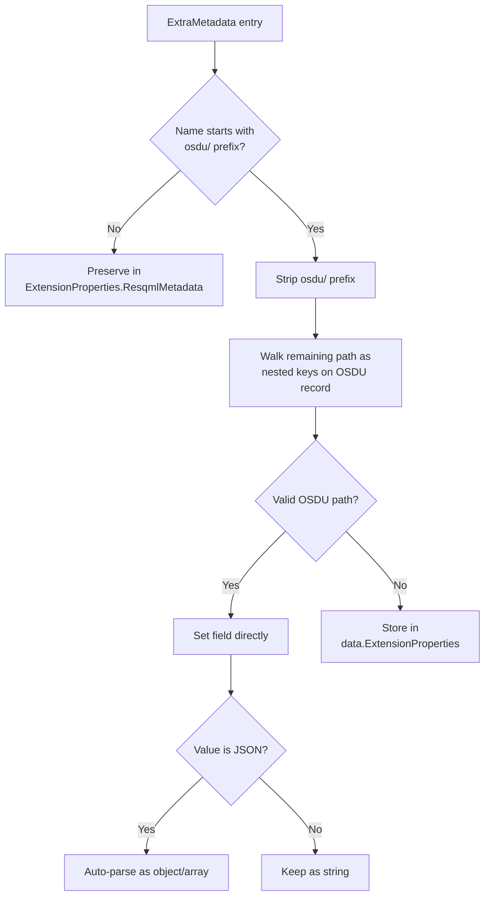
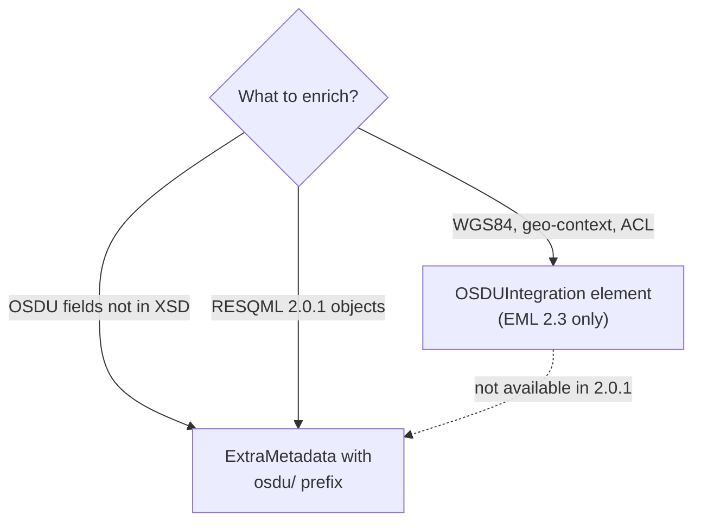
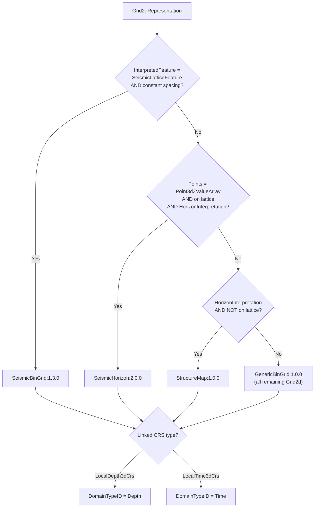
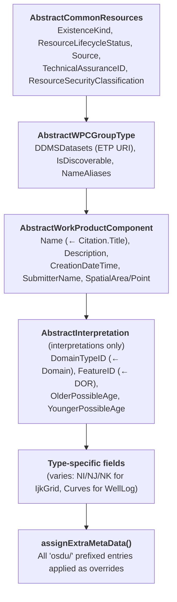

# RESQML → OSDU Manifest: Mapping Guide

> How to author RESQML/EML objects so the RDDMS manifest converter produces
> rich, lossless OSDU records - minimising information loss on
> application → ETP → OSDU round-trips.

---

## 1. Essential: Always Populate These

### Citation (mandatory on every data object)

| XSD Element            | OSDU Field                              | Guidance                                         |
| ---------------------- | --------------------------------------- | ------------------------------------------------ |
| `Citation.Title`       | `data.Name`                             | Human-meaningful display name, not UUID          |
| `Citation.Description` | `data.Description`                      | One-paragraph purpose. Appears in search.        |
| `Citation.Format`      | `ExtensionProperties.AuthoringSoftware` | `"Vendor Product vX.Y"` - only provenance source |
| `Citation.Originator`  | `createUser`                            | Person or service account                        |
| `Citation.Creation`    | `createTime`                            | ISO-8601                                         |
| `Citation.LastUpdate`  | `modifyTime`                            | ISO-8601                                         |

### LocalCrs (all geometry-bearing representations)

| Element                         | Effect                                                                        |
| ------------------------------- | ----------------------------------------------------------------------------- |
| `ProjectedCrs.EpsgCode`         | Enables WGS84 conversion → `SpatialArea` + `SpatialPoint` for OSDU search     |
| `XOffset`, `YOffset`, `ZOffset` | Local→projected transform, stored in `ExtensionProperties.rddms/localFrame/*` |
| `ArealRotation`                 | Inverse-rotated for projected coords                                          |
| `VerticalCrs.EpsgCode`          | `VerticalCoordinateReferenceSystemID`                                         |

**Always use EPSG codes.** `ProjectedUnknownCrs` disables WGS84 conversion and spatial search.

### InterpretedFeature (all interpretations)

Create the Feature object **before** the Interpretation. Use `DataObjectReference` with correct `ContentType`/`QualifiedType`. The converter resolves `data.FeatureID` and extracts age info.

### Domain

Set `Domain` explicitly (`"depth"`, `"time"`, `"mixed"`) on interpretations → maps to `data.DomainTypeID`.

### Relationship DORs

Every `DataObjectReference` becomes an OSDU SRN link. Ensure correct UUID, ContentType/QualifiedType, and non-null Title.

---

## 2. ExtraMetadata Convention - `osdu/` Prefix

### Mechanism

RESQML 2.0.1:

```xml
<ExtraMetadata>
  <NameValuePair>
    <Name>osdu/data/ExistenceKind</Name>
    <Value>opendes:reference-data--ExistenceKind:Actual:</Value>
  </NameValuePair>
</ExtraMetadata>
```

EML 2.3:

```xml
<ExtensionNameValue>
  <Name>osdu/data/ExistenceKind</Name>
  <Value>opendes:reference-data--ExistenceKind:Actual:</Value>
</ExtensionNameValue>
```

### Resolution Rules



### Common `osdu/` Keys

| Key                                 | OSDU Target                    | Example                                           |
| ----------------------------------- | ------------------------------ | ------------------------------------------------- |
| `osdu/data/ExistenceKind`           | `data.ExistenceKind`           | `"opendes:reference-data--ExistenceKind:Actual:"` |
| `osdu/data/Source`                  | `data.Source`                  | `"Petrel Project: Drogon_2024"`                   |
| `osdu/data/ResourceLifecycleStatus` | `data.ResourceLifecycleStatus` | `"Created"`                                       |
| `osdu/data/GeoContexts`             | `data.GeoContexts`             | JSON array                                        |
| `osdu/data/LineageAssertions`       | `data.LineageAssertions`       | JSON array of SRNs                                |
| `osdu/tags/project`                 | `tags.project`                 | `"Drogon Phase 2"`                                |
| `osdu/tags/discipline`              | `tags.discipline`              | `"ReservoirModeling"`                             |

---

## 3. OSDUIntegration Element (EML 2.3 only)

```xml
<OSDUIntegration>
  <WGS84Latitude Uom="dega">58.44</WGS84Latitude>
  <WGS84Longitude Uom="dega">1.89</WGS84Longitude>
  <Country>Norway</Country>
  <Field>Drogon</Field>
  <Basin>Northern North Sea</Basin>
  <Block>15/9</Block>
  <LineageAssertions>
    <ID>opendes:work-product-component--HorizonInterpretation:uuid1:</ID>
  </LineageAssertions>
</OSDUIntegration>
```

| Element                            | OSDU Mapping                                              |
| ---------------------------------- | --------------------------------------------------------- |
| `WGS84Latitude/Longitude`          | `SpatialPoint.Wgs84Coordinates` (bypasses CRS conversion) |
| `Country/Field/Basin/Block/Region` | `GeoContexts[]` / tags                                    |
| `LineageAssertions`                | `data.LineageAssertions`                                  |
| `LegalTags`                        | `legal.legaltags`                                         |
| `OwnerGroup/ViewerGroup`           | `acl.owners` / `acl.viewers`                              |



---

## 4. Complete Type Mapping

### Structural & Spatial Representations

| OSDU Kind                         | RESQML Source (v2.0.1 / v2.2)                               | Routing                        |
| --------------------------------- | ----------------------------------------------------------- | ------------------------------ |
| `IjkGridRepresentation`           | `obj_IjkGridRepresentation`                                 | Direct                         |
| `UnstructuredGridRepresentation`  | `obj_UnstructuredGridRepresentation`                        | Direct                         |
| `GridConnectionSetRepresentation` | `obj_GridConnectionSetRepresentation`                       | Direct                         |
| `SubRepresentation`               | `obj_SubRepresentation`                                     | Direct                         |
| `SealedSurfaceFramework`          | `obj_SealedSurfaceFrameworkRepresentation`                  | Direct                         |
| `SealedVolumeFramework`           | `obj_SealedVolumeFrameworkRepresentation`                   | Direct                         |
| `UnsealedSurfaceFramework`        | `obj_NonSealedSurfaceFrameworkRepresentation`               | Direct                         |
| `StructureMap`                    | `obj_Grid2dRepresentation`                                  | HorizonInterp + NOT on lattice |
| `HorizonControlPoints`            | `obj_PointSetRepresentation`                                | PointSet + HorizonInterp       |
| `LocalModelCompoundCrs`           | `obj_LocalDepth3dCrs` / `eml23.LocalEngineeringCompoundCrs` | Direct                         |

### Geological Interpretations

| OSDU Kind                               | Source                                      | Routing |
| --------------------------------------- | ------------------------------------------- | ------- |
| `EarthModelInterpretation`              | `obj_EarthModelInterpretation`              | Direct  |
| `FaultInterpretation`                   | `obj_FaultInterpretation`                   | Direct  |
| `HorizonInterpretation`                 | `obj_HorizonInterpretation`                 | Direct  |
| `GeobodyInterpretation`                 | `obj_GeobodyInterpretation`                 | Direct  |
| `GeobodyBoundaryInterpretation`         | `obj_GeobodyBoundaryInterpretation`         | Direct  |
| `StructuralOrganizationInterpretation`  | `obj_StructuralOrganizationInterpretation`  | Direct  |
| `RockFluidOrganizationInterpretation`   | `obj_RockFluidOrganizationInterpretation`   | Direct  |
| `RockFluidUnitInterpretation`           | `obj_RockFluidUnitInterpretation`           | Direct  |
| `FluidBoundaryInterpretation`           | `obj_FluidBoundaryFeature` / v2.2           | Direct  |
| `ReservoirCompartmentInterpretation`    | v2.2 only                                   | Direct  |
| `GeologicUnitOccurrenceInterpretation`  | `obj_StratigraphicOccurrenceInterpretation` | Direct  |
| `StratigraphicColumn`                   | `obj_StratigraphicColumn`                   | Direct  |
| `StratigraphicColumnRankInterpretation` | `obj_StratigraphicColumnRankInterpretation` | Direct  |
| `StratigraphicUnitInterpretation`       | `obj_StratigraphicUnitInterpretation`       | Direct  |

### Features & Reference Data

| OSDU Kind                      | Source                                                                              | Routing                                        |
| ------------------------------ | ----------------------------------------------------------------------------------- | ---------------------------------------------- |
| `LocalBoundaryFeature`         | `obj_GeneticBoundaryFeature`, `obj_TectonicBoundaryFeature`, v2.2 `BoundaryFeature` | Direct                                         |
| `master-data--BoundaryFeature` | -                                                                                   | Auto-created by LocalBoundaryFeature converter |
| `LocalModelFeature`            | `obj_OrganizationFeature`                                                           | Direct                                         |
| `LocalRockVolumeFeature`       | `obj_StratigraphicUnitFeature` / `RockVolumeFeature`                                | Direct                                         |
| `reference-data--PropertyType` | `obj_PropertyKind` / `eml23.PropertyKind`                                           | Direct                                         |

### Seismic

| OSDU Kind                               | Source                           | Routing                                     |
| --------------------------------------- | -------------------------------- | ------------------------------------------- |
| `master-data--SeismicAcquisitionSurvey` | `obj_SeismicLatticeFeature`      | Direct                                      |
| `SeismicBinGrid`                        | `obj_Grid2dRepresentation`       | InterpretedFeature is SeismicLatticeFeature |
| `SeismicHorizon`                        | `obj_Grid2dRepresentation`       | HorizonInterp + Z on seismic lattice        |
| `SeismicFault`                          | `obj_PolylineRepresentation/Set` | FaultInterp + SeismicCoordinates            |
| `SeismicLineGeometry`                   | `obj_SeismicLineFeature`         | v2.0.1 only                                 |

### Generic & Catch-All

| OSDU Kind               | Source                                                                                 | Routing                       |
| ----------------------- | -------------------------------------------------------------------------------------- | ----------------------------- |
| `GenericRepresentation` | TriangulatedSet, PointSet, BlockedWellbore, Polyline/Set                               | Fallback                      |
| `GenericBinGrid`        | `obj_Grid2dRepresentation`                                                             | All remaining Grid2d (with or without interpretation) |
| `GenericProperty`       | Continuous/Discrete/CategoricalProperty                                                | NOT on WellboreFrame          |
| `ColumnBasedTable`      | `obj_StringTableLookup`, `obj_DoubleTableLookup`, `eml23.ColumnBasedTable`             | Direct                        |
| `PersistedCollection`   | `obj_PropertySet`, `obj_RepresentationSetRepresentation`, `eml23.DataobjectCollection` | Direct                        |
| `TimeSeries`            | `obj_TimeSeries`                                                                       | Direct                        |

### Activity & Provenance

| OSDU Kind                       | Source                                            | Routing |
| ------------------------------- | ------------------------------------------------- | ------- |
| `Activity`                      | `obj_Activity` / `eml23.Activity`                 | Direct  |
| `master-data--ActivityTemplate` | `obj_ActivityTemplate` / `eml23.ActivityTemplate` | Direct  |

### Well & WITSML

| OSDU Kind                | Source                                                          | Routing                             |
| ------------------------ | --------------------------------------------------------------- | ----------------------------------- |
| `master-data--Well`      | `witsml21.Well`                                                 | WITSML                              |
| `master-data--Wellbore`  | `witsml21.Wellbore`                                             | WITSML                              |
| `WellboreInterpretation` | `obj_WellboreInterpretation`                                    | Direct                              |
| `WellboreTrajectory`     | `obj_WellboreTrajectoryRepresentation` / `witsml21.Trajectory`  | Direct                              |
| `WellLog`                | `obj_WellboreFrameRepresentation` / `witsml21.Log`              | Frame + properties → single WellLog |
| `WellboreMarkerSet`      | `obj_WellboreMarkerFrameRepresentation` / `WellboreIntervalSet` | Direct                              |
| `WellboreCompletion`     | `witsml21.WellCompletion`                                       | WITSML                              |
| `Rig`                    | `witsml21.Rig`                                                  | WITSML                              |
| `Tubular`                | `witsml21.Tubular`                                              | WITSML                              |
| `BHARunReport`           | `witsml21.BhaRun`                                               | WITSML                              |
| `FluidsReport`           | `witsml21.FluidsReport`                                         | WITSML                              |

### PRODML

| OSDU Kind          | Source                           |
| ------------------ | -------------------------------- |
| `FluidModel`       | `prodml23.FluidCharacterization` |
| `ProductionValues` | `prodml23.TimeSeriesData`        |

### Dynamic Routing (Grid2d)

All Grid2d routing logic lives in `Grid2dToOsduKind` (v2.0.1) and `Grid2dToOsduKind22` (v2.2) in `SeismicBinGrid2Representation[22].ts`. Each candidate's `matchType()` is evaluated in priority order - first match wins.



> DomainTypeID is derived dynamically from the linked CRS for all Grid2d WPCs.

**GenericBinGrid covers all remaining Grid2d cases** — both uninterpreted grids
(isochore, DEM, attribute maps) and grids with non-horizon interpretations
(StratigraphicUnitInterpretation, GeobodyInterpretation, FaultInterpretation, etc.).
This preserves grid geometry metadata (origin, bin widths, node counts, bearing)
that would be lost if falling to GenericRepresentation. When an interpretation
is present, it is stored in `ExtensionProperties.InterpretationID/.InterpretationName/.InterpretationType`.

**v2.0.1 vs v2.2 differences:**

| Aspect                     | v2.0.1                                                          | v2.2                                                |
| -------------------------- | --------------------------------------------------------------- | --------------------------------------------------- |
| Interpretation ref         | `RepresentedInterpretation.ContentType` (EtpContentType parser) | `RepresentedObject.QualifiedType` (string endsWith) |
| Constant spacing type      | `resqml20.DoubleConstantArray`                                  | `eml23.FloatingPointConstantArray`                  |
| SeismicLatticeFeature type | `resqml20.obj_SeismicLatticeFeature`                            | `resqml22.SeismicLatticeFeature`                    |

**Milestone fallback:** The manifest factory uses `getKind()` (not `getKindOrFallback()`) for StructureMap and GenericBinGrid. If those schema kinds are not registered in the target milestone, the dispatch silently falls through to GenericRepresentation.

---

## 5. Converter Architecture



---

## 6. Manifest Behaviors

### Smart Property Inclusion

Properties are excluded from default patterns to avoid bloat. Properties whose `Citation.Title` matches a **canonical OSDU name** (PWLS v4 or OSDU PropertyType) are auto-included.

To include ALL properties: `{ "typePatterns": ["*Property", "*Representation", "*Interpretation*"] }`

### GridConnectionSet: Transmissibility Detection

If any attached ContinuousProperty name contains "transmissibility" or "trans":

```json
{ "HasTransmissibilityMultipliers": true, "TransmissibilityPropertyCount": 2 }
```

### WellLog: Depth Range

Reads first/last elements of frame index array → `TopMeasuredDepth`, `BottomMeasuredDepth`, `SamplingInterval`.

### ColumnBasedTable (EML 2.3)

Enriched converter extracts: column names, UOM, PropertyType, ValueType, ColumnSize. Auto-infers table type (KrPc, PVT, Facies, Generic) from property kinds.

### Activity: Typed Parameter Extraction

Iterates `xml.Parameter[]` and produces individual typed records:

- `StringParameter` → `StringParameter.Value`
- `FloatingPointQuantityParameter` / `DoubleQuantityParameter` → value + UOM
- `IntegerQuantityParameter` → integer value
- `DataObjectParameter` → resolved SRN
- `TimeIndexParameter` → resolved DateTime

### Activity: ExtraMetadata-Driven Fields

The Activity converter initialises these OSDU fields as `undefined`, making them
targetable via `osdu/data/` ExtraMetadata entries:

| ExtraMetadata Key              | OSDU Field                | Value Format                  |
| ------------------------------ | ------------------------- | ----------------------------- |
| `osdu/data/BusinessActivities` | `data.BusinessActivities` | JSON array: `["Exploration"]` |
| `osdu/data/LastActivityState`  | `data.LastActivityState`  | JSON object (see below)       |
| `osdu/data/ActivityStates`     | `data.ActivityStates`     | JSON array of state objects   |
| `osdu/data/PriorActivityIDs`   | `data.PriorActivityIDs`   | JSON array of Activity SRNs   |
| `osdu/data/ParentProjectID`    | `data.ParentProjectID`    | Single SRN string             |

**ActivityState object shape:**

```json
{
  "ActivityStatusID": "opendes:reference-data--ActivityStatus:Approved:",
  "EffectiveDateTime": "2026-03-15T00:00:00Z",
  "TerminationDateTime": "2026-06-01T00:00:00Z"
}
```

### Activity: Decision Chain Pattern

Link Exploration → Development decisions using native RESQML + ExtraMetadata:

```xml
<!-- Development Well Decision (child of Exploration BD) -->
<obj_Activity uuid="dev-bd-uuid" schemaVersion="2.0">
  <Citation><Title>Development BD - Omega Sør</Title>...</Citation>
  <ActivityDescriptor>
    <ContentType>...obj_ActivityTemplate</ContentType>
    <UUID>template-field-dev-wells-uuid</UUID>
    <Title>FieldDevWells</Title>
  </ActivityDescriptor>
  <!-- Native RESQML: links to parent activity -->
  <Parent>
    <ContentType>...obj_Activity</ContentType>
    <UUID>exploration-bd-uuid</UUID>
    <Title>Exploration BD - 34/4-19 S</Title>
  </Parent>
  <Parameter>
    <StringParameter><Title>Decision</Title><Value>Approved</Value></StringParameter>
  </Parameter>
  <!-- OSDU-specific fields via ExtraMetadata -->
  <ExtraMetadata>
    <NameValuePair>
      <Name>osdu/data/BusinessActivities</Name>
      <Value>["Development"]</Value>
    </NameValuePair>
    <NameValuePair>
      <Name>osdu/data/LastActivityState</Name>
      <Value>{"ActivityStatusID":"opendes:reference-data--ActivityStatus:Approved:","EffectiveDateTime":"2026-03-15T00:00:00Z"}</Value>
    </NameValuePair>
    <NameValuePair>
      <Name>osdu/data/PriorActivityIDs</Name>
      <Value>["opendes:work-product-component--Activity:exploration-bd-uuid:"]</Value>
    </NameValuePair>
  </ExtraMetadata>
</obj_Activity>
```

**Resulting OSDU record:**

```json
{
  "kind": "osdu:wks:work-product-component--Activity:1.4.0",
  "data": {
    "Name": "Development BD - Omega Sør",
    "ActivityTemplateID": "opendes:master-data--ActivityTemplate:template-field-dev-wells-uuid:",
    "ParentActivityID": "opendes:work-product-component--Activity:exploration-bd-uuid:",
    "PriorActivityIDs": [
      "opendes:work-product-component--Activity:exploration-bd-uuid:"
    ],
    "BusinessActivities": ["Development"],
    "LastActivityState": {
      "ActivityStatusID": "opendes:reference-data--ActivityStatus:Approved:",
      "EffectiveDateTime": "2026-03-15T00:00:00Z"
    },
    "Parameters": [
      {
        "Title": "Decision",
        "StringParameter": "Approved",
        "ParameterKindID": "...String:"
      }
    ]
  }
}
```

---

## 7. Common Pitfalls

| Pitfall                                | Impact                      | Fix                            |
| -------------------------------------- | --------------------------- | ------------------------------ |
| Empty `Citation.Description`           | Poor search discoverability | Always write a description     |
| Missing `Citation.Format`              | No authoring provenance     | Set to `"Vendor Product vX.Y"` |
| `ProjectedUnknownCrs`                  | No WGS84, no `SpatialArea`  | Use EPSG code                  |
| Missing `InterpretedFeature` DOR       | No `FeatureID`, no age      | Always reference the feature   |
| Broken DOR (wrong ContentType/UUID)    | Link silently dropped       | Validate DORs before export    |
| No `Activity` objects                  | Empty `ancestry.parents[]`  | Create Activity chains         |
| `ExtraMetadata` without `osdu/` prefix | Not mapped to OSDU fields   | Use `osdu/data/...` path       |
| Unstable UUIDs across exports          | Creates duplicates          | Use deterministic UUIDs        |

---

## 8. Version Differences: v2.0.1 vs v2.2

| Mechanism          | RESQML 2.0.1                                 | RESQML 2.2 (EML 2.3)                        |
| ------------------ | -------------------------------------------- | ------------------------------------------- |
| Free-form metadata | `ExtraMetadata` (`NameValuePair[]`)          | `ExtensionNameValue[]`                      |
| OSDU-specific XSD  | Not available                                | `OSDUIntegration` element                   |
| DOR format         | `ContentType` + `UUID`                       | `QualifiedType` + `Uuid`                    |
| CRS                | `obj_LocalDepth3dCrs` / `obj_LocalTime3dCrs` | `eml23.LocalEngineeringCompoundCrs`         |
| Activity           | `obj_Activity` / `obj_ActivityTemplate`      | `eml23.Activity` / `eml23.ActivityTemplate` |
| Type prefix        | `obj_HorizonInterpretation`                  | `HorizonInterpretation`                     |

---

## 9. Round-Trip Checklist

- [ ] `Citation.Title` is meaningful and stable
- [ ] `Citation.Description` is populated
- [ ] `Citation.Format` identifies authoring software
- [ ] All DORs are valid and resolvable
- [ ] `LocalCrs` uses EPSG codes
- [ ] `Domain` is set on interpretations
- [ ] `ExtraMetadata` with `osdu/` prefix covers OSDU-only fields
- [ ] `OSDUIntegration` (EML 2.3) has WGS84 coords
- [ ] Activity/ActivityTemplate chain exists for provenance
- [ ] UUIDs are stable across re-exports

---

## Appendix A: Type-Specific ExtraMetadata Keys

### Horizon Interpretation

| Key                                           | Purpose                           |
| --------------------------------------------- | --------------------------------- |
| `osdu/data/SequenceStratigraphySurfaceTypeID` | Override auto-detected strat type |
| `osdu/data/StratigraphicRoleTypeID`           | Override default                  |
| `osdu/data/isConformableAbove`                | Boolean override                  |
| `osdu/data/isConformableBelow`                | Boolean override                  |

### Stratigraphic Unit Interpretation

| Key                                          | Purpose                                |
| -------------------------------------------- | -------------------------------------- |
| `osdu/data/DepositionGeometryTypeID`         | Override auto-detected deposition mode |
| `osdu/data/MaximumThickness`                 | Override XML                           |
| `osdu/data/ColumnStratigraphicHorizonTopID`  | Explicit top horizon SRN               |
| `osdu/data/ColumnStratigraphicHorizonBaseID` | Explicit base horizon SRN              |

### IjkGrid Representation

| Key                                            | Purpose                |
| ---------------------------------------------- | ---------------------- |
| `osdu/data/NI`, `osdu/data/NJ`, `osdu/data/NK` | Grid dimensions        |
| `osdu/data/KDirectionTypeID`                   | K direction reference  |
| `osdu/data/PillarShapeTypeID`                  | Pillar shape reference |
| `osdu/data/GeometryTypeID`                     | Grid geometry type     |

Auto-populated (no ExtraMetadata needed): `RealizationIndex`, `ParentGridID`, `RockFluidOrganizationInterpretationIDS`, `HasTruncations`.

### Generic Properties

| Key                        | Purpose                             |
| -------------------------- | ----------------------------------- |
| `osdu/data/PropertyTypeID` | Override auto-resolved PropertyType |
| `osdu/data/FacetTypeID`    | Facet reference data                |

Auto-populated: `FacetIDs` (from `xml.Facet[]`), `RealizationIndices` (v2.2), `TimeIndices` (v2.2).

---

## Appendix B: Full XML Example (RESQML 2.0.1)

```xml
<obj_HorizonInterpretation
    xmlns="http://www.energistics.org/energyml/data/resqmlv2"
    uuid="a1b2c3d4-e5f6-7890-abcd-ef1234567890"
    schemaVersion="2.0">
  <Citation>
    <Title>Top Draupne - Drogon Base Case 2024</Title>
    <Originator>john.doe@company.com</Originator>
    <Creation>2024-03-15T10:30:00Z</Creation>
    <Format>Schlumberger Petrel 2024.1</Format>
    <Editor>jane.smith@company.com</Editor>
    <LastUpdate>2024-06-01T14:22:00Z</LastUpdate>
    <Description>Top Draupne horizon interpretation for the Drogon field,
      base case scenario.</Description>
  </Citation>
  <Domain>depth</Domain>
  <InterpretedFeature>
    <ContentType>application/x-resqml+xml;version=2.0;type=obj_GeneticBoundaryFeature</ContentType>
    <Title>Top Draupne</Title>
    <UUID>11111111-2222-3333-4444-555555555555</UUID>
  </InterpretedFeature>
  <SequenceStratigraphySurface>maximum flooding surface</SequenceStratigraphySurface>
  <BoundaryRelation>conformable</BoundaryRelation>
  <ExtraMetadata>
    <NameValuePair>
      <Name>osdu/data/ExistenceKind</Name>
      <Value>opendes:reference-data--ExistenceKind:Actual:</Value>
    </NameValuePair>
    <NameValuePair>
      <Name>osdu/data/Source</Name>
      <Value>Petrel Project: Drogon_BaseCase_2024</Value>
    </NameValuePair>
    <NameValuePair>
      <Name>osdu/tags/project</Name>
      <Value>Drogon Phase 2</Value>
    </NameValuePair>
  </ExtraMetadata>
</obj_HorizonInterpretation>
```

## Appendix C: Full XML Example (EML 2.3 / RESQML 2.2)

```xml
<HorizonInterpretation
    xmlns="http://www.energistics.org/energyml/data/resqmlv2"
    xmlns:eml="http://www.energistics.org/energyml/data/commonv2"
    uuid="a1b2c3d4-e5f6-7890-abcd-ef1234567890"
    schemaVersion="2.2">
  <eml:Citation>
    <eml:Title>Top Draupne - Drogon Base Case 2024</eml:Title>
    <eml:Originator>john.doe@company.com</eml:Originator>
    <eml:Creation>2024-03-15T10:30:00Z</eml:Creation>
    <eml:Format>RESQML Modeling Application v1.0</eml:Format>
    <eml:Description>Top Draupne horizon for Drogon field.</eml:Description>
  </eml:Citation>
  <eml:OSDUIntegration>
    <eml:WGS84Latitude Uom="dega">58.44</eml:WGS84Latitude>
    <eml:WGS84Longitude Uom="dega">1.89</eml:WGS84Longitude>
    <eml:Country>Norway</eml:Country>
    <eml:Field>Drogon</eml:Field>
    <eml:Basin>Northern North Sea</eml:Basin>
    <eml:Block>15/9</eml:Block>
  </eml:OSDUIntegration>
  <eml:ExtensionNameValue>
    <eml:Name>osdu/data/ExistenceKind</eml:Name>
    <eml:Value>opendes:reference-data--ExistenceKind:Actual:</eml:Value>
  </eml:ExtensionNameValue>
  <Domain>depth</Domain>
  <InterpretedFeature>
    <QualifiedType>resqml22.BoundaryFeature</QualifiedType>
    <Title>Top Draupne</Title>
    <Uuid>11111111-2222-3333-4444-555555555555</Uuid>
  </InterpretedFeature>
  <SequenceStratigraphySurface>maximum flooding surface</SequenceStratigraphySurface>
</HorizonInterpretation>
```

---

## Appendix D: Schema Versions by Milestone

Controlled by `RDMS_OSDU_MILESTONE` env var. See `MilestoneKinds.ts` for complete map.

- M26: `osdu:wks:work-product-component--HorizonInterpretation:1.1.0`
- M27: `osdu:wks:work-product-component--HorizonInterpretation:1.2.0`

Do **not** hard-code schema versions in ExtraMetadata SRN values. Use partition + type path only.
