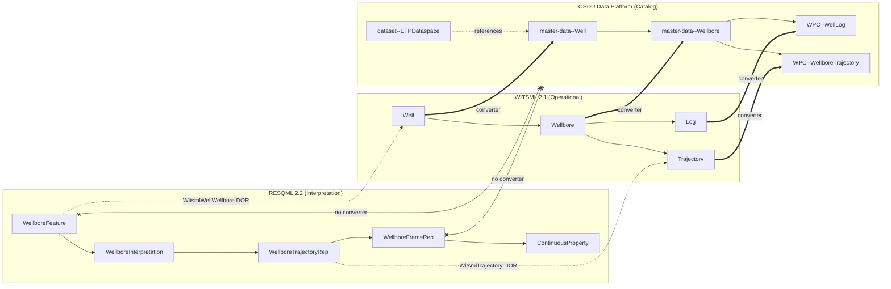
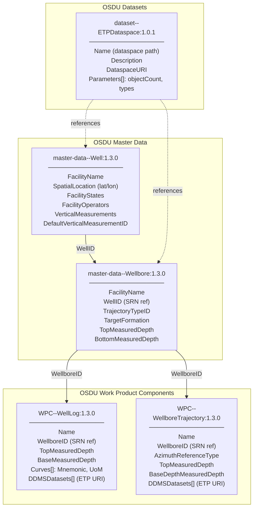
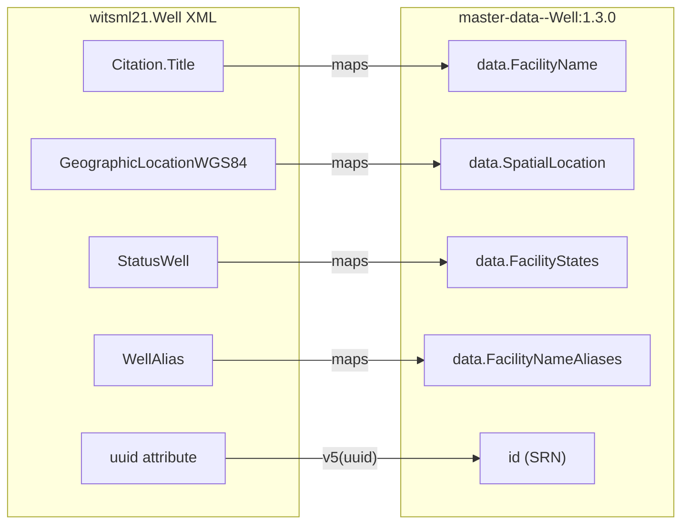
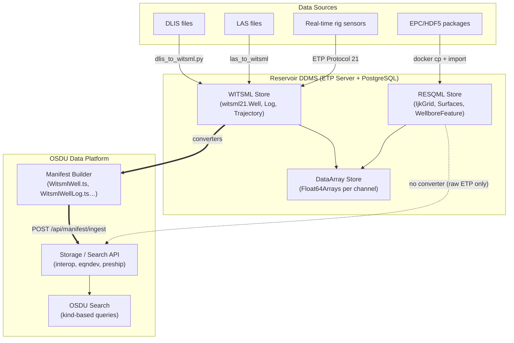

# RESQML vs WITSML — Well Data Model Comparison

> Technical comparison of the two Energistics standards for well data,
> focusing on data models, capabilities, and what is gained or lost in conversion.

---

## Why Two Standards?

| | WITSML | RESQML |
|--|--------|--------|
| **Domain** | Drilling, completions, interventions, real-time rig operations | Subsurface modeling, interpretation, simulation |
| **Primary users** | Drilling engineers, MWD/LWD, service companies, rig-to-office | Geoscientists, reservoir engineers, modelers |
| **Design philosophy** | Flat operational records (Well→Wellbore→Log) | Graph-based interpretation model (Feature→Interpretation→Representation→Property) |
| **Data transfer** | Near-real-time streaming + batch (ETP, SOAP) | File-based exchange (EPC/HDF5) + ETP |
| **Array storage** | Inline XML (`<logData>`) or ETP DataArrays | External HDF5 files or ETP DataArrays |
| **Metadata richness** | High — operators, status, dates, acquisition, UoM per curve | Minimal on wells — focuses on geometry and topology |
| **Versioning** | 1.3.1 → 1.4.1 → 2.0 → 2.1 (container-based → single-object) | 2.0.1 → 2.2 (inheritance-heavy, polymorphic) |

**In short:** WITSML answers "what was drilled, measured, and when" — RESQML answers "what does the subsurface look like and how do we model it."

---

## Data Model Comparison

### Well Identity

| Aspect | WITSML `Well` | RESQML `WellboreFeature` |
|--------|---------------|--------------------------|
| Geographic location | `GeographicLocationWGS84` (lat/lon/CRS) | Not stored (no coordinates) |
| Well status | `StatusWell` (active, plugged, suspended…) | Not applicable |
| Operators | `FacilityOperators`, `CurrentOperatorID` | Not applicable |
| Vertical datums | `VerticalMeasurements`, `DefaultVerticalCRS` | Not applicable |
| Regulatory IDs | `WellAlias`, `NumGovt`, `NumAPI` | Not applicable |
| Purpose | Operational master record | Thin identity placeholder for interpretation graph |
| OSDU kind | `master-data--Well:1.3.0` | None (no OSDU projection) |

**RESQML's `WellboreFeature` is intentionally minimal.** It exists solely to anchor the interpretation graph. All operational metadata (location, status, operators) belongs in WITSML. The feature may contain a `WitsmlWellWellbore` cross-reference pointing back to the WITSML record.

### Wellbore

| Aspect | WITSML `Wellbore` | RESQML `WellboreInterpretation` |
|--------|-------------------|--------------------------------|
| Parent reference | `WellID` (flat FK) | `InterpretedFeature` → `WellboreFeature` (DOR graph link) |
| Status | `StatusWellbore`, `IsActive`, `Purpose` | `IsDrilled` (boolean: drilled vs planned) |
| Sidetrack number | `SequenceNumber` | Not stored (multilaterals via `ParentIntersection`) |
| Target formation | `TargetFormation`, `FormationNameAtTotalDepth` | Not applicable |
| Depth references | `VerticalMeasurements`, `DefaultVerticalMeasurementID` | Local CRS reference on geometry |
| Bottom-hole location | `ProjectedBottomHoleLocation`, `GeographicBottomHoleLocation` | Not applicable |
| OSDU kind | `master-data--Wellbore:1.3.0` | None |

### Trajectory

| Aspect | WITSML `Trajectory` | RESQML `WellboreTrajectoryRepresentation` |
|--------|--------------------|--------------------------------------------|
| Parent | `WellboreID` (flat FK) | `RepresentedInterpretation` → `WellboreInterpretation` |
| Station data | `<TrajectoryStation>` with MD, Incl, Azi per row | Parametric line geometry (control points + tangent vectors) |
| Array storage | Float64Arrays at `/WITSML/{uuid}/{mnemonic}` | HDF5 external arrays via `AbstractParametricLineGeometry` |
| Azimuth reference | `AziRef` (grid north, true north, magnetic) | `MdDomain` (driller vs logger) |
| MD range | `MdMinMeasured`, `MdMaxMeasured` | `MdInterval` with datum reference |
| Multilateral support | Not modeled (one trajectory per wellbore) | `ParentIntersection` with `KickoffMd` + parent trajectory DOR |
| Acquisition metadata | `AcquisitionRemark`, `ServiceCompanyID`, `SurveyToolType` | Not applicable |
| CRS | Implied by parent Well's CRS | Explicit `LocalCrs` on the representation |
| OSDU kind | `work-product-component--WellboreTrajectory:1.3.0` | None |

### Well Logs / Curve Data

| Aspect | WITSML `Log` | RESQML `WellboreFrameRepresentation` + Properties |
|--------|--------------|---------------------------------------------------|
| Structure | Single object with multiple `LogCurveInfo` channels | Frame (defines MD nodes) + separate `ContinuousProperty` / `DiscreteProperty` objects per curve |
| Index | First `LogCurveInfo` (MD or time), `IndexType` attribute | `NodeMd` array on the frame |
| Curve metadata | `Mnemonic`, `Unit`, `TypeLogData`, `NullValue` per curve | `PropertyKind` + UOM reference per property object |
| Supported types | `double`, `double array`, `int`, `string`, `date time` | `FloatingPointExternalArray`, `IntegerExternalArray`, `BooleanExternalArray` |
| Multi-dim arrays | Bracket encoding `[v1 v2 v3]` → `Float64Array[rows, dim]` | Multi-dim HDF5 external arrays |
| Inline data | `<logData><data>` rows in XML (WITSML ≤2.0) or `<Data><Data>` (2.1) | Never inline — always external references |
| Array path | `/WITSML/{uuid}/{mnemonic}` | `/RESQML/{uuid}/{pathInHdf}` |
| OSDU kind | `work-product-component--WellLog:1.3.0` | None (properties on frames explicitly skipped) |

---

## Relationship Models

### Three-Way Mapping: WITSML ↔ OSDU ↔ RESQML

### OSDU Schema Mapping Detail

### Source Type → OSDU Kind Mapping

| ETP Source Type | OSDU Kind | Converter | Key Fields Mapped |
|-----------------|-----------|-----------|-------------------|
| `witsml21.Well` | `master-data--Well:1.3.0` | `WitsmlWell.ts` | FacilityName, SpatialLocation, FacilityStates, VerticalMeasurements |
| `witsml21.Wellbore` | `master-data--Wellbore:1.3.0` | `WitsmlWellbore.ts` | FacilityName, WellID, TargetFormation, TopDepth, BottomDepth |
| `witsml21.Log` | `WPC--WellLog:1.3.0` | `WitsmlWellLog.ts` | Name, WellboreID, Curves[], DDMSDatasets (ETP DataArray URIs) |
| `witsml21.Trajectory` | `WPC--WellboreTrajectory:1.3.0` | `WitsmlTrajectory.ts` | Name, WellboreID, AzimuthRef, DDMSDatasets |
| `resqml20.obj_WellboreFeature` | — | **None** | Not mappable (lacks location, status, operators) |
| `resqml20.obj_WellboreInterpretation` | — | **None** | Not mappable (no OSDU schema for interpretations) |
| `resqml20.obj_WellboreTrajectoryRepresentation` | — | **None** | Could map to WellboreTrajectory but no converter implemented |
| `resqml20.obj_WellboreFrameRepresentation` | — | **Skipped** | Properties explicitly excluded from manifesting |
| `resqml20.obj_IjkGridRepresentation` | `WPC--EarthModel:1.0.0` | `IjkGrid.ts` | Name, mesh dimensions (not well-specific) |
| `resqml20.obj_TriangulatedSetRepresentation` | `WPC--StructureMap:1.0.0` | `TriangulatedSet.ts` | Name, surface geometry |

### What RESQML Wells Would Need for OSDU Mapping

To project RESQML well objects to OSDU, a converter would need to:

1. **`WellboreFeature` → `master-data--Well`**: Resolve the `WitsmlWellWellbore` DOR to get coordinates and metadata (requires the linked WITSML Well to exist), OR accept a well record with no location.
2. **`WellboreTrajectoryRepresentation` → `WPC--WellboreTrajectory`**: Extract MD stations from the parametric line geometry, compute inclination/azimuth from control points + tangent vectors. Lossy (geometry type not preserved).
3. **`WellboreFrameRepresentation` + Properties → `WPC--WellLog`**: Flatten separate property objects into a single WellLog with Curves[]. Each property's PropertyKind maps to a mnemonic.

These converters are not implemented because RESQML well data typically coexists with WITSML counterparts — the WITSML objects provide the authoritative OSDU projection.

---

### WITSML ↔ OSDU Field Mapping (Detailed)

---

## What Gets Lost in Conversion

### WITSML → RESQML (operational → model)

| Lost | Why |
|------|-----|
| Geographic coordinates | RESQML features have no location fields |
| Well status / operator history | Not in RESQML schema |
| Acquisition metadata (service company, tool type, date) | RESQML is interpretation, not acquisition |
| Vertical datum details | Simplified to a local CRS reference |
| Index direction (increasing/decreasing) | Implicit in MD array ordering |
| Null value conventions (`-999.25`) | Must be handled at property level |
| Real-time streaming context | RESQML is static exchange |

### RESQML → WITSML (model → operational)

| Lost | Why |
|------|-----|
| Multilateral parent intersections | WITSML has no `ParentIntersection` concept |
| Interpretation vs representation distinction | WITSML has no feature/interp/rep separation |
| Per-property provenance/history | WITSML curves are columns in one object |
| Local CRS topology | WITSML uses global CRS on the Well |
| Parametric line geometry types (cubic, tangent, min curvature) | WITSML stores stations, not geometry type |
| Property-to-property relationships | No graph linking in WITSML |
| `IsDrilled` vs planned semantics | WITSML uses `Purpose` enum, less formal |

---

## How RDDMS Handles the Three-Layer Architecture

The system implements a **three-layer architecture**:

1. **ETP Layer (lossless storage):** Both WITSML and RESQML objects stored as native XML in PostgreSQL via ETP Protocol 4 (Store). Full fidelity preserved — no conversion at write time.

2. **Array Layer (shared):** Both standards use ETP Protocol 9 (DataArray) for bulk numeric data. WITSML arrays stored at `/WITSML/{uuid}/{mnemonic}`, RESQML at `/RESQML/{uuid}/{hdfPath}`. Same Float64Array backend.

3. **OSDU Layer (projection):** Manifest builder reads WITSML objects from ETP, runs type-specific converters (`WitsmlWell.ts` → `master-data--Well:1.3.0`), and produces OSDU records for catalog ingestion. RESQML objects remain ETP-only — discoverable via URI but not in OSDU Search.

4. **Cross-protocol search:** The `/wells` endpoint queries both `witsml21.Well` and `resqml20.obj_WellboreFeature` per dataspace, preferring WITSML. GraphQL `federatedSearch` merges local RDDMS + OSDU catalog results.

5. **Cross-references:** RESQML `WitsmlWellWellbore` / `WitsmlTrajectory` DORs link interpretation objects back to operational WITSML records, enabling navigation without duplication.

### Compliance Summary

| Aspect | Status |
|--------|--------|
| WITSML 2.1 XML namespace (`energyml/data/witsmlv2`) | Compliant |
| WITSML 1.4.1 namespace (`witsml.org/schemas/1series`) | Compliant |
| EML Citation on WITSML objects | Generated with UUID + Title + creation date |
| No `xsi:type` on WITSML root (element name = type) | Correct per spec |
| `xsi:type` on RESQML polymorphic elements | Parsed correctly by `processXsiType()` |
| ETP URI type identification | `dataObjectType` from URI used as `$type` fallback |
| Array storage paths | Follow server convention (`/WITSML/` or `/RESQML/` prefix) |
| Demo XML files | Valid against respective schemas |

---

## When to Use Which

| Scenario | Use |
|----------|-----|
| Real-time drilling data from rig | WITSML (streaming via ETP Protocol 21) |
| Well log from wireline service | WITSML `Log` (operational, has acquisition metadata) |
| Directional survey for drilling ops | WITSML `Trajectory` (has tool type, azimuth ref) |
| Earth model with well paths and properties | RESQML (geometry + property graph) |
| Reservoir simulation with wellbore completions | RESQML + PRODML (connected model) |
| Multi-well comparison / QC | WITSML (flat, queryable, has units) |
| Publishing to OSDU catalog | WITSML (has converters) → OSDU records |
| Subsurface interpretation workflow | RESQML (feature/interp/rep pattern) |
| Both operational + model context needed | Store both; link via DOR cross-references |

---

## References

- [Energistics WITSML Standards](https://energistics.org/witsml-data-standards)
- [Energistics RESQML Standards](https://energistics.org/resqml-data-standards)
- [ETP 1.2 Specification](https://energistics.org/energistics-transfer-protocol)
- [OSDU Well Schema `master-data--Well:1.3.0`](https://community.opengroup.org/osdu/data/data-definitions/-/tree/master/definitions/master-data/Well)
- XSD schemas: `energyml/data/witsmlv2` (WITSML 2.1), `energyml/data/resqmlv2` (RESQML 2.2)
