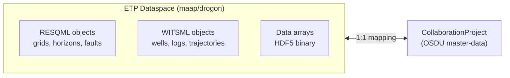
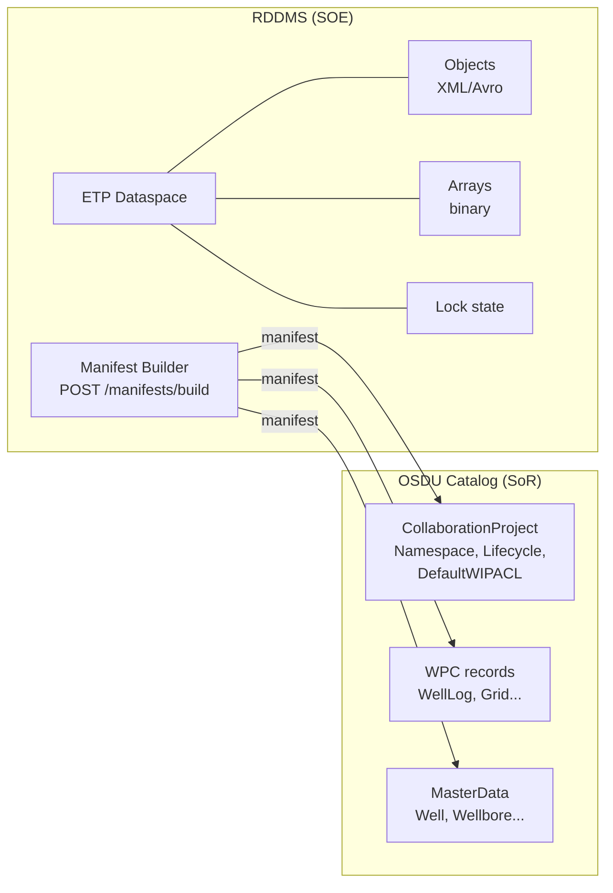
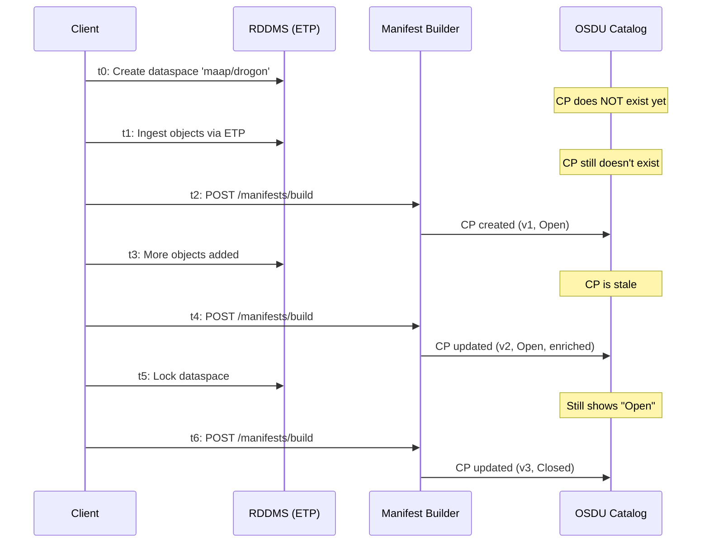
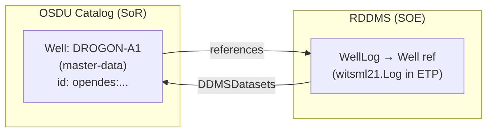
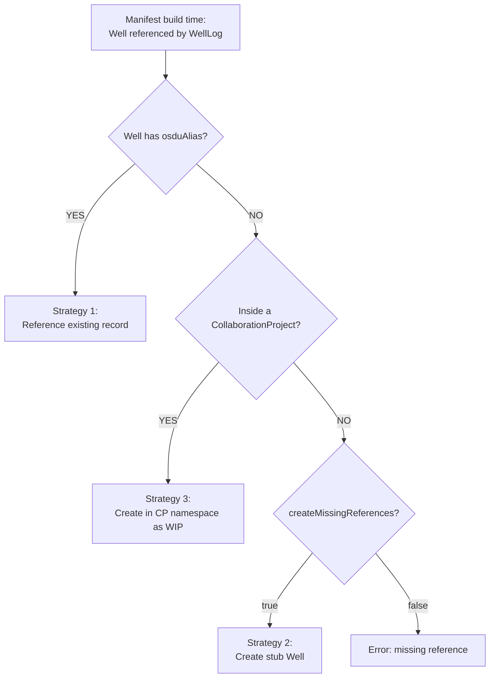

# RDDMS CollaborationProject Integration (S5)

## Overview

The OSDU `master-data--CollaborationProject:1.0.0` schema (M27/Venus) provides a
**namespace for work-in-progress (WIP) data** across DDMS instances and domains.
It represents the "system of engagement" (SOE) — a temporary collaborative workspace
where data lives before being published to the "system of record" (SoR).

In RDDMS, an **ETP dataspace maps directly to a CollaborationProject**:



## Architecture



## Consistency Model

### The Problem

Multiple processes interact with the same data:
- ETP clients create/modify objects in dataspaces
- Manifest builds push records to OSDU
- Dataspace locks/unlocks change lifecycle state
- Multiple DDMS instances may reference the same collaboration
- OSDU ingestion is eventually consistent (async workflow)

### The Solution: Idempotent Upsert at Manifest Time

RDDMS uses **eventual consistency** with RDDMS as the **source of truth**:

| Guarantee | Mechanism |
|-----------|-----------|
| **Deterministic identity** | UUID v5 from dataspace name → same CP always gets same ID |
| **Version tracking** | Checks existing version in OSDU, bumps on update |
| **Additive updates** | Never deletes fields, only enriches (DDMSDatasets merge) |
| **Idempotent** | Repeated manifest builds produce the same record |
| **Lock-state sync** | LifecycleStatusID reflects dataspace lock at build time |

### What IS guaranteed

1. **Every manifest build includes a fresh CP record** — derived from live dataspace state
2. **CP ID is stable** — same dataspace always maps to the same CollaborationProject UUID
3. **Version conflicts are avoided** — existing OSDU version is checked before push
4. **ACL inheritance** — WIP objects inherit the CP's `DefaultWIPACL`
5. **Multiple DDMS convergence** — if two DDMS instances reference the same dataspace,
   they produce the same CP UUID (deterministic v5)

### What is NOT guaranteed (by design)

1. **Real-time sync** — CP in OSDU reflects state at last manifest build, not live state
2. **Lock propagation** — locking a dataspace in ETP does not immediately update OSDU
3. **Cross-DDMS coordination** — no distributed lock; last-writer-wins at the OSDU layer
4. **Deletion cascade** — deleting a dataspace does not auto-delete the CP from OSDU

### Consistency Timeline



**Key insight:** The manifest build is the **sync point**. Between builds, OSDU may be stale.

## Usage Patterns

### Pattern 1: Standard Workflow (ores/drogon demo)

```bash
# 1. Create dataspace (the collaboration namespace)
curl -X POST http://localhost:3000/dataspaces \
  -H "Content-Type: application/json" \
  -d '{"path": "maap/drogon", "acl": {...}, "legal": {...}}'

# 2. Ingest objects (RESQML + WITSML = multi-domain WIP data)
openETPServer hdf5 -i drogon_demo_22.epc -s ws://localhost:9002 -d maap/drogon
curl -X PUT http://localhost:3000/witsml/store?dataspace=maap/drogon \
  -d @well_21.xml

# 3. Build manifest → includes CollaborationProject automatically
curl -X POST http://localhost:3000/manifests/build \
  -H "Content-Type: application/json" \
  -d '{"uris": ["eml:///dataspace('\''maap/drogon'\'')"], "partition": "opendes"}'

# Response includes:
# - MasterData[]: CollaborationProject + Wells + Wellbores
# - Data.Datasets[]: ETPDataspace record
# - Data.WorkProductComponents[]: WellLog, Grid, etc.

# 4. Push to OSDU catalog
curl -X POST https://osdu-instance/api/storage/v2/records \
  -d @manifest.json
```

### Pattern 2: Explicit Collaboration Header

When the caller already has a collaboration project ID (e.g., from an external system):

```bash
curl -X POST http://localhost:3000/manifests/build \
  -H "x-collaboration: {\"id\": \"existing-cp-uuid\"}" \
  -d '{"uris": [...], "partition": "opendes"}'
```

When `x-collaboration` is provided, the auto-generated CP uses that ID instead of
deriving one from the dataspace name.

### Pattern 3: Multi-Domain Collaboration

Multiple DDMS instances contribute to the same project:

```
Reservoir DDMS (RDDMS):  dataspace 'project-alpha/reservoir'
Seismic DDMS:            dataspace 'project-alpha/seismic'
Well DDMS:               dataspace 'project-alpha/wells'
```

Each produces its own CollaborationProject record. To tie them together, use the same
`x-collaboration` header across all manifest builds, or reference a shared
`TrustedCollectionID` (CollaborationProjectCollection).

### Pattern 4: Lifecycle Management

```bash
# Lock dataspace (marks collaboration as "Closed" on next manifest build)
curl -X POST http://localhost:3000/dataspaces/maap%2Fdrogon/lock

# Build manifest → CP.LifecycleStatusID = ...CollaborationProjectLifecycleStatus:Closed:
curl -X POST http://localhost:3000/manifests/build ...

# Unlock to reopen
curl -X DELETE http://localhost:3000/dataspaces/maap%2Fdrogon/lock
```

## Schema Mapping

| ETP Dataspace Field | CollaborationProject Field | Notes |
|---|---|---|
| `path` (dataspace name) | `data.Namespace` | The WIP namespace |
| `path` | `data.ProjectName` | Human-readable name |
| `storeCreated` | `data.CreationDateTime` | When dataspace was created |
| ACL (customData) | `data.DefaultWIPACL` | Applied to WIP objects |
| ACL (customData) | `data.ProjectContributorACL` | Who can contribute |
| Lock state | `data.LifecycleStatusID` | Open/Closed |
| UUID v5(path) | `id` | Deterministic, stable |

## OSDU Kind

```
osdu:wks:master-data--CollaborationProject:1.0.0   (M27 only)
```

Not available in M26 (Mercury). If running against M26, the CP record is still generated
but must be registered manually via schema service.

## Implementation Files

| File | Purpose |
|---|---|
| `src/lib/jsonTypes/MilestoneKinds.ts` | Kind registration (`M27: "1.0.0"`) |
| `src/lib/jsonTypes/CollaborationProject.ts` | Converter: dataspace → CP record |
| `src/lib/jsonTypes/Generated/master-data/CollaborationProject.1.0.0.ts` | Type interface |
| `src/lib/jsonTypes/Manifest.ts` | S5 integration (emits CP per dataspace) |
| `src/lib/jsonTypes/ResqmlOsdu.ts` | Re-exports `CollaborationProjectManifest` |

## Future Work

- [ ] Event-driven sync: push CP update on dataspace lock/unlock (not just at manifest time)
- [ ] `TrustedCollectionID`: link CP to a `CollaborationProjectCollection` for SoR input tracking
- [ ] `LifecycleEvents`: record state transitions (Open→Closed→Published) with timestamps
- [ ] Cross-DDMS coordination: shared CP across reservoir/seismic/well DDMS via external ID
- [ ] Deletion reconciliation: detect deleted dataspaces and mark CP as archived

## Master Data Strategy: Wells + WellLogs in CollaborationProjects

### The Problem

Wells are **master data** (owned by OSDU catalog / system of record), but WellLogs are
**work-product-components** that must reference a Well. When RDDMS ingests a WellLog,
it needs a Well to point to — but should it CREATE the Well or REFERENCE an existing one?



### Strategy 1: Reference Existing (Production Pattern)

Wells already exist in OSDU → RDDMS just links to them via `osduAlias`:

```xml
<Well uuid="...">
  <Aliases authority="osdu" Identifier="opendes:master-data--Well:existing-uuid"/>
  ...
</Well>
```

The manifest builder sees the alias → skips creating a new Well → appends `DDMSDatasets`
URI to the existing record (additive merge).

**Best for:** Production environments where MDM processes own Well creation.

### Strategy 2: Create-if-Missing (Current Default)

```typescript
// OSDUContext default:
createMissingReferences: true  // creates stub Well if not in OSDU
```

RDDMS creates a minimal Well record when the log references a Well that doesn't exist.
Only has `FacilityName` + `DDMSDatasets` — no coordinates, no regulatory IDs.

**Risk:** Creates orphan/duplicate Wells if the "real" Well arrives later from MDM.
**Mitigation:** DDMSDatasets merge ensures if the Well IS later created properly, the
DDMS link survives.

**Best for:** Local development, demos, isolated environments.

### Strategy 3: CollaborationProject Namespace (SOE Pattern)

Wells inside a CollaborationProject are **WIP** — they live in the CP namespace and
don't pollute the SoR until published:

```
t0: Create CP (dataspace 'project-x/wells')
t1: Ingest Well + WellLog into ETP dataspace
t2: Build manifest → Well in CP namespace (WIP, not SoR)
t3: Review/approve → Publish Well to SoR (promote to master-data)
t4: CP lifecycle → Closed
```

Wells in a CP are "draft" master data. They carry `x-collaboration` header during
ingestion, so OSDU knows they're namespace-scoped and not yet authoritative.

**Best for:** Multi-user workflows where Wells need review before becoming authoritative.

### Decision Matrix



### Practical Rules for Adding Logs

1. **Well exists in OSDU** → pass its ID via `osduAlias` or `x-collaboration` header
2. **New field study** → use a CollaborationProject dataspace (WIP wells)
3. **Demo/local dev** → rely on `createMissingReferences: true` (auto-creates stubs)

The DDMSDatasets merge pattern (already implemented) ensures that regardless of which
path created the Well, subsequent WellLog ingestions **enrich** the record rather than
duplicating it.
