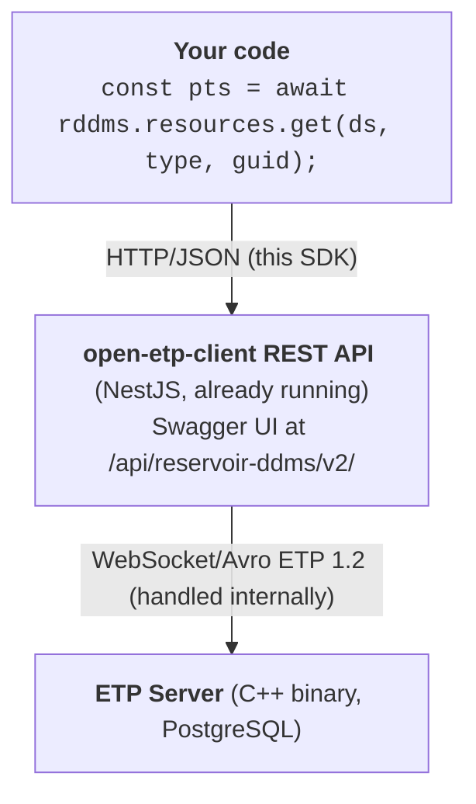

# REST SDK - `RddmsClient`

Typed TypeScript SDK for the Reservoir DDMS REST API.

## Why this SDK?

| Approach | Protocol | Complexity | Maintenance |
|----------|----------|------------|-------------|
| **FESAPI** (C++) | ETP 1.2 binary | Compile toolchain, XML schemas, HDF5 linking | Manual |
| **PyETP** (Python) | ETP 1.2 binary | Incomplete, raw protocol knowledge needed | Manual |
| **ResqmlClient** (this repo) | ETP 1.2 WebSocket/Avro | Full-featured but requires ETP session management | Manual |
| **RddmsClient** (this SDK) | **HTTP/JSON** | **Typed fetch calls - no protocol knowledge** | **Auto-maintained from OpenAPI spec** |

The existing `ResqmlClient` talks raw ETP 1.2 (WebSocket + Avro binary frames)
directly to the ETP server. It is powerful but requires understanding of the
ETP protocol, session lifecycle, and Avro serialization.

`RddmsClient` talks HTTP/JSON to the REST gateway (this service, already running).
The gateway handles all ETP complexity. Users just call typed methods and get JSON
back.



## Quick Start

```typescript
import { RddmsClient } from './sdk';

const rddms = new RddmsClient({
  baseUrl: 'http://localhost:8080/api/reservoir-ddms/v2',
  partitionId: 'dev',          // data-partition-id header
  // token: '...',             // omit to auto-fetch from /auth/token
});

// List dataspaces
const dataspaces = await rddms.dataspaces.list();

// Atomic write (auto-transaction)
await rddms.atomicWrite('demo/test', [crs, hdfProxy, pointSet], [coordArray]);

// Read object as JSON
const obj = await rddms.resources.get('demo/test', 'resqml20.obj_PointSetRepresentation', guid);

// Read array data
const arr = await rddms.arrays.get('demo/test', 'eml20.obj_EpcExternalPartReference', hdfGuid, arrayPath);
console.log(arr.data.data);  // [0, 0, 0, 1, 1, 1, ...]
```

## API Reference

### Constructor

```typescript
new RddmsClient(options: RddmsClientOptions)
```

| Option | Type | Default | Description |
|--------|------|---------|-------------|
| `baseUrl` | `string` | - | Full REST API URL |
| `partitionId` | `string` | `'opendes'` | `data-partition-id` header |
| `token` | `string` | auto-fetch | Bearer token (omit for dev) |
| `headers` | `Record<string,string>` | `{}` | Extra headers |

### Namespaces

#### `rddms.health`
| Method | Returns | Description |
|--------|---------|-------------|
| `.readiness()` | `boolean` | ETP server reachable? |
| `.liveness()` | `boolean` | Service alive? |
| `.info()` | `object` | Server version, protocols |
| `.converters()` | `object[]` | Registered type converters |

#### `rddms.dataspaces`
| Method | Returns | Description |
|--------|---------|-------------|
| `.list()` | `object[]` | All dataspaces |
| `.create(input[])` | `string[]` | Create dataspaces |
| `.info(ds)` | `object` | Metadata for one |
| `.delete(ds)` | `void` | Delete |
| `.clone(ds, {targetDataspaceId})` | `string` | Copy |
| `.lock(ds)` / `.unlock(ds)` | `boolean` | Read-only toggle |

#### `rddms.resources`
| Method | Returns | Description |
|--------|---------|-------------|
| `.types(ds)` | `TypeCount[]` | Type summary |
| `.list(ds, opts?)` | `ResourceSummary[]` | All resources |
| `.listByType(ds, type, opts?)` | `ResourceSummary[]` | By type |
| `.get(ds, type, guid, opts?)` | `object[]` | Full JSON content |
| `.getMultiple(uris, opts?)` | `object[]` | Batch get by URI |
| `.put(ds, objects, opts?)` | `boolean` | Write objects |
| `.delete(ds, type, guid, opts?)` | `void` | Delete object |
| `.targets(ds, type, guid, opts?)` | `ResourceSummary[]` | Forward refs |
| `.sources(ds, type, guid, opts?)` | `ResourceSummary[]` | Back refs |
| `.validate(ds)` | `object` | XSD + DOR validation |

#### `rddms.graph`
| Method | Returns | Description |
|--------|---------|-------------|
| `.all(ds, opts?)` | `GraphResult` | Full graph |
| `.targets(ds, type, guid, opts?)` | `GraphResult` | Target graph |
| `.sources(ds, type, guid, opts?)` | `GraphResult` | Source graph |

#### `rddms.arrays`
| Method | Returns | Description |
|--------|---------|-------------|
| `.list(ds, type, guid)` | `object[]` | List arrays for object |
| `.metadata(ds, type, guid, path)` | `object` | Type + dimensions |
| `.get(ds, type, guid, path, opts?)` | `ArrayResult` | Array data |
| `.put(ds, arrays, opts?)` | `boolean[]` | Write arrays |

#### `rddms.transactions`
| Method | Returns | Description |
|--------|---------|-------------|
| `.start(ds, opts?)` | `string` | Transaction UUID |
| `.commit(ds, txId)` | `boolean` | Commit |
| `.rollback(ds, txId)` | `boolean` | Rollback |

#### `rddms.query`
| Method | Returns | Description |
|--------|---------|-------------|
| `.findResources(input)` | `ResourceSummary[]` | URI-based search |
| `.findObjects(input)` | `object[]` | Search + fetch content |
| `.graphSearch(input)` | `GraphResult` | Batch graph traversal |
| `.growingMetadata(input)` | `object` | WellLog/Trajectory parts |
| `.growingRange(input)` | `object` | Parts by index range |
| `.channelMetadata(input)` | `object` | Channel names/UOMs |

#### `rddms.manifest`
| Method | Returns | Description |
|--------|---------|-------------|
| `.build(input)` | `object` | OSDU manifest from ETP |

### Helper

```typescript
await rddms.atomicWrite(dataspace, objects, arrays?)
```
Start transaction → put objects → put arrays → commit. Auto-rollback on error.

## Examples

| File | What it demonstrates |
|------|---------------------|
| [`01-hello-pointset.ts`](src/examples/sdk/01-hello-pointset.ts) | PointSet write + array upload + read-back + graph |
| [`02-grid2d-property.ts`](src/examples/sdk/02-grid2d-property.ts) | Grid2D with continuous property and Z-values array |
| [`03-transactions.ts`](src/examples/sdk/03-transactions.ts) | Commit vs rollback, atomicWrite helper |
| [`04-query-graph.ts`](src/examples/sdk/04-query-graph.ts) | FindResources, batch graph search, list all |
| [`05-dataspaces.ts`](src/examples/sdk/05-dataspaces.ts) | Create, list, info, lock/unlock, clone, delete |

Run any example:
```sh
npx ts-node src/examples/sdk/01-hello-pointset.ts
```

## When to use what

| Use case | Tool |
|----------|------|
| **App integration, scripting, CI** | `RddmsClient` (this SDK) |
| **Interactive API exploration** | Swagger UI or Bruno collection |
| **Custom ETP protocol handlers** | `ResqmlClient` (low-level) |
| **C++ desktop application** | FESAPI |
| **Python data science** | PyETP or call REST SDK endpoints with `requests` |
