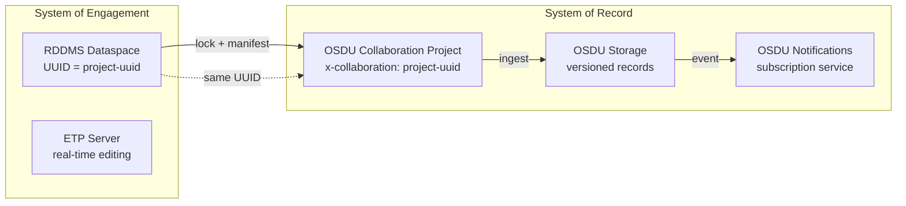

# RESQML 2.2 in OSDU — Deep Analysis & Development Plan

> Owner: OSDU RESQML Development Lead
> Date: 2026-06-03
> Scope: RESQML 2.2 schema analysis, OSDU integration assessment, and prioritized development roadmap for RDDMS vNext

---

## Table of Contents

1. [Executive Summary](#1-executive-summary)
2. [RESQML 2.2 Schema Analysis](#2-resqml-22-schema-analysis)
3. [Geo-Modeling Coverage: Seismic to Simulation](#3-geo-modeling-coverage-seismic-to-simulation)
4. [Ontology, Semantics, FIRP & Lineage](#4-ontology-semantics-firp--lineage)
5. [Complement to WITSML & Common Energistics Elements](#5-complement-to-witsml--common-energistics-elements)
6. [Design Principles & Efficiency](#6-design-principles--efficiency)
7. [OSDU Mapping: WPC & Master Data](#7-osdu-mapping-wpc--master-data)
8. [Metadata in RESQML vs OSDU](#8-metadata-in-resqml-vs-osdu)
9. [Current Gaps & Pain Points](#9-current-gaps--pain-points)
10. [Development Plan: Simplify, Optimize, Add, Reorganize](#10-development-plan)
11. [Prioritized Backlog](#11-prioritized-backlog)

---

## 1. Executive Summary

RESQML 2.2 is a mature, XML/HDF5-based data exchange standard covering the full subsurface modeling lifecycle. Its **FIRP** (Feature → Interpretation → Representation → Property) ontology provides rigorous semantic separation that no other standard achieves. However, its integration with OSDU remains incomplete: many RESQML types lack OSDU schema projections, reference data is disconnected, and operational concerns (notifications, multi-DDMS sync, session resilience) need resolution.

This document provides:
- A technical analysis of RESQML 2.2 against OSDU requirements
- Identification of what works well, what's missing, and what needs rework
- A ranked development plan with cost/risk/gain scoring

---

## 2. RESQML 2.2 Schema Analysis

### 2.1 Data Object Taxonomy (from XSD / energyml-python)

RESQML 2.2 defines ~80 concrete data objects organized by the FIRP pattern. The XML namespace is `http://www.energistics.org/energyml/data/resqmlv2` and it depends on EML Common v2.3.

#### Features (Geological + Technical)

| Category | Objects |
|----------|---------|
| **Boundary** | `BoundaryFeature` (horizons, faults, geobody boundaries, fluid contacts) |
| **Rock Volume** | `RockVolumeFeature` (reservoir compartments, geobodies) |
| **Technical** | `WellboreFeature`, `SeismicLatticeFeature`, `SeismicLineFeature`, `SeismicLineSetFeature`, `SeismicLatticeSetFeature`, `CulturalFeature`, `FrontierFeature`, `Model` |

#### Interpretations

| Category | Objects |
|----------|---------|
| **Boundary** | `BoundaryFeatureInterpretation`, `FaultInterpretation`, `HorizonInterpretation`, `GeobodyBoundaryInterpretation`, `FluidBoundaryInterpretation` |
| **Volume** | `GeologicUnitInterpretation`, `RockFluidUnitInterpretation`, `ReservoirCompartmentInterpretation` |
| **Organization** | `StructuralOrganizationInterpretation`, `StratigraphicColumn`, `StratigraphicColumnRankInterpretation`, `StratigraphicOccurrenceInterpretation`, `RockFluidOrganizationInterpretation`, `EarthModelInterpretation` |
| **Generic** | `GenericFeatureInterpretation`, `WellboreInterpretation` |

#### Representations

| Category | Objects |
|----------|---------|
| **Point/Line** | `PointSetRepresentation`, `PolylineRepresentation`, `PolylineSetRepresentation` |
| **Surface** | `TriangulatedSetRepresentation`, `Grid2dRepresentation`, `PlaneSetRepresentation` |
| **Volume/Grid** | `IjkGridRepresentation`, `UnstructuredGridRepresentation`, `UnstructuredColumnLayerGridRepresentation`, `TruncatedIjkGridRepresentation`, `TruncatedUnstructuredColumnLayerGridRepresentation`, `GpGridRepresentation` |
| **Well** | `WellboreTrajectoryRepresentation`, `WellboreFrameRepresentation`, `BlockedWellboreRepresentation`, `SeismicWellboreFrameRepresentation` |
| **Framework** | `SealedSurfaceFrameworkRepresentation`, `NonSealedSurfaceFrameworkRepresentation`, `SealedVolumeFrameworkRepresentation` |
| **Seismic** | `Seismic2dPostStackRepresentation`, `Seismic3dPostStackRepresentation` |
| **Composite** | `RepresentationSetRepresentation`, `SubRepresentation`, `StreamlineRepresentation`, `Graph2dRepresentation` |

#### Properties

| Objects |
|---------|
| `ContinuousProperty`, `DiscreteProperty`, `CategoricalProperty`, `BooleanProperty`, `CommentProperty`, `PointsProperty` |

#### Supporting Objects (from EML Common v2.3)

| Objects |
|---------|
| `Activity`, `ActivityTemplate`, `TimeSeries`, `PropertyKind`, `PropertyKindDictionary`, `GraphicalInformationSet`, `ColorMap` |

### 2.2 Key Schema Design Features

1. **Polymorphic geometry** — `AbstractParametricLineGeometry` supports vertical, piecewise-linear, natural-cubic, tangential-cubic, minimum-curvature, and Z-linear-cubic interpolations
2. **External array references** — All bulk data via `ExternalDataArray` → HDF5 or ETP DataArray
3. **Local CRS per representation** — Enables multi-CRS models without re-projection
4. **DataObjectReference (DOR)** — UUID-based cross-references forming a typed graph
5. **Realization indexing** — Built-in stochastic/Monte Carlo support via `RealizationIndex`
6. **Time-dependent geometry** — `TimeIndex` on representations for 4D modeling
7. **Activation/deactivation** — Toggle objects on/off via `ActivationToggleIndices` + `TimeSeries`

### 2.3 Schema Strengths

- **Topologically complete**: Nodes, edges, faces, cells all separately addressable as `IndexableElement`
- **Lossless geometry exchange**: Parametric curves preserve interpolation method (not just station points)
- **Multi-grid support**: Parent/child windows, GP-grids mixing IJK + unstructured
- **Split topology**: `SplitNodePatch`, `SplitEdges`, `SplitColumnEdges` handle faulted grids without duplication
- **Framework representations**: Sealed/unsealed surface and volume frameworks for watertight models

### 2.4 Schema Weaknesses

- **Object explosion**: A single well log with 46 curves = 48 objects (1 frame + 1 index property + 46 curve properties)
- **No inline data**: Even a 3-point polyline requires an external HDF5 reference
- **Deep inheritance**: 5+ levels of abstract classes make implementation complex
- **Verbose XML**: A simple horizon surface may require 500+ lines of XML
- **Limited operational metadata**: No acquisition date, service company, tool type on representations
- **No built-in versioning**: Must use external mechanisms (ETP dataspace snapshots, OSDU versions)

---

## 3. Geo-Modeling Coverage: Seismic to Simulation

### 3.1 Workflow Stage Coverage

| Workflow Stage | RESQML Coverage | Assessment |
|----------------|----------------|------------|
| **Seismic acquisition geometry** | `SeismicLatticeFeature`, `SeismicLineFeature`, `SeismicLatticeSetFeature` | ✅ Full — bin grids, line geometry, inline/crossline labels |
| **Seismic interpretation (horizons)** | `BoundaryFeature` + `HorizonInterpretation` + `Grid2dRepresentation` / `TriangulatedSetRepresentation` | ✅ Full — supports time and depth domain, multiple realizations |
| **Seismic interpretation (faults)** | `BoundaryFeature` + `FaultInterpretation` + `PolylineSetRepresentation` (sticks) / `TriangulatedSetRepresentation` | ✅ Full — fault throw, listric flag, dip/azimuth |
| **Velocity modeling** | Properties on `Grid2dRepresentation` or `IjkGridRepresentation` | ✅ Adequate — velocity as property, multiple realizations |
| **Depth conversion** | Time/depth domain flag on interpretations | ✅ Built-in `Domain` enum (DEPTH, TIME, MIXED) |
| **Structural modeling** | `StructuralOrganizationInterpretation` + `SealedSurfaceFrameworkRepresentation` | ✅ Full — sealed model with contact topology |
| **Stratigraphic modeling** | `StratigraphicColumn` + `StratigraphicColumnRankInterpretation` + `StratigraphicOccurrenceInterpretation` | ✅ Full — multi-rank, age ordering |
| **Property modeling** | `ContinuousProperty` / `DiscreteProperty` on any representation | ✅ Full — PropertyKind taxonomy, UOM, facets |
| **Grid construction** | `IjkGridRepresentation`, `UnstructuredGridRepresentation`, `GpGridRepresentation` | ✅ Full — corner-point, unstructured, hybrid |
| **Grid properties (porosity, perm, Sw)** | Properties attached to grid cells | ✅ Full — per-cell, per-face, per-node attachment |
| **Upscaling / grid refinement** | `AbstractParentWindow`, `Regrid` | ✅ Full — parent-child grid relationships |
| **Well placement in model** | `BlockedWellboreRepresentation` | ✅ Full — well-grid intersection with cell/face indices |
| **Rock-fluid organization** | `RockFluidOrganizationInterpretation` + `RockFluidUnitInterpretation` | ✅ Full — phase units, fluid contacts |
| **Streamlines** | `StreamlineRepresentation` with flux type | ✅ Full — oil/gas/water flux tracing |
| **4D / time-stepping** | `TimeSeries` + `TimeIndex` on properties and geometry | ✅ Full — production history, pressure evolution |
| **Geobodies** | `RockVolumeFeature` + `GeologicUnitInterpretation` | ✅ Full — composition, emplacement, 3D shape |
| **Well logs in model context** | `WellboreFrameRepresentation` + Properties | ⚠️ Functional but verbose (N objects per log) |
| **DAS / fiber optic** | Not in RESQML (→ PRODML) | ❌ Out of scope |
| **Production data** | Not in RESQML (→ PRODML) | ❌ Out of scope |
| **Drilling real-time** | Not in RESQML (→ WITSML) | ❌ Out of scope |

### 3.2 Topology & Numerical Representation Quality

**Verdict: Excellent.** RESQML 2.2's representation of subsurface topology is the most rigorous available:

- **Grid fidelity**: IJK grids support split pillars (faults), K-gaps, pinch-outs, radial grids — matching or exceeding capabilities of Eclipse/CMG/tNavigator grid formats
- **Unstructured grids**: Full polyhedral support (tetrahedral, pyramidal, prism, hexahedral, arbitrary) with face/node/edge topology
- **Surface frameworks**: Sealed frameworks guarantee watertight models — essential for volume calculation and simulation
- **Parametric lines**: Minimum-curvature wellbore trajectories preserved exactly (not degraded to piecewise-linear)
- **Coordinate precision**: Float64 arrays, explicit CRS per representation, no implicit coordinate assumptions

### 3.3 Gaps in Seismic-to-Simulation Chain

| Gap | Impact | Notes |
|-----|--------|-------|
| **Regular surface grid (Petrel "RegularGrid2d" with Z + properties)** | Medium | Can be represented as `Grid2dRepresentation` but OSDU WPC mapping is missing. Needs dedicated WPC or mapping to SeismicHorizon kind |
| **Seismic bin-grid linkage** | Low | RESQML `SeismicCoordinates` exists on representations; needs explicit mapping to OSDU `SeismicBinGrid` WPC |
| **Dynamic simulation results** | Medium | Time-stepped properties work but no dedicated "simulation run" metadata object. OSDU has `ReservoirSimulationModel` but no RESQML equivalent |
| **Completion/perforation in model** | Low | `BlockedWellboreRepresentation` locates well in grid but completion details → WITSML/PRODML |

---

## 4. Ontology, Semantics, FIRP & Lineage

### 4.1 The FIRP Pattern

```
Feature → Interpretation → Representation → Property
   (what)      (opinion)       (geometry)      (values)
```

**Design principles:**
1. **Separation of concerns** — The same physical feature can have multiple interpretations (different geologists' opinions)
2. **Multiple representations per interpretation** — Same fault interpretation may have a triangulated surface AND a polyline set (sticks)
3. **Properties decoupled from geometry** — Same grid can carry porosity from different modeling runs without duplicating topology
4. **Versioning via multiplicity** — Not explicit versioning, but multiple interpretations/representations naturally capture evolution

**Semantic strength:** FIRP enforces a knowledge hierarchy that prevents conflating measurement with interpretation. This is unique among subsurface standards.

**Semantic weakness:** The pattern adds verbosity. A horizon requires: 1 Feature + 1 Interpretation + 1 Representation = 3 objects minimum (vs. 1 in Petrel, 1 in OSDU `GenericRepresentation`).

### 4.2 Ontological Coverage

| Concept | RESQML Mechanism | Completeness |
|---------|-----------------|--------------|
| Object identity | UUID (EML Citation) | ✅ Complete |
| Object relationships | DataObjectReference (DOR) — typed UUID links | ✅ Complete |
| Temporal context | `HasOccurredDuring` → `AbstractTimeInterval` | ✅ Complete |
| Spatial context | Local CRS per representation | ✅ Complete |
| Classification | `PropertyKind` hierarchy (extensible dictionary) | ✅ Complete |
| Units of measure | EML UOM standard (shared with WITSML/PRODML) | ✅ Complete |
| Provenance / author | `Citation.Originator`, `Citation.Creation` | ⚠️ Minimal — no workflow history |
| Lineage | `Activity` + `ActivityTemplate` (EML Common) | ⚠️ Available but rarely used |
| Uncertainty | `RealizationIndex` for stochastic | ⚠️ Index only — no distribution metadata |

### 4.3 Lineage & Audit Trail

**Current state in EML/RESQML:**
- `Activity` object links inputs → outputs with roles defined by `ActivityTemplate`
- `Citation.Creation` and `Citation.LastUpdate` timestamps exist
- No built-in "history log" — must be reconstructed from Activity chain

**Current state in OSDU:**
- `LineageAssertions[]` on every record (input/output SRNs)
- `data.Provenance` with `Activity` references
- Full audit via Legal/Compliance tags and Storage service versioning

**Gap:** RESQML `Activity` objects are rarely populated by modeling software. OSDU lineage is record-level metadata. The two don't align automatically.

**Recommendation:** Auto-generate OSDU `Activity` WPCs from RESQML ingestion events. Define standard `ActivityTemplate` for: ingestion, depth-conversion, grid-construction, property-modeling, simulation-run.

### 4.4 PropertyKind Taxonomy

RESQML 2.2 uses the `PropertyKindDictionary_v2.1.0.xml` which defines ~300 standard property kinds (porosity, permeability, water saturation, etc.) with:
- Parent-child hierarchy (e.g., `permeability` → `permeability rock` → `permeability x direction`)
- Standard UOM mappings
- Extensibility via custom dictionaries

**OSDU equivalent:** OSDU reference data catalogs (`reference-data--PropertyType`) cover similar ground but with different identifiers.

**Gap:** No automatic mapping between RESQML PropertyKind UUIDs and OSDU PropertyType IDs. The Energistics PWLS (Practical Well Log Standard) v3.0 could bridge this — it maps log mnemonics to property kinds and can share UUIDs with OSDU.

---

## 5. Complement to WITSML & Common Energistics Elements

### 5.1 Shared Infrastructure (EML Common v2.3)

Both RESQML 2.2 and WITSML 2.1 build on EML Common v2.3:

| Component | Used By | Purpose |
|-----------|---------|---------|
| `AbstractObject` (Citation, UUID, aliases) | Both | Identity, naming, timestamps |
| `DataObjectReference` | Both | Cross-standard linking |
| `Activity` / `ActivityTemplate` | Both | Lineage/provenance |
| `TimeSeries` | Both | Time-indexed data |
| `PropertyKind` / `PropertyKindDictionary` | RESQML (explicit), WITSML (via PWLS) | Measurement classification |
| UOM dictionary | Both | Unit conversion |
| `AbstractGraphicalInformation` | RESQML | Visualization hints |
| EPC packaging | Both | File bundling |
| Identifier Specification v5.0 | Both | URI format (`eml:///dataspace/type(uuid)`) |

### 5.2 Cross-Standard Linking

RESQML explicitly references WITSML objects:

```xml
<!-- In WellboreFeature -->
<WitsmlWellbore>
  <WitsmlWell>
    <WellName>...</WellName>
    <WellUuid>...</WellUuid>
  </WitsmlWell>
  <WellboreUuid>...</WellboreUuid>
  <WellboreName>...</WellboreName>
</WitsmlWellbore>

<!-- In WellboreTrajectoryRepresentation -->
<!-- RepresentedObject can point to a WITSML Wellbore UUID -->
```

### 5.3 Division of Responsibility

| Domain | WITSML | RESQML | PRODML |
|--------|--------|--------|--------|
| Well identity & location | ✅ Authoritative | ❌ Reference only | ❌ |
| Drilling operations | ✅ | ❌ | ❌ |
| Well logs (acquisition) | ✅ | ⚠️ Can store but verbose | ❌ |
| Well logs (in model context) | ❌ | ✅ (FrameRep + Properties) | ❌ |
| Trajectory (operational) | ✅ | ❌ | ❌ |
| Trajectory (in model) | ❌ | ✅ (parametric geometry) | ❌ |
| Completions | ✅ | ❌ | ⚠️ (flow networks) |
| Earth model | ❌ | ✅ Authoritative | ❌ |
| Reservoir grids | ❌ | ✅ Authoritative | ❌ |
| Production data | ❌ | ❌ | ✅ Authoritative |
| DAS/fiber | ❌ | ❌ | ✅ |
| Fluid properties | ❌ | ⚠️ (RockFluidUnit phase) | ✅ |

### 5.4 WITSML in RDDMS Context

Current state:
- RDDMS stores WITSML 2.1 objects via ETP Store protocol (same backend as RESQML)
- WITSML manifest generation implemented (`WitsmlWell.ts`, `WitsmlWellbore.ts`, `WitsmlWellLog.ts`, `WitsmlTrajectory.ts`)
- WDDMS 2.0 also considers using WITSML — potential duplication/conflict

**Key questions:**
- WITSML consumption: native WITSML XML via ETP, or converted to Parquet/JSON via WellboreDDMS?
- WITSML version: v2.1 required for ETP/RDDMS ingestion (v1.4.1 supported for legacy queries)
- WITSML → DataDef mappings: not complete — contribution needed on manifest generation

---

## 6. Design Principles & Efficiency

### 6.1 RESQML Design Principles

1. **Separation of topology from geometry** — Grid connectivity is independent of node coordinates
2. **Separation of geometry from properties** — Properties can change without rebuilding geometry
3. **External bulk data** — XML for metadata, HDF5/DataArray for numeric arrays
4. **Graph-based relationships** — DOR links form a directed graph, not a hierarchy
5. **Schema polymorphism** — `xsi:type` dispatch for geometry, arrays, and property types
6. **Extensibility** — Custom PropertyKinds, custom enumeration extensions (`.*:.*` pattern)

### 6.2 Efficiency Analysis

| Aspect | Performance Characteristic |
|--------|--------------------------|
| **Metadata access** | Fast — small XML objects, indexed by UUID in PostgreSQL |
| **Bulk data access** | Efficient — HDF5 chunked arrays or ETP DataArray streaming |
| **Object count per model** | High — a typical earth model = 200-2000 objects |
| **Graph traversal** | Medium — requires multiple DOR lookups (no embedded graph) |
| **Serialization** | Slow for large models — XML parsing overhead significant |
| **Storage efficiency** | Good — HDF5 compression, small XML metadata |
| **Network transfer** | Good — ETP binary Avro + DataArray protocol for bulk |
| **Query performance** | Poor for cross-object queries — no built-in index/search |

### 6.3 What Could Be More Efficient

1. **JSON alternative** — Energistics JSON Style Guide published; JSON schemas forthcoming. Would reduce parsing overhead by 30-50%.
2. **Inline small arrays** — A 3-point polyline shouldn't require HDF5. Threshold: arrays < 1000 elements could be inline.
3. **Flattened well log** — A single "WellLog" object with embedded curves (like WITSML) would reduce object count 50x for petrophysical data.
4. **Lazy DOR resolution** — Only resolve referenced objects on demand, not at parse time.
5. **Columnar storage** — Properties on grids are perfect for Apache Arrow/Parquet. HDF5 is row-oriented by default.

---

## 7. OSDU Mapping: WPC & Master Data

### 7.1 Current OSDU Kinds with RESQML Affinity

Based on OSDU Data Definitions (M26.1):

| OSDU Kind | RESQML Source | Format | Mapping Status |
|-----------|--------------|--------|----------------|
| `WPC--EarthModelInterpretation` | `EarthModelInterpretation` | — | ⚠️ Metadata only, no geometry |
| `WPC--FaultInterpretation` | `FaultInterpretation` | — | ⚠️ Metadata only |
| `WPC--HorizonInterpretation` | `HorizonInterpretation` / `BoundaryFeatureInterpretation` | — | ⚠️ Metadata only |
| `WPC--GeobodyInterpretation` | `GeologicUnitInterpretation` | RESQML | ✅ Identified |
| `WPC--GeobodyBoundaryInterpretation` | `GeobodyBoundaryInterpretation` | — | ✅ Identified |
| `WPC--FluidBoundaryInterpretation` | `FluidBoundaryInterpretation` | — | ✅ Identified |
| `WPC--StratigraphicColumn` | `StratigraphicColumn` | RESQML | ✅ Identified |
| `WPC--StratigraphicColumnRankInterpretation` | `StratigraphicColumnRankInterpretation` | RESQML | ✅ Identified |
| `WPC--StratigraphicUnitInterpretation` | `GeologicUnitInterpretation` | RESQML | ✅ Identified |
| `WPC--StructuralOrganizationInterpretation` | `StructuralOrganizationInterpretation` | — | ⚠️ Metadata only |
| `WPC--IjkGridRepresentation` | `IjkGridRepresentation` | — | ⚠️ Dimensions only |
| `WPC--UnstructuredGridRepresentation` | `UnstructuredGridRepresentation` | — | ⚠️ Minimal |
| `WPC--UnstructuredColumnLayerGridRepresentation` | `UnstructuredColumnLayerGridRepresentation` | — | ⚠️ Minimal |
| `WPC--GpGridRepresentation` | `GpGridRepresentation` | — | ⚠️ Minimal |
| `WPC--GridConnectionSetRepresentation` | `GridConnectionSetRepresentation` | — | ⚠️ Minimal |
| `WPC--GenericRepresentation` | Any `AbstractRepresentation` | — | ✅ Catch-all |
| `WPC--GenericProperty` | Any `AbstractProperty` | — | ✅ Catch-all |
| `WPC--SeismicHorizon` | `Grid2dRepresentation` / `TriangulatedSetRepresentation` + horizon interp | RESQML, csv | ⚠️ Mapping exists |
| `WPC--SeismicFault` | `PolylineSetRepresentation` + fault interp | RESQML, csv | ⚠️ Mapping exists |
| `WPC--SealedSurfaceFramework` | `SealedSurfaceFrameworkRepresentation` | — | ✅ Identified |
| `WPC--SealedVolumeFramework` | `SealedVolumeFrameworkRepresentation` | — | ✅ Identified |
| `WPC--UnsealedSurfaceFramework` | `NonSealedSurfaceFrameworkRepresentation` | — | ✅ Identified |
| `WPC--SubRepresentation` | `SubRepresentation` | — | ✅ Identified |
| `WPC--TimeSeries` | `TimeSeries` (EML) | — | ✅ Identified |
| `WPC--VelocityModeling` | Properties on grid/surface representations | RESQML | ⚠️ Needs mapping logic |
| `WPC--RockFluidOrganizationInterpretation` | `RockFluidOrganizationInterpretation` | — | ✅ Identified |
| `WPC--RockFluidUnitInterpretation` | `RockFluidUnitInterpretation` | RESQML | ✅ Identified |
| `WPC--ReservoirCompartmentInterpretation` | `ReservoirCompartmentInterpretation` | RESQML 2.2 | ✅ Identified |
| `WPC--GeologicUnitOccurrenceInterpretation` | `StratigraphicOccurrenceInterpretation` | — | ✅ Identified |
| `WPC--LocalBoundaryFeature` | `BoundaryFeature` | — | ✅ Identified |
| `WPC--LocalRockVolumeFeature` | `RockVolumeFeature` | — | ✅ Identified |
| `WPC--LocalModelFeature` | `Model` feature | — | ✅ Identified |
| `WPC--LocalModelCompoundCrs` | Local CRS objects | — | ✅ Identified |
| `WPC--WellboreMarkerSet` | `WellboreFrameRepresentation` + interval stratigraphic units | RESQML | ⚠️ Needs mapping |
| `WPC--VoidageGroupInterpretation` | Group of `ReservoirCompartmentInterpretation` | — | ✅ Identified |
| `WPC--ColumnBasedTable` | Could map from RESQML property arrays | — | ❌ No mapping |

### 7.2 Master Data Mappings

| OSDU Master Data Kind | RESQML Object | Mapping Feasibility |
|----------------------|---------------|---------------------|
| `master-data--Well` | `WellboreFeature` → `WitsmlWellWellbore.WellUuid` | ⚠️ Indirect — needs linked WITSML Well |
| `master-data--Wellbore` | `WellboreFeature` → `WitsmlWellWellbore.WellboreUuid` | ⚠️ Indirect |
| `master-data--BoundaryFeature` | `BoundaryFeature` | ✅ Direct — name, type |
| `master-data--RockVolumeFeature` | `RockVolumeFeature` | ✅ Direct |
| `master-data--SeismicAcquisitionSurvey` | `SeismicLatticeFeature` / `SeismicLineFeature` | ⚠️ Partial |

### 7.3 Conceptual Fit Assessment

**What maps well:**
- Interpretations → OSDU WPC interpretations (1:1 for most types)
- Features → OSDU master-data features (boundary, rock volume)
- Organization interpretations → OSDU structural/stratigraphic WPCs

**What maps poorly:**
- **Representations** → OSDU has no separate "representation" entity type per se; they're bundled into the interpretation WPC or live as `GenericRepresentation`
- **Properties** → OSDU `GenericProperty` is a catch-all that loses RESQML's typed property semantics
- **The graph** — RESQML's DOR graph doesn't map to OSDU's flat record-with-relationships model. OSDU uses `data.XXXRef` fields; RESQML uses navigation from any node.

### 7.4 Schema Mapping Implementation Status (RDDMS)

| RESQML Type | OSDU Converter | Status |
|-------------|---------------|--------|
| `IjkGridRepresentation` | `IjkGridRepresentation.ts` → `WPC--IjkGridRepresentation:1.2.0` | ✅ Implemented |
| `UnstructuredGridRepresentation` | `UnstructuredGridRepresentation.ts` → `WPC--UnstructuredGridRepresentation:1.2.0` | ✅ Implemented |
| `TriangulatedSetRepresentation` | `GenericRepresentation.ts` → `WPC--GenericRepresentation:1.2.0` | ✅ Implemented |
| `PolylineSetRepresentation` | `GenericRepresentation.ts` → `WPC--GenericRepresentation` or `SeismicFault` | ✅ Implemented |
| `Grid2dRepresentation` | `SeismicBinGrid2Representation.ts` → `WPC--SeismicHorizon` or `SeismicBinGrid` | ✅ Implemented |
| `FaultInterpretation` | `FaultInterpretation.ts` → `WPC--FaultInterpretation:1.2.0` | ✅ Implemented |
| `HorizonInterpretation` | `HorizonInterpretation.ts` → `WPC--HorizonInterpretation:1.2.0` | ✅ Implemented |
| `EarthModelInterpretation` | `EarthModelInterpretation.ts` → `WPC--EarthModelInterpretation:1.2.0` | ✅ Implemented |
| `GeobodyInterpretation` | `GeobodyInterpretation.ts` → `WPC--GeobodyInterpretation:1.3.0` | ✅ Implemented |
| `GeobodyBoundaryInterpretation` | `GeobodyBoundaryInterpretation.ts` → `WPC--GeobodyBoundaryInterpretation:1.1.0` | ✅ Implemented |
| `StratigraphicColumn` | `StratigraphicColumn.ts` → `WPC--StratigraphicColumn:1.2.0` | ✅ Implemented |
| `StratigraphicColumnRankInterpretation` | `StratigraphicColumnRankInterpretation.ts` → `WPC--StratigraphicColumnRankInterpretation:1.3.0` | ✅ Implemented |
| `StratigraphicUnitInterpretation` | `StratigraphicUnitInterpretation.ts` → `WPC--StratigraphicUnitInterpretation:1.3.0` | ✅ Implemented |
| `GridConnectionSetRepresentation` | `GridConnectionSetRepresentation.ts` → `WPC--GridConnectionSetRepresentation:1.2.0` | ✅ Implemented |
| `SubRepresentation` | `SubRepresentation.ts` → `WPC--SubRepresentation:1.2.0` | ✅ Implemented |
| `StructuralOrganizationInterpretation` | Reuses `EarthModelInterpretation` → `WPC--EarthModelInterpretation:1.2.0` | ✅ Implemented |
| `RockFluidOrganizationInterpretation` | Reuses `EarthModelInterpretation` → `WPC--EarthModelInterpretation:1.2.0` | ✅ Implemented |
| `RockFluidUnitInterpretation` | Reuses `GeobodyInterpretation` → `WPC--GeobodyInterpretation:1.3.0` | ✅ Implemented |
| `FluidBoundaryInterpretation` (v2.2) | Reuses `GeobodyBoundaryInterpretation` → `WPC--GeobodyBoundaryInterpretation:1.1.0` | ✅ Implemented |
| `FluidBoundaryFeature` (v2.0) | Reuses `LocalBoundaryFeature` → `WPC--LocalBoundaryFeature:1.2.0` | ✅ Implemented |
| `SealedSurfaceFrameworkRepresentation` | `GenericRepresentation.ts` → `WPC--GenericRepresentation:1.2.0` | ✅ Implemented |
| `SealedVolumeFrameworkRepresentation` | `GenericRepresentation.ts` → `WPC--GenericRepresentation:1.2.0` | ✅ Implemented |
| `BlockedWellboreRepresentation` | `GenericRepresentation.ts` → `WPC--GenericRepresentation:1.2.0` | ✅ Implemented |
| `WellboreMarkerFrameRepresentation` (v2.0) | `GenericRepresentation.ts` → `WPC--GenericRepresentation:1.2.0` | ✅ Implemented |
| `WellboreFrameRepresentation` | **Skipped** — WITSML authoritative for well data | ⏭️ Excluded |
| `ContinuousProperty` / `DiscreteProperty` | `GenericProperty.ts` → `WPC--GenericProperty:1.2.0` | ✅ Implemented |
| `Activity` / `ActivityTemplate` | `Activity.ts` / `ActivityTemplate.ts` | ✅ Implemented |
| `TimeSeries` | `TimeSeries.ts` → `WPC--TimeSeries:1.2.0` | ✅ Implemented |

---

## 8. Metadata in RESQML vs OSDU

### 8.1 RESQML Metadata (from EML Citation)

Every RESQML object carries:

```xml
<Citation>
  <Title>Horizon_Top_Reservoir</Title>
  <Originator>PetrelUser</Originator>
  <Creation>2026-01-15T10:30:00Z</Creation>
  <Format>Petrel 2024.1</Format>
  <Description>Top reservoir horizon interpretation v3</Description>
</Citation>
```

Plus:
- UUID (unique identity)
- Aliases (alternative identifiers)
- `CustomData` (arbitrary key-value pairs — vendor extensions)
- Schema version in namespace

### 8.2 OSDU Metadata (System + Legal + Data)

Every OSDU record carries:
- `id` (SRN), `kind`, `version`, `acl`, `legal` (compliance)
- `ancestry` (parent versions), `tags` (free-form)
- `data.*` (domain-specific fields from the schema)
- `meta[]` (CRS, unit catalogs)
- System properties: `createTime`, `createUser`, `modifyTime`, `modifyUser`

### 8.3 Metadata Gap Analysis

| Metadata Aspect | RESQML | OSDU | Gap |
|-----------------|--------|------|-----|
| Object name | `Citation.Title` | `data.Name` | ✅ Maps directly |
| Creator | `Citation.Originator` | `createUser` (system) | ⚠️ RESQML is free text; OSDU is authenticated user |
| Creation time | `Citation.Creation` | `createTime` (system-managed) | ⚠️ RESQML allows arbitrary dates |
| Description | `Citation.Description` | `data.Description` | ✅ Maps |
| Source application | `Citation.Format` | Not standard | ⚠️ No OSDU field for source tool |
| Access control | None | `acl` (viewer/owner groups) | ❌ RESQML has no ACL concept |
| Legal compliance | None | `legal` (country, export control) | ❌ Must be added at OSDU level |
| CRS | `LocalCrs` per representation | `meta[].CRS` | ⚠️ Different mechanisms |
| Relationships | DOR graph (any-to-any) | `data.XXXRef` (typed fields) | ⚠️ Partial — OSDU references are pre-defined |
| Versioning | None built-in | Record version (auto-increment) | ❌ RESQML relies on external versioning |
| Spatial extent | Computed from geometry | `data.SpatialArea` / `GeoLocation` | ⚠️ Must be computed during mapping |

### 8.4 Reference Data Disconnect

**Critical gap:** OSDU reference data (CRS catalogs, UOM catalogs, PropertyType catalogs, geological age catalogs) is not available to RDDMS at runtime.

- RDDMS operates as a System of Engagement with its own PostgreSQL — no connection to OSDU Storage/Search APIs for reference data
- CRS catalog and transformations are shared with Wellbore DDMS and Seismic DDMS but NOT with RDDMS
- RESQML uses its own PropertyKind dictionaries (XML-based) — different identifiers than OSDU `reference-data--PropertyType`

**Potential solution:** Energistics PWLS v3.0 shares UUIDs with OSDU. Ingesting PWLS into RDDMS would bridge the property-kind gap. For CRS: either replicate the OSDU CRS catalog into RDDMS, or provide a lookup service.

---

## 9. Current Gaps & Pain Points

### 9.1 Reference Data & CRS

| Issue | Impact | Current Workaround |
|-------|--------|-------------------|
| OSDU reference data not available in RDDMS | Cannot validate PropertyKinds, CRS, UOMs at ingestion time | Accept anything, validate at manifest generation |
| CRS catalog not shared with RDDMS | Cannot transform coordinates between representations | Use local CRS only, defer transformation |
| PropertyKind → OSDU PropertyType mapping missing | GenericProperty WPC loses semantic value | Use PWLS UUIDs as bridge |

### 9.2 Multi-DDMS Data Synchronization

| Issue | Impact | Current Workaround |
|-------|--------|-------------------|
| Trajectory in both RDDMS and WDDMS | Data duplication, potential inconsistency | RDDMS is SoE, OSDU Storage is SoR after ingestion |
| Well logs in RDDMS vs WDDMS | Same data, different formats | Accept duplication, prefer WITSML for operational, RESQML for model context |
| Dataspace locking semantics | No clear SoE → SoR transition protocol | Manual lock + ingest |

### 9.3 Notification & Eventing

| Issue | Impact | Current Workaround |
|-------|--------|-------------------|
| RDDMS changes not notifiable without OSDU ingestion | Consumers can't subscribe to model updates | Must ingest to OSDU Storage to trigger notifications |
| ETP has notification protocol | But only within ETP sessions (not cross-system) | Not leveraged for external consumers |
| No alignment between ETP notifications and OSDU notification service | Two independent eventing systems | Document which to use when |

### 9.4 Manifest Generation

| Issue | Impact | Current Workaround |
|-------|--------|-------------------|
| Manifest generates too many objects | Overwhelming OSDU ingestion, noisy catalog | Filter by type pattern; manual pruning |
| Many RESQML types have no OSDU converter | Objects silently skipped | ✅ Fixed — all major types now registered |
| Generated manifest quality varies | Missing fields, incorrect relationships | Manual editing post-generation |

### 9.5 Collaboration & Versioning

| Issue | Impact | Current Workaround |
|-------|--------|-------------------|
| RDDMS dataspace ≠ OSDU Collaboration Project | No unified "project" concept across SoE/SoR | Use `x-collaboration` header manually |
| No multi-version support in ETP | Cannot compare model versions side-by-side | Clone dataspace for versioning |
| Session survivability | Large uploads can fail mid-transfer | Server-side M26 support; client retry logic in development |

### 9.6 Infrastructure & Operations

| Issue | Impact | Severity |
|-------|--------|----------|
| Broken AWS pipelines (entitlement service) | Cannot deploy on AWS | High — blocks multi-cloud |
| SSL client compatibility | Need two images for SSL/non-SSL servers | Medium — operational complexity |
| Invalid generated OpenAPI spec | Consumers get wrong types for `/manifest/build` response | Low — documentation issue |
| Blob storage scalability (PG vs S3) | Large models (>1GB) strain PostgreSQL | Medium — demo exists for S3 bypass |

---

## 10. Development Plan

### 10.1 Simplify

| Item | What | How |
|------|------|-----|
| **S1** | Reduce manifest object explosion | ✅ **DONE** — Added `DEFAULT_DATASPACE_TYPE_PATTERNS` in `Manifest.ts`. Dataspace-level manifest now indexes only interpretations, representations, strat columns, activities, collections, and WITSML types by default. Properties, CRS, features, TimeSeries excluded. Pass `typePatterns: ["*"]` for full indexing. |
| **S2** | Flatten well-log-in-model mapping | Map `WellboreFrameRepresentation` + all attached properties as single `WPC--WellLog` with `Curves[]` |
| **S3** | Simplify RESQML Feature→OSDU master-data | Auto-create `master-data--BoundaryFeature` from RESQML `BoundaryFeature` (direct 1:1) |
| **S4** | Standardize collaboration project mapping | Map RDDMS dataspace UUID → OSDU `x-collaboration` header automatically |

### 10.2 Optimize

| Item | What | How |
|------|------|-----|
| **O1** | PropertyKind alignment via PWLS | ✅ **DONE** — v2.2 `QuantityClass` → OSDU `UnitQuantityID` mapping implemented in `PropertyType23.ts`. v2.0.1 already uses `RepresentativeUom`. PWLS-3 manifest (3,629 PropertyTypes) already bundled. |
| **O2** | CRS catalog federation | Expose OSDU CRS catalog to RDDMS via lightweight lookup API (or replicate on deploy) |
| **O3** | Selective manifest generation | ✅ **DONE** — Subsumed by S1. Default type filter now indexes interpretation-level objects only; representations + properties accessible via ETP but not catalog-indexed by default |
| **O4** | Session survivability (client) | Implement retry logic with array chunking for large transfers |
| **O5** | S3/blob storage for large arrays | Production path for models >1GB (bypass PG TOAST for HDF5 chunks) |

### 10.3 Add

| Item | What | How |
|------|------|-----|
| **A1** | RESQML → OSDU converters for all interpretation types | ✅ **DONE** — All major types registered in `ResqmlOsdu.ts` (both v2.0.1 and v2.2). Includes: FaultInterpretation, HorizonInterpretation, EarthModelInterpretation, StructuralOrganization, StratigraphicColumn, GeobodyInterpretation, RockFluidUnit/Org, FluidBoundary, SealedSurface/VolumeFramework, BlockedWellbore |
| **A2** | SeismicHorizon manifest from `Grid2dRepresentation` | ✅ **DONE** — Implemented StructureMap routing for depth-domain Grid2d. Both v2.0.1 (`StructureMap.ts`) and v2.2 (`StructureMap22.ts`) converters. `Grid2dToOsduKind` now routes: SeismicBinGrid → SeismicHorizon → StructureMap → GenericRepresentation. Schema `StructureMap.1.0.0.ts` created from official M27 definition. |
| **A3** | Activity/lineage auto-generation | On RDDMS ingestion: auto-create OSDU `WPC--Activity` with inputs/outputs, template for each workflow step |
| **A4** | WITSML → DataDef manifest mappings | Complete WITSML 2.1 object → OSDU kind converters (beyond Well/Wellbore/Log/Trajectory) |
| **A5** | Notification alignment | ETP `SubscriptionNotification` → OSDU notification service bridge for SoE→SoR event propagation |
| **A6** | Regular surface grid WPC | Define or adopt a dedicated OSDU WPC for Petrel-style regular 2D grids with Z + multi-property |
| **A7** | Completion data in RDDMS | Store WITSML completion objects; map to OSDU `WPC` or use PRODML flow networks |
| **A8** | Multi-DDMS dataset versioning | Implement version tracking across RDDMS dataspaces with OSDU record versioning |

### 10.4 Reorganize

| Item | What | How |
|------|------|-----|
| **R1** | Energistics RESQML documentation ownership | Establish maintenance path for RESQML schema docs and user guide (currently stale at v2.0.1 in EO) |
| **R2** | SoE vs SoR usage documentation | ✅ **DONE** — Published in [community README](https://community.opengroup.org/osdu/platform/domain-data-mgmt-services/reservoir/home). Covers: SoR/SoE/SoI tiers, dual-catalog pattern, 7-step promotion workflow, governance guidance table, partial indexing, cross-DDMS patterns |
| **R3** | RDDMS ↔ WDDMS boundary definition | Publish decision matrix: which well data goes where, consumption format (WITSML native vs Parquet/JSON) |
| **R4** | Manifest builder architecture | Modular converter registry — each converter is a standalone module, community can contribute independently |
| **R5** | OSDU Data Definition contribution pipeline | Establish process for RDDMS team to contribute new WPC kinds and schema updates to OSDU DD |

---

## 11. Prioritized Backlog

### Scoring Criteria

- **Gain**: Business value + user impact + standards compliance (1-5, 5=highest)
- **Severity**: How blocking is the current gap (1-5, 5=critical blocker)
- **Cost**: Implementation effort in person-weeks (L/M/H)
- **Risk**: Technical + organizational risk (L/M/H)

### Tier 1: High Gain + High Severity (Do First)

| Rank | ID | Item | Gain | Severity | Cost | Risk | Notes |
|------|-----|------|------|----------|------|------|-------|
| 1 | A1 | RESQML→OSDU converters for interpretation types | 5 | 5 | ✅ Done | L | **COMPLETED** — All major types now registered in `ResqmlOsdu.ts`. Covers both resqml20 and resqml22 namespaces. Organization interpretations map to EarthModelInterpretation; fluid units map to GeobodyInterpretation; framework representations map to GenericRepresentation. |
| 2 | O1 | PropertyKind alignment via PWLS | 5 | 4 | ✅ Done | L | **COMPLETED** — v2.2 PropertyKind `QuantityClass` now maps to OSDU `UnitQuantityID` (138/189 direct matches). v2.0.1 already had `RepresentativeUom` mapping. PWLS-3 UUID bridge (3,629 entries) was already bundled in `PropertyTypesManifest.json`. |
| 3 | R2 | SoE vs SoR usage documentation | 4 | 5 | ✅ Done | L | **COMPLETED** — Published in community RDDMS README. Defines three tiers (SoR, SoE, SoI), dual-catalog pattern (content vs metadata), 7-step SoE→SoR promotion workflow, governance decision matrix, DataspaceOSDU lock protocol, partial indexing support. |
| 4 | A3 | Activity/lineage auto-generation | 5 | 4 | M (4-6w) | M | Key differentiator. Requires agreement on ActivityTemplate standardization |
| 5 | S1 | Reduce manifest object explosion | 4 | 4 | ✅ Done | L | **COMPLETED** — `DEFAULT_DATASPACE_TYPE_PATTERNS` applied when no explicit `typePatterns` provided. Default includes `*Interpretation*`, `*Representation`, `*StratigraphicColumn`, `*Activity*`, `*Collection`, `witsml21.*`. Typical earth model dataspace: ~50 WPC records vs ~600 previously (~90% reduction). |

### Tier 2: High Gain + Medium Severity (Do Next)

| Rank | ID | Item | Gain | Severity | Cost | Risk | Notes |
|------|-----|------|------|----------|------|------|-------|
| 6 | A2 | SeismicHorizon/StructureMap from Grid2dRep | 4 | 3 | ✅ Done | L | **COMPLETED** — Grid2d routing: SeismicBinGrid (lattice only) → SeismicHorizon (time-domain on lattice) → StructureMap (depth-domain with horizon interp) → GenericRepresentation (fallback). Both v2.0.1 and v2.2 converters created. Uses official M27 StructureMap.1.0.0 schema. |
| 7 | O2 | CRS catalog federation | 4 | 4 | M (4-6w) | M | Cross-DDMS dependency. Needs community agreement on API |
| 8 | R3 | RDDMS↔WDDMS boundary definition | 4 | 4 | L (2w) | M | Organizational — needs Wellbore DDMS team alignment |
| 9 | O4 | Session survivability (client) | 3 | 4 | M (4w) | L | Server done in M26. Client retry + array chunking needed |
| 10 | A4 | WITSML→DataDef manifest mappings | 4 | 3 | M (6-8w) | L | Extends existing converters. Community contribution opportunity |

### Tier 3: Medium Gain + Medium Severity (Plan)

| Rank | ID | Item | Gain | Severity | Cost | Risk | Notes |
|------|-----|------|------|----------|------|------|-------|
| 11 | S4 | Collaboration project mapping | 3 | 3 | L (2w) | L | Simple: map dataspace UUID → `x-collaboration` header |
| 12 | A5 | Notification alignment | 4 | 3 | H (8-12w) | H | Complex: bridge two eventing systems. Needs architecture decision |
| 13 | R4 | Manifest builder modular architecture | 3 | 3 | M (4w) | L | Refactoring — enables community contributions |
| 14 | O3 | Selective manifest generation | 3 | 3 | L (2w) | L | Configuration-driven filtering. Quick implementation |
| 15 | S2 | Flatten well-log-in-model mapping | 3 | 2 | M (4w) | M | Requires design decision on property flattening |

### Tier 4: Strategic / Long-term (Invest)

| Rank | ID | Item | Gain | Severity | Cost | Risk | Notes |
|------|-----|------|------|----------|------|------|-------|
| 16 | O5 | S3/blob storage for large arrays | 4 | 2 | H (12w+) | H | Architecture change. Demo exists. Production requires migration strategy |
| 17 | R1 | RESQML doc ownership | 5 | 2 | L (ongoing) | H | Organizational — requires Energistics governance change |
| 18 | A6 | Regular surface grid WPC | 3 | 2 | M (4w) | M | Needs OSDU DD contribution process. May be rejected |
| 19 | R5 | OSDU DD contribution pipeline | 4 | 2 | L (2w) | M | Process, not code. Depends on community responsiveness |
| 20 | A7 | Completion data in RDDMS | 3 | 2 | M (6w) | M | Low urgency — WITSML handles this today |
| 21 | A8 | Multi-DDMS versioning | 4 | 2 | H (8-12w) | H | Cross-system protocol. Needs ETP extension or OSDU mechanism |

### Tier 5: Infrastructure / Bug Fixes (Resolve)

| Rank | ID | Item | Gain | Severity | Cost | Risk | Notes |
|------|-----|------|------|----------|------|------|-------|
| 22 | — | Fix AWS pipeline (entitlement service) | 2 | 4 | L (1-2w) | L | Assigned to Epam. Unblocks multi-cloud |
| 23 | — | Fix OpenAPI spec for `/manifest/build` | 2 | 2 | L (<1w) | L | Issue #91 — documentation fix |
| 24 | — | SSL dual-image support | 2 | 2 | L (1w) | L | Client config flag for SSL/non-SSL |
| 25 | — | Invalid OpenAPI generation | 2 | 2 | L (<1w) | L | Issue #90 — swagger.json fix |

---

## Appendix A: RESQML 2.2 → OSDU Converter Specification (Item A1 — ✅ COMPLETED)

All converters below are now registered in `src/lib/jsonTypes/ResqmlOsdu.ts`. The pattern reuses existing converter implementations for types without dedicated OSDU WPC schemas:

- **Organization interpretations** (StructuralOrg, RockFluidOrg) → `EarthModelInterpretation` converter
- **Rock/fluid unit interpretations** → `GeobodyInterpretation` converter
- **Fluid boundary** (v2.2 interpretation) → `GeobodyBoundaryInterpretation` converter
- **Fluid boundary** (v2.0 feature) → `LocalBoundaryFeature` converter
- **Framework representations** (SealedSurface, SealedVolume) → `GenericRepresentation` converter
- **Wellbore representations** (Blocked, MarkerFrame) → `GenericRepresentation` converter

Each converter implements:

```typescript
interface ResqmlOsduConverter {
  sourceType: string;           // e.g., "resqml22.FaultInterpretation"
  targetKind: string;           // e.g., "osdu:wks:work-product-component--FaultInterpretation:1.3.0"
  convert(xml: TypedObject, context: ConversionContext): OsduRecord;
}
```

**Priority order for implementation:**
1. `FaultInterpretation` → `WPC--FaultInterpretation`
2. `HorizonInterpretation` → `WPC--HorizonInterpretation`
3. `EarthModelInterpretation` → `WPC--EarthModelInterpretation`
4. `StructuralOrganizationInterpretation` → `WPC--StructuralOrganizationInterpretation`
5. `StratigraphicColumn` → `WPC--StratigraphicColumn`
6. `GeologicUnitInterpretation` → `WPC--StratigraphicUnitInterpretation`
7. `GeobodyInterpretation` → `WPC--GeobodyInterpretation`
8. `RockFluidUnitInterpretation` → `WPC--RockFluidUnitInterpretation`
9. `Grid2dRepresentation` (with horizon interp) → `WPC--SeismicHorizon`
10. `PolylineSetRepresentation` (with fault interp) → `WPC--SeismicFault`

---

## Appendix B: Activity Template Definitions (for Item A3)

```json
{
  "kind": "osdu:wks:work-product-component--Activity:1.4.0",
  "data": {
    "ActivityTemplateID": "osdu:reference-data--ActivityTemplate:RDDMSIngestion",
    "Parameters": [
      { "Title": "InputDataspace", "Role": "input", "DataObjectIDs": ["eml:///dataspace('project-x')/..."] },
      { "Title": "OutputManifest", "Role": "output", "DataObjectIDs": ["osdu:..."] }
    ]
  }
}
```

**Standard templates to define:**
- `RDDMSIngestion` — EPC/WITSML → RDDMS dataspace
- `ManifestGeneration` — RDDMS objects → OSDU manifest
- `CatalogIngestion` — Manifest → OSDU Storage records
- `DepthConversion` — Time-domain → Depth-domain representations
- `GridConstruction` — Structural model → Simulation grid
- `PropertyModeling` — Input data → Modeled properties
- `SimulationRun` — Grid + properties + schedule → Results

---

## Appendix C: Decision Matrix — Where Does Well Data Live?

| Data Type | Primary Store | Secondary | Consumption Format | Rationale |
|-----------|--------------|-----------|-------------------|-----------|
| Well identity (name, location, status) | WDDMS / OSDU master-data | RDDMS (ref only via DOR) | JSON (OSDU API) | WITSML authoritative for operational metadata |
| Directional survey (operational) | WDDMS | — | WITSML 2.1 / Parquet | Acquisition context needed |
| Trajectory in model | RDDMS | — | ETP DataArray | Parametric geometry preserved |
| Well log (raw acquisition) | WDDMS | — | WITSML 2.1 / LAS / Parquet | Service company, tool metadata |
| Well log (in model context) | RDDMS | — | ETP DataArray | Frame + properties, linked to grid |
| Completions | WDDMS / OSDU WPC | RDDMS (if PRODML) | WITSML 2.1 | Operational object |
| Formation markers | Both (different semantics) | — | WITSML (picks) / RESQML (model markers) | WITSML = observed; RESQML = interpreted |

---

## Appendix D: Collaboration Project Integration



**Lifecycle:**
1. Create RDDMS dataspace with UUID
2. Work in SoE mode (ETP read/write, no notifications to external consumers)
3. When ready: lock dataspace → generate manifest → ingest to OSDU with `x-collaboration: {uuid}`
4. OSDU notifications fire for all new/updated records
5. Consumers query OSDU Storage/Search with `x-collaboration` filter

---

## Appendix E: Key Community Actions Required

| Action | Forum | Owner | Dependency |
|--------|-------|-------|------------|
| Propose RDDMS CRS catalog sharing | OSDU DDMS sub-committee | RDDMS team | Wellbore DDMS + Seismic DDMS teams |
| Contribute RESQML→DD ActivityTemplates | OSDU Data Definitions WG | RDDMS team | Chris Hough (DD maintainer) |
| Align WDDMS 2.0 WITSML consumption format | OSDU Wellbore DDMS team | Joint | Thomas H. (WDDMS lead) |
| Define regular surface grid WPC | OSDU Data Definitions WG | RDDMS team | Geophysics domain experts |
| Energistics RESQML documentation update | Energistics RESQML Work Group | RDDMS team member | Energistics governance |
| PWLS v3.0 ingestion into RDDMS | Internal | RDDMS team | PV (PWLS expert) |
| Evaluate ETP→OSDU notification bridge | OSDU Architecture WG | Joint | Platform team |

---

## Appendix F: OSDU M27 New WPC Schemas — RESQML Mapping Opportunities

> Source: GitLab `osdu/subcommittees/data-def/work-products/schema` repository (master branch, 2025-06)

The following **new** work-product-component schemas in M27 are directly relevant to RESQML types that we currently map to generic/approximate kinds. Upgrading to dedicated schemas improves query precision, enables type-specific indexing, and aligns with OSDU DD community intent.

### High Priority (Direct RESQML equivalents, currently mapped to approximate kinds)

| M27 Schema | Latest Version | RESQML Source | Current Mapping | Upgrade Impact |
|------------|---------------|---------------|-----------------|----------------|
| `StructureMap` | 1.0.0 | `Grid2dRepresentation` (depth, horizon interp) | ✅ **DONE** (A2) | Dedicated depth surface kind |
| `StructuralOrganizationInterpretation` | 1.2.0 | `StructuralOrganizationInterpretation` | → EarthModelInterpretation | Proper structural model metadata |
| `RockFluidOrganizationInterpretation` | 1.2.0 | `RockFluidOrganizationInterpretation` | → EarthModelInterpretation | Dedicated fluid system schema |
| `RockFluidUnitInterpretation` | 1.3.0 | `RockFluidUnitInterpretation` | → GeobodyInterpretation | Proper phase/contact fields |
| `FluidBoundaryInterpretation` | 1.2.0 | `FluidBoundaryInterpretation` | → GeobodyBoundaryInterpretation | Dedicated fluid contact schema |
| `SealedSurfaceFramework` | 1.2.0 | `SealedSurfaceFrameworkRepresentation` | → GenericRepresentation | Sealed model topology metadata |
| `SealedVolumeFramework` | 1.2.0 | `SealedVolumeFrameworkRepresentation` | → GenericRepresentation | Volume framework metadata |
| `SubRepresentation` | 1.2.0 | `SubRepresentation` | → GenericRepresentation | Selected element subsets |
| `GridConnectionSetRepresentation` | 1.2.0 | `GridConnectionSetRepresentation` | → GenericRepresentation | Non-neighbor connections |

### Medium Priority (New RESQML-aligned types, no current mapping)

| M27 Schema | Latest Version | RESQML Source | Notes |
|------------|---------------|---------------|-------|
| `UnsealedSurfaceFramework` | 1.3.1 | `NonSealedSurfaceFrameworkRepresentation` | Unsealed fault framework |
| `GpGridRepresentation` | 1.2.0 | `GpGridRepresentation` | General-purpose unstructured grid |
| `UnstructuredColumnLayerGridRepresentation` | 1.2.0 | `UnstructuredColumnLayerGridRepresentation` | PEBI/Voronoi grids |
| `UnstructuredGridRepresentation` | 1.2.0 | `UnstructuredGridRepresentation` | Fully unstructured (already mapped but check version) |
| `GeologicUnitOccurrenceInterpretation` | 1.2.0 | `StratigraphicOccurrenceInterpretation` | Well-to-model correlation |
| `AquiferInterpretation` | 1.2.0 | (no direct RESQML type — derived) | Reservoir aquifer support |
| `ReservoirCompartmentInterpretation` | 1.2.0 | `RockVolumeFeature` + `GeologicUnitInterpretation` | Compartment metadata |
| `FaultSystem` | 1.4.1 | Collection of `FaultInterpretation` objects | Grouped fault framework |
| `VelocityModeling` | 1.4.0 | Properties on `Grid2dRepresentation` or `IjkGrid` | Dedicated velocity model schema |
| `IjkGridNumericalAquiferRepresentation` | 1.2.0 | `IjkGridRepresentation` (aquifer cells) | Numerical aquifer in grid |
| `GenericBinGrid` | 1.0.0 | `Grid2dRepresentation` (no interp) | Non-seismic regular 2D grid |

### Low Priority (Not directly RESQML-mapped or infrastructure)

| M27 Schema | Latest Version | Notes |
|------------|---------------|-------|
| `CollaborationProjectCollection` | 1.0.0 | Maps from dataspace concept (S4), not RESQML |
| `LocalBoundaryFeature` | 1.2.0 | Feature-level — covered by master-data (S3) |
| `LocalModelFeature` | 1.2.0 | Feature-level — covered by master-data (S3) |
| `LocalRockVolumeFeature` | 1.2.0 | Feature-level — covered by master-data (S3) |
| `LocalModelCompoundCrs` | 1.2.0 | CRS — already mapped |
| `VoidageGroupInterpretation` | 1.2.0 | Reservoir engineering, not RESQML |

### Recommended Upgrade Path

1. **Phase 1 (M27 adoption)**: Upgrade 9 high-priority schemas. Create dedicated converters + TypeScript interfaces. Estimated: 3-4 weeks.
2. **Phase 2 (Grid extension)**: GpGrid, UnstructuredColumnLayer, IjkGridNumericalAquifer. Requires geometry extraction logic. Estimated: 4-6 weeks.
3. **Phase 3 (Framework enrichment)**: FaultSystem, VelocityModeling, GeologicUnitOccurrence. Estimated: 3-4 weeks.

### Action Items for OSDU DD Contribution

- Review StructuralOrganizationInterpretation.1.2.0 schema for field coverage (does it capture RESQML's ordered contact list?)
- Verify FaultSystem.1.4.1 schema supports fault-to-fault relationships (RESQML `StructuralOrganizationInterpretation.OrderedBoundaryFeatureInterpretation`)
- Propose GenericBinGrid.1.0.0 as fallback for Grid2d without seismic or horizon interpretation (instead of GenericRepresentation)
- Evaluate VelocityModeling.1.4.0 — does it reference a specific Grid2d or IJK grid? Or is it property-only?

---

## Appendix G: ETP Server Storage Behavior — Findings from Interop Validation (2026-06-04)

> Validated against `maap/drogon22` dataspace on `admeinterop.energy.azure.com` (imported 2026-06-01).
> The EPC imported had RESQML 2.0 XML element names with v2.0 ContentTypes in `[Content_Types].xml`.

### Key Finding: ETP is a Lossy, Normalizing Store

The ETP server does NOT store raw XML. It:
1. Parses XML → AVRO (binary structured format)
2. Determines `qualifiedType` from `[Content_Types].xml` (not from XML body's `xsi:type`)
3. Stores structured AVRO data in PostgreSQL
4. Returns JSON (from AVRO) when queried via REST API

### Import Tool Type Normalization

The `osdu-etp-sslclient --import-epc` actively transforms types:

```
[Content_Types].xml declares:                    Stored as:
───────────────────────────────────────────────────────────────
version=2.0;type=obj_ContinuousProperty      →  resqml22.ContinuousProperty
version=2.0;type=obj_GeneticBoundaryFeature  →  resqml22.BoundaryFeature
version=2.0;type=obj_IjkGridRepresentation   →  resqml22.IjkGridRepresentation
version=2.0;type=obj_EpcExternalPartReference→  .obj_EpcExternalPartReference
```

Rules applied:
- Strips `obj_` prefix from type names
- Maps version 2.0 → 2.2 (forces `resqml22.*` qualified types)
- Renames deprecated types: `GeneticBoundaryFeature` → `BoundaryFeature`, `StratigraphicUnitFeature` → `RockVolumeFeature`
- Forces `SchemaVersion: "2.2"` regardless of input
- Updates `Citation.Format` string from "v2.0" → "v2.2"

### Fields Dropped During Storage

| Category | Fields Lost |
|----------|------------|
| **DOR UUIDs** | Tracked in ETP relationship graph, NOT inline in object body. REST returns `{"$type": "eml23.DataObjectReference", "Title": "..."}` — no UUID |
| **HDF5 array refs** | Stored via DataArray protocol. REST returns `{"$type": "resqml22.DoubleHdf5Array"}` — no PathInHdfFile |
| **Property metadata** | `UOM`/`Uom`, `Count`/`ValueCountPerIndexableElement`, `MinimumValue`, `MaximumValue` |
| **Property values** | `PatchOfValues`/`ValuesForPatch` (array refs) |
| **Well trajectory** | `StartMd`, `FinishMd`, `MdDatum` DOR, `MdUom` |
| **Deprecated fields** | `GeneticBoundaryKind` (v2.0), `DisabledMarkers` |
| **User extensions** | `ExtraMetadata` (all key-value pairs) |
| **Relationships** | `RepresentedInterpretation`/`InterpretedFeature` DOR UUIDs (stored in graph only) |

### REST API Manifest Builder Impact

| Result | Types |
|--------|-------|
| **201 OK** | BoundaryFeature, WellboreFeature, WellboreInterpretation, WellboreTrajectory, Model |
| **500 Fail** | HorizonInterpretation, FaultInterpretation, ContinuousProperty, DiscreteProperty, Grid2d, IjkGrid, PointSet, StratigraphicColumn |

**Root cause**: The manifest builder (`POST /manifests/build`) calls `dorToUri()` to resolve DOR references. When the DOR has no UUID (stripped by ETP), resolution fails → 500 error.

**Types that succeed** are those with either no DOR references or DORs that the builder doesn't attempt to resolve.

### Why "Wrong" XML Ingests Successfully

1. **No XSD validation** — ETP uses AVRO schema (derived from XML), not XSD
2. **Lenient parser** — Accepts both v2.0 and v2.2 element names (same XML namespace)
3. **QualifiedType from Content_Types** — The object's ETP type is determined from the EPC package metadata, not from the XML body's `xsi:type`
4. **Unrecognized fields silently dropped** — No error, just lost data
5. **Same structural format** — The AVRO schema is a union that handles both v2.0 and v2.2 field layouts

### Practical Implications

| Use Case | Local ETP Server | ADME Interop ETP |
|----------|-----------------|-----------------|
| Store RESQML objects | ✅ Any version | ✅ Any version |
| Retrieve full XML | ❌ Returns JSON (lossy) | ❌ Returns JSON (lossy) |
| Manifest build (simple types) | ✅ Works (DORs intact) | ✅ Works |
| Manifest build (complex types) | ✅ Works (DORs intact) | ❌ Fails (DORs stripped) |
| Array data access | ✅ Via DataArray protocol | ✅ Via DataArray protocol |
| Round-trip EPC export | ❌ Not possible (data loss) | ❌ Not possible |

### Recommendation

For reliable manifest generation from RESQML 2.2 data on ADME instances:
- **Use the Python EPC-based manifest builder** (`build_full_manifest_22.py`) which reads the EPC directly
- **Do NOT rely on the REST API manifest builder** for types with DOR references stored on ADME
- The REST API builder works correctly on the LOCAL ETP server (where DOR UUIDs are preserved in object bodies)

---

## Appendix H: RESQML 2.0.1 ↔ 2.2 Element Mapping Reference

> Used by the EPC builder (`build_drogon22_epc.py`) and the manifest converters.

### Type Renames (v2.0.1 → v2.2)

| RESQML 2.0.1 Type | RESQML 2.2 Type | Notes |
|--------------------|-----------------|-------|
| `obj_GeneticBoundaryFeature` | `BoundaryFeature` | Unified; `GeneticBoundaryKind` removed |
| `obj_TectonicBoundaryFeature` | `BoundaryFeature` | Same unification |
| `obj_StratigraphicUnitFeature` | `RockVolumeFeature` | Renamed |
| `obj_OrganizationFeature` | `Model` | Renamed |
| All `obj_*` types | Remove `obj_` prefix | v2.2 drops the prefix |

### Field Renames (v2.0.1 → v2.2)

| Element | v2.0.1 | v2.2 | Notes |
|---------|--------|------|-------|
| Property value count | `Count` | `ValueCountPerIndexableElement` | |
| Property values | `PatchOfValues` | `ValuesForPatch` | |
| Unit of measure | `UOM` | `Uom` | Case change |
| Well trajectory MD range | `StartMd` + `FinishMd` | `MdInterval` (eml: namespace) | Structural change |
| DOR content type | `ContentType` | `QualifiedType` | v2.2 uses qualified type string |
| DOR UUID field | `UUID` | `Uuid` | Case change |
| Feature reference | `RepresentedInterpretation` | `InterpretedFeature` / `RepresentedObject` | Context-dependent |

### DOR (DataObjectReference) Format Change

**v2.0.1:**
```xml
<eml:ContentType>application/x-resqml+xml;version=2.0;type=obj_LocalDepth3dCrs</eml:ContentType>
<eml:Title>Local Depth CRS</eml:Title>
<eml:UUID>0a0ae03b-aee1-4651-8f11-5433eeda0ec2</eml:UUID>
```

**v2.2:**
```xml
<eml:QualifiedType>resqml22.LocalDepth3dCrs</eml:QualifiedType>
<eml:Title>Local Depth CRS</eml:Title>
<eml:Uuid>0a0ae03b-aee1-4651-8f11-5433eeda0ec2</eml:Uuid>
```

### Namespace Changes

| Component | v2.0.1 | v2.2 |
|-----------|--------|------|
| RESQML | `http://www.energistics.org/energyml/data/resqmlv2` | Same |
| EML Common | `http://www.energistics.org/energyml/data/commonv2` | Same |
| Schema version | `schemaVersion="2.0"` | `schemaVersion="2.2"` |
| EML version (DOR types) | eml20 | eml23 |

### Property-Specific Changes

**v2.0.1 ContinuousProperty:**
```xml
<resqml2:Count>1</resqml2:Count>
<resqml2:IndexableElement>nodes</resqml2:IndexableElement>
<resqml2:PropertyKind xsi:type="resqml2:StandardPropertyKind">
    <resqml2:Kind>amplitude</resqml2:Kind>
</resqml2:PropertyKind>
<resqml2:PatchOfValues>
    <resqml2:Values xsi:type="resqml2:DoubleHdf5Array">...</resqml2:Values>
</resqml2:PatchOfValues>
<resqml2:UOM>Euc</resqml2:UOM>
```

**v2.2 ContinuousProperty:**
```xml
<resqml2:ValueCountPerIndexableElement>1</resqml2:ValueCountPerIndexableElement>
<resqml2:IndexableElement>nodes</resqml2:IndexableElement>
<resqml2:PropertyKind xsi:type="resqml2:StandardPropertyKind">
    <resqml2:Kind>amplitude</resqml2:Kind>
</resqml2:PropertyKind>
<resqml2:ValuesForPatch>
    <resqml2:Values xsi:type="resqml2:DoubleHdf5Array">...</resqml2:Values>
</resqml2:ValuesForPatch>
<resqml2:Uom>Euc</resqml2:Uom>
```

### Grid2dRepresentation Changes

**v2.0.1:** Geometry wrapped in `Grid2dPatch`:
```xml
<resqml2:Grid2dPatch>
    <resqml2:FastestAxisCount>100</resqml2:FastestAxisCount>
    <resqml2:SlowestAxisCount>200</resqml2:SlowestAxisCount>
    <resqml2:Geometry>...</resqml2:Geometry>
</resqml2:Grid2dPatch>
```

**v2.2:** Geometry flattened (no patch wrapper):
```xml
<resqml2:FastestAxisCount>100</resqml2:FastestAxisCount>
<resqml2:SlowestAxisCount>200</resqml2:SlowestAxisCount>
<resqml2:Geometry>...</resqml2:Geometry>
```

Gz3xvhiIXahqMnZb8lkhqG86MQp1OjEwdQk.01.0z1a91wuy