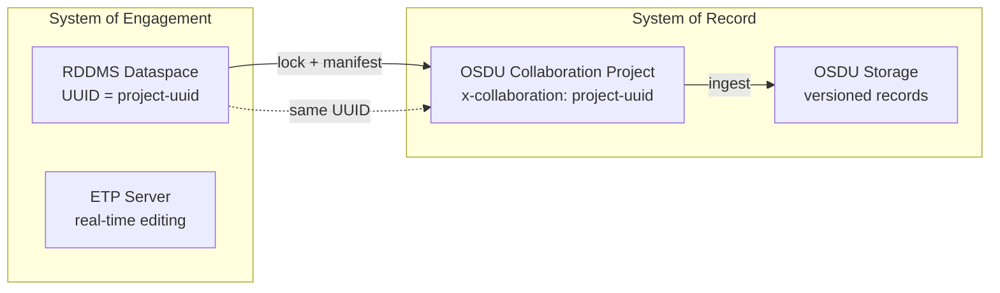

# RESQML 2.2 in OSDU — Analysis & Development Plan

> Owner: OSDU RESQML Development Lead
> Updated: 2026-06-05
> Scope: RESQML 2.2 schema analysis, OSDU integration assessment, and remaining development roadmap
> See: [CHANGELOG.md](CHANGELOG.md) for all completed work with file-level references

---

## Table of Contents

1. [Executive Summary](#1-executive-summary)
2. [RESQML 2.2 Schema Analysis](#2-resqml-22-schema-analysis)
3. [Geo-Modeling Coverage](#3-geo-modeling-coverage-seismic-to-simulation)
4. [Ontology, Semantics & FIRP](#4-ontology-semantics--firp)
5. [Complement to WITSML & Common Elements](#5-complement-to-witsml--common-energistics-elements)
6. [Design Principles & Efficiency](#6-design-principles--efficiency)
7. [OSDU Mapping Status](#7-osdu-mapping-status)
8. [Current Gaps & Remaining Work](#8-current-gaps--remaining-work)
9. [Appendices](#appendices)

---

## 1. Executive Summary

RESQML 2.2 is a mature, XML/HDF5-based data exchange standard covering the full subsurface modeling lifecycle. Its **FIRP** (Feature → Interpretation → Representation → Property) ontology provides rigorous semantic separation unique among subsurface standards.

**Integration status:** The `open-etp-client` now covers all major RESQML→OSDU converter paths, CRS handling (EPSG/WKT/LocalAuthority/Vertical), seismic domain routing, WITSML manifest generation, and session resilience. Remaining work is primarily external (ETP server fixes, cross-DDMS coordination, OSDU DD contributions).

See [CHANGELOG.md](CHANGELOG.md) for all completed implementations with file-level references.

---

## 2. RESQML 2.2 Schema Analysis

### 2.1 Data Object Taxonomy

~80 concrete data objects organized by FIRP. Namespace: `http://www.energistics.org/energyml/data/resqmlv2`, depends on EML Common v2.3.

| Layer | Key Objects |
|-------|------------|
| **Features** | `BoundaryFeature`, `RockVolumeFeature`, `WellboreFeature`, `SeismicLatticeFeature`, `SeismicLineFeature`, `Model` |
| **Interpretations** | `FaultInterpretation`, `HorizonInterpretation`, `EarthModelInterpretation`, `StructuralOrganizationInterpretation`, `StratigraphicColumn`, `GeobodyInterpretation`, `RockFluidOrganizationInterpretation` |
| **Representations** | `IjkGridRepresentation`, `UnstructuredGridRepresentation`, `TriangulatedSetRepresentation`, `Grid2dRepresentation`, `PolylineSetRepresentation`, `WellboreTrajectoryRepresentation`, `SealedSurfaceFrameworkRepresentation`, `SubRepresentation` |
| **Properties** | `ContinuousProperty`, `DiscreteProperty`, `CategoricalProperty`, `BooleanProperty`, `PointsProperty` |
| **Support (EML)** | `Activity`, `ActivityTemplate`, `TimeSeries`, `PropertyKind`, `GraphicalInformationSet` |

### 2.2 Key Design Features

1. **Polymorphic geometry** — parametric curves (min-curvature, cubic, etc.)
2. **External array references** — bulk data via HDF5 or ETP DataArray
3. **Local CRS per representation** — multi-CRS models without re-projection
4. **DataObjectReference (DOR)** — UUID-based typed graph
5. **Realization indexing** — built-in stochastic/Monte Carlo support
6. **Time-dependent geometry** — `TimeIndex` for 4D modeling
7. **Split topology** — faulted grids without node duplication

### 2.3 Strengths & Weaknesses

| Strengths | Weaknesses |
|-----------|------------|
| Topologically complete (nodes, edges, faces, cells all addressable) | Object explosion (46-curve log = 48 objects) |
| Lossless parametric geometry | No inline data (even 3-point polyline needs HDF5) |
| Multi-grid + parent/child windows | Deep inheritance (5+ abstract levels) |
| Sealed frameworks (watertight models) | Verbose XML (simple horizon = 500+ lines) |
| PropertyKind taxonomy (extensible) | No built-in versioning |

---

## 3. Geo-Modeling Coverage: Seismic to Simulation

| Stage | RESQML Coverage | Assessment |
|-------|----------------|------------|
| Seismic acquisition geometry | `SeismicLatticeFeature`, `SeismicLineFeature` | ✅ Full |
| Seismic interpretation (horizons/faults) | `BoundaryFeature` + Interp + Rep | ✅ Full |
| Structural modeling | `StructuralOrganizationInterpretation` + `SealedSurfaceFramework` | ✅ Full |
| Stratigraphic modeling | `StratigraphicColumn` + Rank + Occurrence | ✅ Full |
| Property modeling | `ContinuousProperty`/`DiscreteProperty` on any rep | ✅ Full |
| Grid construction | IJK, Unstructured, GP, Truncated | ✅ Full |
| Well placement in model | `BlockedWellboreRepresentation` | ✅ Full |
| Rock-fluid organization | `RockFluidOrganizationInterpretation` | ✅ Full |
| 4D / time-stepping | `TimeSeries` + `TimeIndex` | ✅ Full |
| DAS / fiber, Production, Drilling | — | ❌ Out of scope (PRODML/WITSML) |

**Remaining gap:** Regular surface grid with Z + multi-property (Petrel style) — needs `GenericBinGrid:1.0.0` or dedicated WPC.

---

## 4. Ontology, Semantics & FIRP

```
Feature → Interpretation → Representation → Property
   (what)      (opinion)       (geometry)      (values)
```

- Same feature → multiple interpretations (different geologists)
- Same interpretation → multiple representations (mesh + polylines)
- Properties decoupled from geometry (same grid, different model runs)
- Lineage via `Activity` + `ActivityTemplate` (auto-generated by RDDMS — see CHANGELOG A3)
- PropertyKind taxonomy: ~300 standard kinds, bridged to OSDU via PWLS (see CHANGELOG O1)

---

## 5. Complement to WITSML & Common Energistics Elements

### Shared Infrastructure (EML Common v2.3)

Both RESQML 2.2 and WITSML 2.1: `AbstractObject`, `DataObjectReference`, `Activity`, `TimeSeries`, `PropertyKind`, UOM dictionary, EPC packaging, Identifier Spec v5.0.

### Division of Responsibility

| Domain | WITSML | RESQML | PRODML |
|--------|--------|--------|--------|
| Well identity & operations | ✅ | Ref only | — |
| Well logs (acquisition / model) | ✅ / — | — / ✅ | — |
| Earth model & grids | — | ✅ | — |
| Production / DAS | — | — | ✅ |

Full boundary definition in `RESQML-WITSML.md` (see CHANGELOG R3).

---

## 6. Design Principles & Efficiency

**Core:** Topology separated from geometry, geometry from properties, external bulk data, graph relationships (DOR), schema polymorphism.

**Efficiency opportunities (future):**
- JSON alternative (Energistics JSON Style Guide) — 30-50% parsing reduction
- Inline small arrays (< 1000 elements)
- Columnar storage (Arrow/Parquet for grid properties)

---

## 7. OSDU Mapping Status

### 7.1 Implementation Coverage

All major RESQML types have dedicated OSDU converters. See [MAPPING.md](../MAPPING.md) for the complete registry.

**Key points:**
- Interpretations → 1:1 OSDU WPC kinds (dedicated M27 schemas — Phase 1 complete)
- Representations → `GenericRepresentation` catch-all or routed to specific kind (SeismicHorizon, StructureMap, SeismicFault, SeismicBinGrid)
- Properties → `GenericProperty` (catch-all, loses typed semantics)
- Features → OSDU master-data (BoundaryFeature, SeismicAcquisitionSurvey)
- WITSML → Well, Wellbore, WellLog, Trajectory, Rig, Tubular, FluidsReport, BHARun, WellCompletion

### 7.2 CRS Architecture (Implemented)

```
RESQML (full fidelity)              OSDU (manifest)
═══════════════════════              ═══════════════
Global Projected CRS          ──→   CRS record (Projected:EPSG::<code>)
Vertical CRS                  ──→   CRS record (Vertical:EPSG::<code>)
Local frame (offsets/rotation) ──→  ExtensionProperties["rddms/localFrame/*"]
Coordinates (local)           ──→   SpatialArea (rotation+offset applied → global)
                              ──→   Wgs84Coordinates (CRS Convert)
```

Handles: EPSG, WKT, LocalAuthority, Vertical (v2.0.1 + v2.2). See CHANGELOG "CRS Handling: 5 Fixes".

### 7.3 Metadata Gaps (Structural — Not Fixable in Client)

| RESQML | OSDU | Gap |
|--------|------|-----|
| `Citation.Originator` (free text) | `createUser` (authenticated) | Semantic mismatch |
| DOR graph (any-to-any) | `data.XXXRef` (typed fields) | Partial mapping only |
| No ACL concept | `acl` groups required | Must inject at OSDU level |
| No legal/compliance | `legal` tags required | Must inject at OSDU level |

---

## 8. Current Gaps & Remaining Work

### 8.1 ETP Server Deficiencies (🔴 EXTERNAL — ETP Server Team)

| Issue | Severity | Notes |
|-------|----------|-------|
| `PutDataObjects` transaction bug (standalone mode) | Critical | No standards-compliant write path exists |
| RESQML 2.2 EPC import (fesapi limitation) | Critical | Only `version=2.0` content types recognized |
| XML→AVRO→JSON lossy (DOR UUIDs stripped) | High | No raw XML storage, no EPC export |
| RESQML 2.0.1 `obj_` prefix tolerance | High | Server requires non-`obj_` element names |
| ExtraMetadata silently dropped | Medium | OSDU tags lost on import |

**Recommended server fixes:** (1) Fix transaction init in standalone, (2) Support v2.2/v2.3 content types, (3) Accept both `obj_X` and `X` element names, (4) Store raw XML, (5) Preserve DOR UUIDs.

### 8.2 Cross-DDMS Coordination (🟡 COORD)

| Issue | Forum |
|-------|-------|
| CRS catalog not shared with RDDMS | OSDU DDMS sub-committee |
| ETP notification → OSDU notification bridge | Architecture WG |
| WDDMS 2.0 WITSML format alignment | Wellbore DDMS team |

### 8.3 OSDU Data Definitions (🔴 EXTERNAL)

| Issue | Notes |
|-------|-------|
| `LocalModelCompoundCrs` schema empty | "No attributes present yet" — needs DD extension |
| Regular surface grid WPC | Needs contribution process |
| RESQML documentation ownership | Energistics governance |

### 8.4 Remaining Local Work (🟢 LOCAL)

| Item | Description | Effort | Priority |
|------|-------------|--------|----------|
| M27 Phase 2 | GpGrid, UnstructuredColumnLayer, IjkGridNumericalAquifer, UnsealedSurfaceFramework | M (4-6w) | Medium |
| M27 Phase 3 | FaultSystem, VelocityModeling, GeologicUnitOccurrence, AquiferInterpretation, GenericBinGrid | M (3-4w) | Low |
| A5: Notification bridge | ETP SubscriptionNotification → OSDU notification service | H (8-12w) | Medium |
| O5: S3/blob storage | Large arrays bypass PG TOAST | H (12w+) | Low |
| A8: Multi-DDMS versioning | Cross-system version tracking | H (8-12w) | Low |
| ACL/legal-tag config | Accept in manifest build request | S (1w) | Medium |
| Dynamic `supportedDataObjects` | Build from converter registry | S (2d) | Low |

### 8.5 Test Matrix — Non-Additive Changes (🧪 Hardening)

All non-additive/bugfix changes have strict unit tests in `src/__tests__/TestCrsAndBugfixes.ts`:

| Risk Area | Tests | Integration Test Needed? |
|-----------|-------|--------------------------|
| ArealRotation coordinates | 4 unit (0°/45°/90°, rad/dega) | ✅ Yes — validate against known rotated dataset (North Sea ED50) |
| Vertical CRS | 2 unit | ✅ Yes — verify OSDU Search finds VerticalCRS on ingested records |
| localFrame round-trip | 2 unit | ✅ Yes — OSDU→RESQML reconstruction from ExtensionProperties |
| WKT CRS | 3 unit | ✅ Yes — CRS Convert v4 accepts our WKT persistableReference |
| Node count (#67) | 3 unit | ✅ Yes — re-ingest triangulated surface, check IndexableElementCount |
| Delete locked dataspace (#130) | 2 unit | ✅ Yes — test against real locked dataspace on server |
| S1 type filter | 9 unit | ✅ Yes — diff manifest output before/after for earth model dataspace |
| A2 StructureMap routing | 3 unit | ✅ Yes — verify depth horizon Grid2d produces StructureMap kind in OSDU |
| O4 chunking | 5 unit | ✅ Yes — upload array > negotiatedSize, verify DataArray integrity |
| Manifest best-effort | 2 unit | ⚠️ Monitor — partial manifests need logging/alerting |

**Unit test command:** `npx jest --testPathPattern=TestCrsAndBugfixes` (41 tests, ~6s)
**Full suite:** `npm test` (299 tests, ~24s)

### 8.6 Remaining Integration Tests — Detailed Plan

#### Category A: Bug Fixes (🐛) — Validate Corrected Behavior

These tests confirm the fix produces correct output where the old code was wrong.
**All require ETP server + OSDU instance.**

| # | Bug | Test Procedure | Pass Criteria | Dataset |
|---|-----|----------------|---------------|---------|
| A1 | #67 Node count | 1. Import `Grid_and_New_Wells.epc` (has TriangulatedSurface)<br>2. `POST /manifests/build`<br>3. Check `IndexableElementCount` on GenericRepresentation WPC | Value = N (number of vertices), NOT 3N | `devops/data/Grid_and_New_Wells.epc` |
| A2 | #126 Invalid dateTime | 1. `PUT /witsml/store` with XML containing `<Creation>not-a-date</Creation>`<br>2. Observe HTTP response | HTTP 400 + `EINVALID_ARGUMENT` error body (not 500) | Crafted invalid WITSML XML |
| A3 | #130 Delete locked DS | 1. Create dataspace, lock it<br>2. `DELETE /dataspaces/{id}`<br>3. Observe response | HTTP 403 (not 204). Dataspace still exists after call | Any test dataspace |
| A4 | CRS ArealRotation | 1. Import Volve with rotated CRS (ArealRotation=3.5°, ED50/UTM31)<br>2. `POST /manifests/build`<br>3. Extract `SpatialArea.AsIngestedCoordinates.features[0].geometry.coordinates` | Coordinates differ from simple offset by rotation transform. Compare with Petrel-exported WGS84 ±100m | `Volve_Demo_Horizons_Depth.epc` |

#### Category B: Non-Additive Behavioral Changes (⚠️) — Validate No Regression

These tests confirm the new behavior doesn't break existing consumers.
**Require both before/after comparison.**

| # | Change | Test Procedure | Pass Criteria | Risk |
|---|--------|----------------|---------------|------|
| B1 | S1 Default filter | 1. Build manifest for `maap/drogon22` WITH `typePatterns: ["*"]`<br>2. Build manifest WITHOUT typePatterns (default)<br>3. Compare | Default produces subset of full. All Interpretation+Representation types present. No ContinuousProperty/PropertyKind/CRS in default. | Automation expecting full manifest |
| B2 | A2 StructureMap routing | 1. Import depth-domain Grid2d with HorizonInterpretation<br>2. Build manifest<br>3. Check WPC `kind` | `kind` = `osdu:wks:work-product-component--StructureMap:1.0.0` (not GenericRepresentation) | OSDU Search queries by old kind |
| B3 | Manifest best-effort | 1. Import dataspace with 1 valid + 1 corrupt object (missing DOR target)<br>2. Build manifest | Manifest returns 1 WPC (not 0, not error). Response includes warning/count of skipped objects | Silent partial output |
| B4 | #125 SIGTERM shutdown | 1. Start pod with open ETP transaction<br>2. Send SIGTERM<br>3. Check ETP server transaction state | Transaction rolled back. Pod exits within 30s (not full grace period) | Kubernetes restart behavior |
| B5 | M27 Kind migration | 1. Build manifest for dataspace with `StructuralOrganizationInterpretation`<br>2. Ingest to OSDU<br>3. Search by old kind vs new kind | Found under `StructuralOrganizationInterpretation:1.2.0` (new). NOT found under `EarthModelInterpretation:1.2.0` (old) | Consumers querying old kind |

#### Category C: Additive Features (✅) — Validate New Functionality Works

These tests confirm new capabilities function correctly end-to-end.
**No backward compatibility concern — purely new output.**

| # | Feature | Test Procedure | Pass Criteria | Dataset |
|---|---------|----------------|---------------|---------|
| C1 | Vertical CRS (Fix 1) | 1. Import model with EPSG:5714 vertical CRS<br>2. Build manifest<br>3. Check `VerticalCoordinateReferenceSystemID` | Field populated with `...Vertical:EPSG::5714`. `persistableReferenceVerticalCrs` is valid JSON | Any model with explicit vertical |
| C2 | localFrame (Fix 3) | 1. Build manifest for model with XOffset=420000, YOffset=6470000<br>2. Check `ExtensionProperties` on WPC | Contains `rddms/localFrame/xOffset`, `yOffset`, `zOffset`, `arealRotationDeg`, `projectedAxisOrder` | Volve or synthetic |
| C3 | WKT CRS (Fix 4) | 1. Import model with `ProjectedUnknownCrs` containing WKT string<br>2. Build manifest | `persistableReferenceCrs` = WKT string. `CoordinateReferenceSystemID` contains `Projected:WKT::` | Synthetic EPC with WKT CRS |
| C4 | LocalAuthority CRS (Fix 5) | 1. Import v2.2 model with `ProjectedLocalAuthorityCrs`<br>2. Build manifest | `CoordinateReferenceSystemID` contains `Projected:LocalAuthority::{auth}-{code}` | Synthetic v2.2 EPC |
| C5 | SeismicLineGeometry | 1. Import EPC with `obj_SeismicLineFeature`<br>2. Build manifest | WPC kind = `SeismicLineGeometry:1.2.0`. FirstCMP/LastCMP populated. | Homer.epc or synthetic |
| C6 | WellLog flattening (S2) | 1. Import model with WellboreFrameRepresentation + 10 ContinuousProperty<br>2. Build manifest | Single `WellLog:1.3.0` WPC with 10 entries in `Curves[]` (not 11 separate objects) | Grid_and_New_Wells.epc |
| C7 | Activity generation (A3) | 1. Build manifest with `generateLineageActivity: true`<br>2. Check output | Contains 1 `Activity:1.4.0` WPC. Its `Parameters[].DataObjectIDs` lists all other WPCs. UUID is deterministic | Any dataspace |
| C8 | Dedup (S3) | 1. Build manifest twice for same dataspace<br>2. Check master-data output on second run | Second run produces 0 new master-data records (dedup check passes) | Any with BoundaryFeature |
| C9 | Auto-collaboration (S4) | 1. Build manifest for `demo/Volve` without `x-collaboration` header<br>2. Build again for same dataspace | Both manifests have same `x-collaboration` UUID. Different dataspace → different UUID | Any |
| C10 | WITSML converters (A4) | 1. Store WITSML 2.1 Rig + Tubular + FluidsReport + BHARun<br>2. Build manifest | WPCs: `Rig:1.3.0`, `Tubular:1.3.0`, `FluidsReport:1.3.0`, `BHARunReport:1.3.0` | Crafted WITSML XML |
| C11 | O4 large array | 1. Import model with array > 4MB (exceeds typical negotiatedSize)<br>2. PUT via ETP DataArray<br>3. GET back and compare | Array values identical. No truncation or corruption at chunk boundary | Large synthetic grid |

#### Summary: Test Effort Estimation

| Category | Count | Requires Server | Effort |
|----------|-------|-----------------|--------|
| A: Bug fix validation | 4 | Yes (ETP + OSDU) | 2 days |
| B: Behavioral regression | 5 | Yes (ETP + OSDU) | 3 days |
| C: Additive feature validation | 11 | Yes (ETP + OSDU) | 5 days |
| **Total integration tests** | **20** | | **~10 days** |

**Prerequisites:** Running local ETP server + OSDU instance (or ADME interop environment). Test datasets in `devops/data/`.

### 8.7 Community Actions Required

| Action | Forum | Status |
|--------|-------|--------|
| RDDMS CRS catalog sharing | OSDU DDMS sub-committee | Open |
| RESQML ActivityTemplates contribution | OSDU Data Definitions WG | Open |
| WDDMS 2.0 format alignment | Wellbore DDMS team | Open |
| ETP→OSDU notification bridge | Architecture WG | Open |
| Energistics RESQML doc update | Energistics Work Group | Open |

---

## Appendices

### Appendix B: Activity Template Definitions (for DD Contribution)

| Template | Purpose |
|----------|---------|
| `RDDMSIngestion` | EPC/WITSML → RDDMS dataspace |
| `ManifestGeneration` | RDDMS objects → OSDU manifest |
| `CatalogIngestion` | Manifest → OSDU Storage records |
| `DepthConversion` | Time → Depth representations |
| `GridConstruction` | Structural model → Simulation grid |
| `PropertyModeling` | Input data → Modeled properties |
| `SimulationRun` | Grid + properties + schedule → Results |

---

### Appendix C: Decision Matrix — Where Does Well Data Live?

| Data Type | Primary Store | Rationale |
|-----------|--------------|-----------|
| Well identity (name, location) | WDDMS / OSDU master-data | WITSML authoritative |
| Directional survey (operational) | WDDMS | Acquisition context |
| Trajectory in model | RDDMS | Parametric geometry preserved |
| Well log (raw acquisition) | WDDMS | Service company metadata |
| Well log (in model context) | RDDMS | Frame + properties, linked to grid |
| Completions | WDDMS / OSDU WPC | Operational object |
| Formation markers | Both | WITSML = observed; RESQML = interpreted |

---

### Appendix D: Collaboration Project Integration



Lifecycle: Create dataspace → Work in SoE (ETP) → Lock → Manifest → Ingest with `x-collaboration: {uuid}` → Notifications fire. Auto-collaboration from dataspace name (see CHANGELOG S4).

---

### Appendix G: ETP Server Storage Behavior (Reference)

**Key finding:** ETP is a lossy, normalizing store. Parses XML → AVRO → PostgreSQL → JSON on read.

**Lost in transfer:** DOR UUIDs (relationship graph only), HDF5 refs, property metadata (UOM, Count, Min/Max), ExtraMetadata, trajectory StartMd/FinishMd.

**Import tool normalization:** Strips `obj_` prefix, maps v2.0→v2.2, renames deprecated types, forces SchemaVersion 2.2.

**Workaround:** EPC-based manifest builder for ADME; REST API builder for local ETP (DORs preserved).

---

### Appendix H: RESQML 2.0.1 ↔ 2.2 Quick Reference

| Element | v2.0.1 | v2.2 |
|---------|--------|------|
| Type prefix | `obj_*` | No prefix |
| Property count | `Count` | `ValueCountPerIndexableElement` |
| Property values | `PatchOfValues` | `ValuesForPatch` |
| UOM field | `UOM` | `Uom` |
| DOR ref type | `ContentType` | `QualifiedType` |
| DOR UUID | `UUID` | `Uuid` |
| MD range | `StartMd`+`FinishMd` | `MdInterval` |
| CRS class | `obj_LocalDepth3dCrs` | `LocalEngineeringCompoundCrs` |
| CRS forms | EPSG, Unknown | EPSG, WKT, LocalAuthority, GML, Unknown |
| Rotation | `ArealRotation` (PlaneAngleMeasure) | `Azimuth` (degrees) |

---

### Appendix K: Seismic Domain BinGrid Routing (Implemented)

| RESQML Input | Detection | OSDU Kind |
|---|---|---|
| Grid2d → SeismicLatticeFeature | InterpretedFeature type | `SeismicBinGrid:1.3.0` |
| Grid2d → Horizon + on lattice | FromRepLatticeArray | `SeismicHorizon:2.0.0` |
| Grid2d → Horizon, NOT on lattice | Direct points | `StructureMap:1.0.0` |
| Polyline → FaultInterp + SeismicCoords | SeismicCoordinates | `SeismicFault:2.0.0` |
| SeismicLatticeFeature | Direct type | `SeismicAcquisitionSurvey:1.4.0` |
| SeismicLineFeature | Direct type | `SeismicLineGeometry:1.2.0` |

Known issues (non-blocking): (1) GenericRepresentation22Manifest ignores routing result, (2) v2.2 Polyline uses v2.0 router (works accidentally), (3) Kind string uses `.` vs `:`.

---

### Appendix M: M27 Schema Upgrade Phases

**Phase 1: ✅ COMPLETE** — 9 schemas with dedicated converters (see CHANGELOG "M27 Schema Upgrades").

**Phase 2 (Grid Extension):**

| Schema | RESQML Source |
|--------|---------------|
| `GpGridRepresentation:1.2.0` | `GpGridRepresentation` |
| `UnstructuredColumnLayerGridRepresentation:1.2.0` | `UnstructuredColumnLayerGridRepresentation` |
| `IjkGridNumericalAquiferRepresentation:1.2.0` | `IjkGridRepresentation` (aquifer cells) |
| `UnsealedSurfaceFramework:1.3.1` | `NonSealedSurfaceFrameworkRepresentation` |

**Phase 3 (Framework Enrichment):**

| Schema | RESQML Source |
|--------|---------------|
| `FaultSystem:1.4.1` | Collection of FaultInterpretation |
| `VelocityModeling:1.4.0` | Properties on Grid2d/IjkGrid |
| `GeologicUnitOccurrenceInterpretation:1.2.0` | `StratigraphicOccurrenceInterpretation` |
| `AquiferInterpretation:1.2.0` | Derived |
| `GenericBinGrid:1.0.0` | Grid2d (no interp) |

**DD review items:** Verify StructuralOrgInterp captures ordered contacts; verify FaultSystem supports fault-to-fault; evaluate VelocityModeling grid reference.
